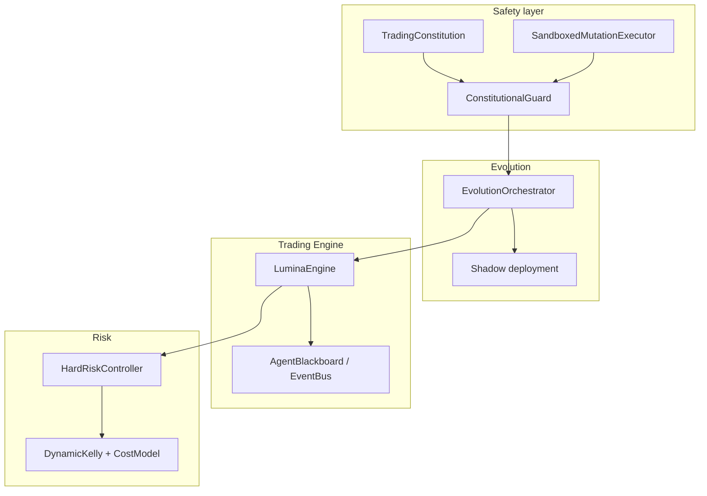

<div align="center">

# LUMINA

### Het objectief beste zelf-lerende, zelf-evoluerende AI-daytrading organisme voor NinjaTrader

[](https://github.com/Steve-Mee/Lumina/blob/main/pyproject.toml)
[](https://www.python.org/downloads/)
[](LICENSE)
[](https://github.com/Steve-Mee/Lumina/releases)

[](https://github.com/Steve-Mee/Lumina/actions/workflows/lumina-quality-gate.yml)
[](https://github.com/Steve-Mee/Lumina/actions/workflows/safety-gate.yml)

[Quick Start](#-quick-start) · [Architectuur](#-architectuur-overzicht) · [Safety](#️-risk-management--safety) · [ADR’s](docs/adr/README.md)

</div>

---

## 🎯 Missie & filosofie

**LUMINA** is gebouwd om te behoren tot de **1% die wél slaagt** — niet door geluk, maar door discipline:

| Pilaar | Wat het betekent |
|--------|------------------|
| 🧠 **Extreme intellectual honesty** | Geen cosmetische backtests, geen verborgen risico’s. Alleen wat de data en de audit trail hard ondersteunen. |
| 🧪 **Rigoureuze testing** | Fail-closed gates, markers, sandboxed evolution — kwaliteit is geen bijzaak, het is architectuur. |
| ⚡ **Radicale creativiteit** | SIM/Paper is het laboratorium: daar mag Lumina experimenteren, dromen en muteren zonder ketenen. |

**Kapitaalbehoud is heilig in REAL mode.** In SIM en Paper trading mag het organisme radicaal leren en evolueren — zolang REAL een fort blijft.

### Elon Musk Mindset Protocol (samenvatting)

- **First principles** — breek problemen terug tot fundamentele waarheden (markt, uitvoering, risico).
- **“Onmogelijk” = nog niet opgelost** — splits op, meet, elimineer stap voor stap.
- **Radicale eenvoud** — de meest elegante oplossing wint, tenzij je een volledig nieuwe moet uitvinden.
- **Boundary pushing** — oplossingen die 99% niet durft, mét bewijs en governance.
- **100% eerlijkheid** — geen pleasen; harde waarheid en betere alternatieven.
- **10×-denken** — *Hoe maken we dit onverslaanbaar?*

> **Niks is onmogelijk. Durf radicaal te zijn.**  
> Niet roekeloos — *radicaal met meten, review en fail-closed veiligheid.*

---

## ✨ Waarom Lumina anders is

- 🛡️ **Trading Constitution + ConstitutionalGuard** — machine-enforceable regels (15 principes) vóór mutatie, in de sandbox en vóór promotie. Geen “gentlemen’s agreement”.
- 🌑 **Shadow deployment + verplichte human approval** — radicale DNA-mutaties eerst in het donker valideren; REAL volgt pas na governance en bewijs ([ADR 0002](docs/adr/0002-shadow-deployment-human-approval.md)).
- 🗨️ **AgentBlackboard + centrale Event Bus** — gepubliceerde domein-events en contracts i.p.v. een mengelmoes aan directe calls; schaalbaar en auditbaar ([ADR 0001](docs/adr/0001-bounded-contexts-central-event-bus.md)).
- 📉 **Purged cross-validation, order book replay, reality-gap penalty** — backtests die lekken en roze bril actief bestrijden ([ADR 0004](docs/adr/0004-backtest-realism-purged-cv-orderbook-replay-reality-gap.md)).
- 📐 **Bounded contexts in `lumina_core/`** — risk, trading engine, evolution, safety en agent orchestration als expliciete domeinen, geen tweeledige “god module”.
- 💰 **Dynamic Kelly + volledig cost model** — position sizing en breakeven die rekening houden met volatiliteit en echte kosten, niet alleen PnL op papier.

---

## 🚀 Quick Start

### Eerste install (aanbevolen)

```bash
python scripts/bootstrap_lumina.py
```

- Maakt een lokale **`.venv`**, installeert launcher/runtime-dependencies en start **Streamlit**.
- **`lumina_launcher.py`** — hardware-aware **guided setup**: hardwarescan, aanbevolen **Qwen3.5**-model en stap-voor-stap installatie.
- Status na setup: `state/lumina_setup_complete.json`, `state/lumina_setup_status.json`.
- Modelcatalogus en aanbevelingen: `lumina_model_catalog.json`.

### Handmatig / tweede machine

| Stap | Actie |
|------|--------|
| 1 | Repository clonen en `python scripts/bootstrap_lumina.py` draaien |
| 2 | Lokale config: `config.yaml`, secrets in `.env` (**niet committen**) |
| 3 | Optioneel: **Docker** — `docker-compose.yml` (lokaal), `docker-compose.prod.yml` (productieachtig) |

### Fine-tuning & GGUF (Linux / WSL2 + CUDA)

Unsloth fine-tuning zit voorbereid in de app; echte training vraagt **Linux of WSL2 met CUDA**. Voor **llama.cpp** / GGUF-export: `python scripts/setup_llama_cpp.py`.

---

## 🏛️ Architectuur overzicht

LUMINA is opgebouwd als **bounded contexts** onder `lumina_core/`: elk domein heeft een duidelijke grens en API — risk, trading engine, evolution, safety, agent orchestratie.



**Documentatie**

- 📚 **Architecture Decision Records:** [docs/adr/README.md](docs/adr/README.md) — canonieke `000x`-reeks (template + beslissingen).
- 🛡️ **AGI Safety (diepgaand):** [docs/AGI_SAFETY.md](docs/AGI_SAFETY.md).
- ℹ️ Er is (nog) geen apart `docs/architecture.md`; het architectuurspoor loopt via **ADR’s** en safety-docs.

---

## 🔑 Key Features

| Domein | Capability |
|--------|------------|
| 🧬 Evolution | DNA-registry, genetic operators, dream engine, evolution dashboard — mutatie met governance. |
| 🛡️ Safety | Pre-mutation → sandbox → pre-promotion; audit trails; red-team bereid ([AGI Safety](docs/AGI_SAFETY.md)). |
| 📊 Risk | Hard limits, Monte Carlo / VaR-stijl allocatie, dynamic Kelly, execution cost model. |
| 🤖 Agents & bus | Blackboard-topics, centrale event bus, producer allowlists waar van toepassing. |
| 📈 Backtest-realism | Purged CV, order book replay, reality-gap penalty (zie [ADR 0004](docs/adr/0004-backtest-realism-purged-cv-orderbook-replay-reality-gap.md)). |
| 🖥️ Operator UX | Launcher met guided setup, journals/dashboards onder `journal/`. |

---

## 🛡️ Risk management & Safety

- **Fail-closed by default** — fout in een check = blokkeren, niet “doorlaten en hopen”.
- **REAL** — kapitaalbescherming primeert; constitutionele regels en approvals zijn niet optioneel.
- **SIM / Paper** — maximale leerruimte zonder echte orders.
- **Sandboxed evolution** — fitness-scoring in geïsoleerde subprocessen: geen corruptie van live state door een defecte mutant.

Meer detail: [docs/AGI_SAFETY.md](docs/AGI_SAFETY.md) · [ADR 0003](docs/adr/0003-trading-constitution-sandboxed-mutation-executor.md).

---

## 🧪 Development & Quality

**Contributing:** lees [CONTRIBUTING.md](CONTRIBUTING.md) voor branches, ADR’s, tests, self-evolution (shadow / constitution / Approval Gym) en PR-richtlijnen — verplicht leesvoer voordat je substantiële changes pusht.

**Release checklist:** volg [docs/RELEASE_CHECKLIST.md](docs/RELEASE_CHECKLIST.md) voor elke release (pre-release gates, GitHub Release-structuur, post-release). Optioneel: `python scripts/prepare_release.py` voor een draft `CHANGELOG_DRAFT.md` en een korte reminder.

| Onderdeel | Afspraak |
|-----------|----------|
| **Python** | 3.13+, type hints (Pydantic + mypy), **ruff** |
| **Tests** | `tests/`, markers (`unit`, `integration`, `slow`, `nightly`) — zie [ADR 0005](docs/adr/0005-test-suite-overhaul-markers-timeouts-isolated-fixtures.md) |
| **CI** | Quality gate + safety workflows op GitHub Actions (badges bovenaan) |
| **ADR’s** | Belangrijke architectuurkeuzes → [docs/adr/](docs/adr/README.md) · nieuw: `python scripts/new_adr.py "Titel"` ([CONTRIBUTING.md](CONTRIBUTING.md)) |
| **Gedrag** | Leidend: [`.cursorrules`](.cursorrules) |

**Werkafspraken**

- Nieuwe notities: `docs/notes/` · Validatiescripts: `scripts/validation/` · Tests: `tests/`
- Geen losse `.log` in de repo-root — gebruik `logs/` of `state/`.

---

## 🗺️ Roadmap (Top 7)

| # | Prioriteit | Status |
|---|------------|--------|
| 1 | Volledige migratie van overgebleven `engine/`-modules naar bounded contexts | 🔄 |
| 2 | REAL: broker connectivity, reconciliatie en operationele runbooks afgestemd op production | 📋 |
| 3 | Test suite: markers, timeouts en isolated fixtures overal consequent ([ADR 0005](docs/adr/0005-test-suite-overhaul-markers-timeouts-isolated-fixtures.md)) | 📋 |
| 4 | Event bus: strikte payload-validatie (Pydantic) op alle kritieke topics | 🔄 |
| 5 | Nightly / CI: backtest-realism stack (purged CV, replay, reality gap) als gate waar haalbaar | 🔄 |
| 6 | Observability: dashboards en audit-first operator workflows (`journal/`, logging) | 🔄 |
| 7 | Model pipeline: Unsloth / GGUF / inference pad productie-hardening (Linux/WSL2) | 📋 |

Legenda: ✅ volbracht in kern · 🔄 actief · 📋 gepland / kritiek pad

---

## 📁 Repository-layout (compact)

| Pad | Rol |
|-----|-----|
| `lumina_core/` | Engine, workers, trainer, simulator, risk, evolution, safety |
| `lumina_bible/` | Bible-engine integratie |
| `lumina_agents/` | Agent-specifieke code |
| `deploy/` | Install / update / smoke scripts |
| `docs/` | Release-workflow, production setup, **ADR’s**, AGI Safety |
| `scripts/` | Bootstrap, utilities, `validation/` |
| `tests/` | Actieve test suite |
| `state/`, `logs/` | Runtime state en logs (gegenereerd / lokaal) |

**Belangrijke entrypoints:** `lumina_runtime.py` · `watchdog.py` · `nightly_infinite_sim.py` · `lumina_launcher.py`

**Runtime data (voorbeelden):** `state/lumina_daytrading_bible.json`, `state/lumina_sim_state.json`, `state/lumina_thought_log.jsonl`, `logs/lumina_full_log.csv`

---

## 💎 Risk API — voorbeeld (Dynamic Kelly & kosten)

```python
from lumina_core.risk.dynamic_kelly import DynamicKellyEstimator
from lumina_core.risk.cost_model import TradeExecutionCostModel

est = DynamicKellyEstimator(
    vol_scaling_enabled=True,
    vol_target_annual=0.15,
    fractional_kelly_real=0.25,
)
est.record_trade(pnl=150.0)
fraction = est.fractional_kelly("real")

model = TradeExecutionCostModel.from_config(cfg, instrument="MES JUN26")
cost = model.cost_for_trade(price=5020.0, quantity=1.0, atr=8.0)
```

*Volatility scaling:* \(f_{\mathrm{vol}} = f_{\mathrm{kelly}} \times \mathrm{clamp}(CV_{\mathrm{target}} / CV_{\mathrm{realized}}, 0, 1)\).  
Typische round-trip kosten (1× MES, normale markt): order van grootte **\$3.52–\$4.50** incl. commission, fees en slippage — gebruik altijd het cost model i.p.v. mental accounting.

---

<div align="center">

### Licentie

Dit project staat onder de **[MIT-licentie](LICENSE)**.

---

*Built with extreme intellectual honesty & radical creativity.*

**LUMINA v5.0.0** · [Releases](https://github.com/Steve-Mee/Lumina/releases) · [Issues](https://github.com/Steve-Mee/Lumina/issues)

</div>
