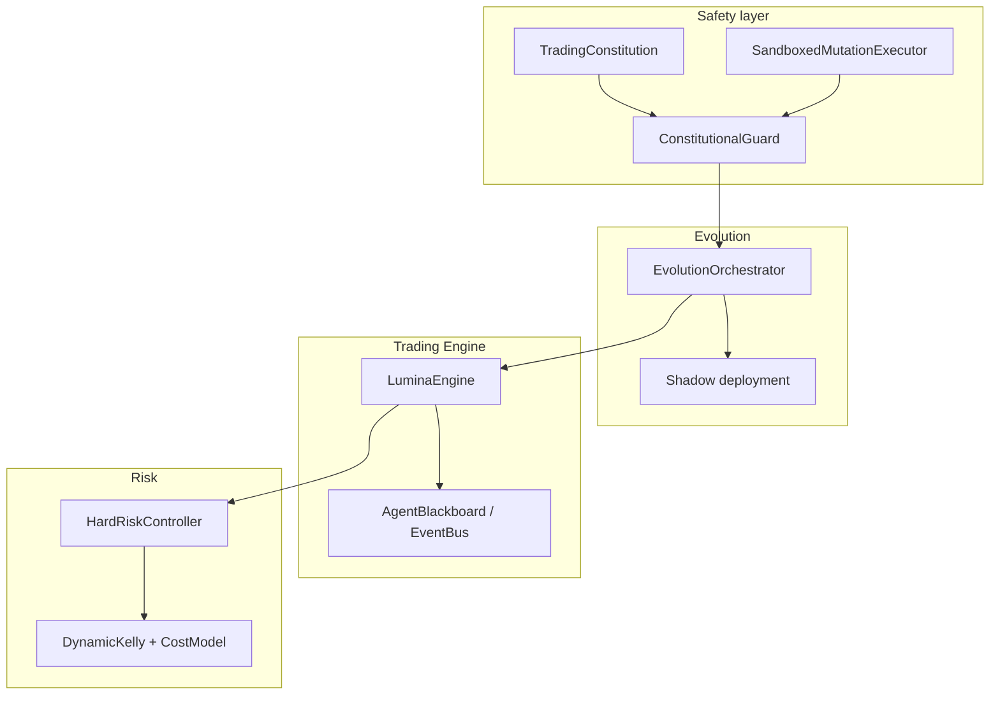

<div align="center">

# LUMINA

### Het objectief beste zelf-lerende, zelf-evoluerende AI-daytrading organisme voor NinjaTrader

[](https://github.com/Steve-Mee/Lumina/blob/main/pyproject.toml)
[](https://www.python.org/downloads/)
[](LICENSE)
[](https://github.com/Steve-Mee/Lumina/releases)

[](https://github.com/Steve-Mee/Lumina/actions/workflows/lumina-quality-gate.yml)
[](https://github.com/Steve-Mee/Lumina/actions/workflows/safety-gate.yml)
[](https://github.com/Steve-Mee/Lumina/actions/workflows/nightly-security-audit.yml)

[Quick Start](#-quick-start) · [Neural Command Deck](#-lumina-neural-command-deck-tauri) · [Maturatie](#-maturatie-ladder) · [Architectuur](#-architectuur-overzicht) · [Safety](#️-risk-management--safety) · [ADR’s](docs/adr/README.md)

</div>

---

## 🎯 Missie & filosofie

**LUMINA** is gebouwd om te behoren tot de **1% die wél slaagt** — niet door geluk, maar door discipline:

| Pilaar | Wat het betekent |
|--------|------------------|
| 🧠 **Extreme intellectual honesty** | Geen cosmetische backtests, geen verborgen risico’s. Alleen wat de data en de audit trail hard ondersteunen. |
| 🧪 **Rigoureuze testing** | Fail-closed gates, markers, sandboxed evolution — kwaliteit is geen bijzaak, het is architectuur. |
| ⚡ **Radicale creativiteit** | SIM/Paper is het laboratorium: daar mag Lumina experimenteren, dromen en muteren zonder ketenen. |

**Kapitaalbehoud is heilig in REAL mode.** In SIM en Paper trading mag het organisme radicaal leren en evolueren — zolang REAL een fort blijft.

### Elon Musk Mindset Protocol (samenvatting)

- **First principles** — breek problemen terug tot fundamentele waarheden (markt, uitvoering, risico).
- **“Onmogelijk” = nog niet opgelost** — splits op, meet, elimineer stap voor stap.
- **Radicale eenvoud** — de meest elegante oplossing wint, tenzij je een volledig nieuwe moet uitvinden.
- **Boundary pushing** — oplossingen die 99% niet durft, mét bewijs en governance.
- **100% eerlijkheid** — geen pleasen; harde waarheid en betere alternatieven.
- **10×-denken** — *Hoe maken we dit onverslaanbaar?*

> **Niks is onmogelijk. Durf radicaal te zijn.**  
> Niet roekeloos — *radicaal met meten, review en fail-closed veiligheid.*

---

## ✨ Waarom Lumina anders is

- 🧬 **Approval Twin (human replacement *judgment*)** — user-trained mimic van de operator (approve/veto); primary auto-approval in birth/SIM wanneer high-conf + clean. **Core unique differentiator** — niet generieke RL. Twin omzeilt nooit constitution, sandbox, shadow of REAL PromotionGate ([ADR 0031](docs/adr/0031-approval-twin-event-bus.md), [ADR 0032](docs/adr/0032-approval-twin-human-replacement-layer.md)). Train: `python -m lumina_launcher twin review|train|metrics`.
- 🛡️ **Trading Constitution + ConstitutionalGuard** — machine-enforceable regels (15 principes) vóór mutatie, in de sandbox en vóór promotie. Geen “gentlemen’s agreement”.
- 🌑 **Shadow deployment + approval gates** — radicale DNA-mutaties eerst in het donker valideren; judgment mag Twin zijn in birth/SIM; REAL blijft multi-gate (shadow + constitution + PromotionGate) ([ADR 0002](docs/adr/0002-shadow-deployment-human-approval.md), [ADR 0032](docs/adr/0032-approval-twin-human-replacement-layer.md)).
- 🗨️ **AgentBlackboard + centrale Event Bus** — gepubliceerde domein-events en contracts i.p.v. een mengelmoes aan directe calls; schaalbaar en auditbaar ([ADR 0001](docs/adr/0001-bounded-contexts-central-event-bus.md)).
- 📉 **Purged cross-validation, order book replay, reality-gap penalty** — backtests die lekken en roze bril actief bestrijden ([ADR 0004](docs/adr/0004-backtest-realism-purged-cv-orderbook-replay-reality-gap.md)).
- 📐 **Bounded contexts in `lumina_core/`** — risk, trading engine, evolution, safety en agent orchestration als expliciete domeinen, geen tweeledige “god module”.
- 💰 **Dynamic Kelly + volledig cost model** — position sizing en breakeven die rekening houden met volatiliteit en echte kosten, niet alleen PnL op papier.

Living direction: [`docs/roadmap.md`](docs/roadmap.md) (v5.2.x wave). Historical analyses under `docs/history/` are snapshots only.

---

## 🧬 Maturatie-ladder

Lumina groeit als organisme. Elke trede heeft een **fail-closed AND-examen**. Geen JSON-stempels, geen floor-cuts, geen Birth-tape als later bewijs. REAL-kapitaal blijft dicht tot de operator `approve-real` geeft.

| Trede | Wat het organisme leert | Exit (kort) | ADR |
|-------|-------------------------|-------------|-----|
| **Genesis** | Wiring: vault, envelope, fabric, charter | Setup complete, fabric GREEN | [0011](docs/adr/0011-tauri-lifecycle-gate-ssot.md) |
| **Birth** | Evolvable plant op historische SIM | Vijf Foundation-receipts + fitness (geen WR 20/35/40%) | [0046](docs/adr/0046-birth-foundation-evolvable-plant.md) |
| **Awakening** | Prefer-better kind vs frozen π* op holdout B | n_B ≥ 500 AND (lift ≥ 5pp **of** OOS ≥ 45%) + occupancy/process-R/STABLE | [0049](docs/adr/0049-awakening-eyes-open.md), [0026](docs/adr/0026-evolution-proof-gate.md) |
| **Playground** | Eerste contact in NT SIM, Command Deck | n_P ≥ 150, orderpath-fill, WR ≥ BE, mean R ≥ 0, envelope sealed | [0050](docs/adr/0050-playground-first-contact.md) |
| **Apprenticeship** | Lopen onder REAL-regels op SIM | 5 groene `sim_real_guard`-dagen, Sharpe ≥ 0.20, DD ≤ 12% | [0051](docs/adr/0051-apprenticeship-walk.md) |
| **Proving Ground** | Examen vóór kapitaal | Cert-OOS 48%/0.35/8% **en** this-run shadow **en** PromotionGate | [0052](docs/adr/0052-proving-ground-exam.md), [0007](docs/adr/0007-promotion-gate-real-mode.md) |
| **REAL** | Live kapitaal | Human `approve-real` + fail-closed live | [0007](docs/adr/0007-promotion-gate-real-mode.md) |

Operator-home na elke trede: **Phase Hub** in de Neural Command Deck. Named wipes: Wipe Awakening / Wipe Birth / Full wipe. SSOT: [`docs/adr/organism-maturation-phases.md`](docs/adr/organism-maturation-phases.md).

**Organen:** Lungs (training-engine, torch/SB3) ≠ Voice (Ollama/grok; Windows nooit vLLM). News praat, plaatst nooit orders. [ADR-0048](docs/adr/0048-lungs-voice-organs-ssot.md).

---

## 🚀 Quick Start

### Eerste install (aanbevolen)

```bash
python scripts/bootstrap_lumina.py
```

- Maakt een lokale **`.venv`**, installeert runtime-dependencies en start de **FastAPI backend** op `:8000`.
- Open daarna de **Neural Command Deck** (Tauri): `cd tauri-app && npm install && npm run tauri dev`.
- Guided setup (hardware, Ollama, model, credentials) loopt via de **Onboarding wizard** in de Command Deck; backend SSOT: `GET /api/setup/onboarding`.
- Monitoring telemetry: `state/monitoring_*.json(l)`; backend-metrics via FastAPI (`/api/monitoring/health`, `/api/monitoring/metrics/json`, `/api/monitoring/adaptive-intelligence/*`). Zie `lumina_os/README.md` en `docs/command-deck-startup-runbook.md`.
- Status na setup: `state/lumina_setup_complete.json`, `state/lumina_setup_status.json`.
- Modelcatalogus: `lumina_model_catalog.json`.
- Headless smoke (CI): `python -m lumina_launcher --smoke --mode sim --duration 15m`
- Production headless (24/7): `python -m lumina_launcher --headless --mode sim`
- Autonomous SIM/Paper loop (daemon, geen UI): `python -m lumina_launcher --mode sim` of `--mode paper`
- Birth status (CLI): `python -m lumina_launcher birth status --json`

### Handmatig / tweede machine

| Stap | Actie |
|------|--------|
| 1 | Repository clonen en `python scripts/bootstrap_lumina.py` draaien |
| 2 | Product-SSOT: `config.yaml`. Machine-overrides (hardware, model, context) in **`config.yaml.local`** (gitignored). Secrets in `.env` (**niet committen**) |
| 3 | Optioneel: **Docker** — `docker-compose.yml` (lokaal), `docker-compose.prod.yml` (productieachtig) |

### Fine-tuning & GGUF (Linux / WSL2 + CUDA)

Unsloth fine-tuning zit voorbereid in de app; echte training vraagt **Linux of WSL2 met CUDA**. Voor **llama.cpp** / GGUF-export: `python scripts/setup_llama_cpp.py`.

---

## 🖥️ LUMINA Neural Command Deck (Tauri)

De **LUMINA Neural Command Deck** (intern: *The Core*) is de native desktop operator-UI. Streamlit is retired ([ADR-0016](docs/adr/0016-streamlit-ui-retirement.md)). De stack is **Tauri v2 + React 19 + TypeScript + Three.js**: spaceship-cockpit, Phase Hub, Birth/Awakening/Playground HUD, live telemetry en fail-closed REAL-mode gates.

### Operator UI

| Aspect | Neural Command Deck |
|--------|---------------------|
| Runtime | Native desktop (Tauri) |
| Telemetry | REST + WebSocket live stream |
| Visuele identiteit | Three.js neural core + HUD panels |
| REAL-veiligheid | Fail-closed mode gates, constitution overlays |

### Architectuur & documentatie

- Frontend: **`tauri-app/`** — Neural Command Deck (cockpit + Phase Hub + maturation surfaces)
- Backend API: **`lumina_os/backend/`** op poort **8000**
- [docs/lumina-core-architecture.md](docs/lumina-core-architecture.md) — systeemdesign, dataflow, security
- [docs/lumina-core-api-contracts.md](docs/lumina-core-api-contracts.md) — JSON Schema contracten (REST + WebSocket)

### Getting Started (nieuwe UI)

**Vereisten**

| Tool | Versie | Doel |
|------|--------|------|
| Node.js | 20+ | Tauri frontend build |
| Rust | stable (via [rustup](https://rustup.rs/)) | Tauri shell |
| Python backend | 3.13+ | Al vereist door LUMINA |

**Stappen**

1. **Start de FastAPI backend**:

   ```powershell
   cd lumina_os
   powershell -ExecutionPolicy Bypass -File .\run_backend.ps1
   ```

   Verificatie: `GET http://127.0.0.1:8000/api/monitoring/health`

2. **Configureer omgevingsvariabelen** in `.env` (repo root):

   ```
   LUMINA_BACKEND_URL=http://127.0.0.1:8000
   LUMINA_ADMIN_API_KEY=<your-key>
   ```

3. **Start de Neural Command Deck**:

   ```bash
   cd tauri-app
   npm ci
   npm run tauri dev
   ```

   Het dev-venster opent op `localhost:1420` en verbindt met de backend op `:8000`.

Zie [docs/command-deck-startup-runbook.md](docs/command-deck-startup-runbook.md) voor restart-gedrag (setup → birth → deck).

### API-overzicht (compact)

| Type | Pad | Doel |
|------|-----|------|
| REST | `GET /api/core/status` | Cockpit snapshot |
| REST | `GET /api/evolution/tree` | DNA lineage graph |
| REST | `POST /api/core/approve-mutation` | Mutatie goedkeuren / afwijzen |
| WS | `/ws/core/live` | Live organism telemetry |
| WS | `/ws/evolution` | Evolution events |

Volledige schema’s: [docs/lumina-core-api-contracts.md](docs/lumina-core-api-contracts.md).

---

## 🏛️ Architectuur overzicht

LUMINA is opgebouwd als **bounded contexts** onder `lumina_core/`: elk domein heeft een duidelijke grens en API — risk, trading engine, evolution, safety, agent orchestratie.


```mermaid
flowchart TB
    subgraph safety [Safety layer]
        TC[TradingConstitution]
        CG[ConstitutionalGuard]
        SM[SandboxedMutationExecutor]
    end
    subgraph evolution [Evolution]
        EO[EvolutionOrchestrator]
        SD[Shadow deployment]
    end
    subgraph trading [Trading Engine]
        LE[LuminaEngine]
        BB[AgentBlackboard / EventBus]
    end
    subgraph risk [Risk]
        RC[HardRiskController]
        DK[DynamicKelly + CostModel]
    end
    TC --> CG
    SM --> CG
    CG --> EO
    EO --> SD
    EO --> LE
    LE --> BB
    LE --> RC
    RC --> DK
```

**Documentatie**

- 📚 **Architecture Decision Records:** [docs/adr/README.md](docs/adr/README.md) — canonieke `000x`-reeks (template + beslissingen).
- 🛡️ **AGI Safety (diepgaand):** [docs/AGI_SAFETY.md](docs/AGI_SAFETY.md).
- ℹ️ Er is (nog) geen apart `docs/architecture.md`; het architectuurspoor loopt via **ADR’s** en safety-docs.

---

## 🔑 Key Features

| Domein | Capability |
|--------|------------|
| 🧬 Evolution | DNA-registry, genetic operators, dream engine, evolution dashboard — mutatie met governance. |
| 🛡️ Safety | Pre-mutation → sandbox → pre-promotion; audit trails; red-team bereid ([AGI Safety](docs/AGI_SAFETY.md)). |
| 📊 Risk | Hard limits, Monte Carlo / VaR-stijl allocatie, dynamic Kelly, execution cost model. |
| 🤖 Agents & bus | Blackboard-topics, centrale event bus, producer allowlists waar van toepassing. |
| 📈 Backtest-realism | Purged CV, order book replay, reality-gap penalty (zie [ADR 0004](docs/adr/0004-backtest-realism-purged-cv-orderbook-replay-reality-gap.md)). |
| 🖥️ Operator UX | Neural Command Deck (Tauri) — cockpit, Phase Hub, named wipes; journals onder `journal/`. |
| 🫁 Organen | Lungs = training physics; Voice = talking assistant. News never orders ([ADR-0048](docs/adr/0048-lungs-voice-organs-ssot.md)). |
| 🧬 Maturatie | Genesis → Birth → Awakening → Playground → Apprenticeship → Proving Ground → REAL. Fail-closed AND per trede. |

---

## 🛡️ Risk management & Safety

- **Fail-closed by default** — fout in een check = blokkeren, niet “doorlaten en hopen”.
- **REAL** — kapitaalbescherming primeert; constitutionele regels en approvals zijn niet optioneel.
- **SIM / Paper** — maximale leerruimte zonder echte orders.
- **Sandboxed evolution** — fitness-scoring in geïsoleerde subprocessen: geen corruptie van live state door een defecte mutant.

Meer detail: [docs/AGI_SAFETY.md](docs/AGI_SAFETY.md) · [ADR 0003](docs/adr/0003-trading-constitution-sandboxed-mutation-executor.md).

---

## 🧪 Development & Quality

**Contributing:** lees [CONTRIBUTING.md](CONTRIBUTING.md) voor branches, ADR’s, tests, self-evolution (shadow / constitution / Approval Gym) en PR-richtlijnen — verplicht leesvoer voordat je substantiële changes pusht.

**Release checklist:** volg [docs/RELEASE_CHECKLIST.md](docs/RELEASE_CHECKLIST.md) voor elke release (pre-release gates, GitHub Release-structuur, post-release). Optioneel: `python scripts/prepare_release.py` voor een draft `CHANGELOG_DRAFT.md` en een korte reminder.

| Onderdeel | Afspraak |
|-----------|----------|
| **Python** | 3.13+, type hints (Pydantic + mypy), **ruff** |
| **Tests** | `tests/`, markers (`unit`, `integration`, `slow`, `nightly`) — zie [ADR 0005](docs/adr/0005-test-suite-overhaul-markers-timeouts-isolated-fixtures.md) |
| **CI** | Quality gate + safety gate + nightly security audit op GitHub Actions (badges bovenaan) |
| **ADR’s** | Belangrijke architectuurkeuzes → [docs/adr/](docs/adr/README.md) · nieuw: `python scripts/new_adr.py "Titel"` ([CONTRIBUTING.md](CONTRIBUTING.md)) |
| **Gedrag** | Leidend: [`.cursorrules`](.cursorrules) |

**Werkafspraken**

- Nieuwe notities: `docs/notes/` · Validatiescripts: `scripts/validation/` · Tests: `tests/`
- Geen losse `.log` in de repo-root — gebruik `logs/` of `state/`.

---

## 🗺️ Roadmap (Top 7)

| # | Prioriteit | Status |
|---|------------|--------|
| 1 | Maturatie-ladder: Awakening / Playground / Apprenticeship / Proving Ground AND-gates (ADR-0049–0052) | 🔄 |
| 2 | REAL: broker connectivity, reconciliatie en production-runbooks — deur blijft dicht tot `approve-real` | 📋 |
| 3 | Resterende `engine/`-modules → bounded contexts | 🔄 |
| 4 | Event bus: strikte payload-validatie (Pydantic) op alle kritieke topics | 🔄 |
| 5 | Nightly / CI: dependency-audit groen houden; backtest-realism stack als extra gate | 🔄 |
| 6 | Observability: dashboards en audit-first operator workflows (`journal/`, logging) | 🔄 |
| 7 | Model pipeline: Unsloth / GGUF / inference pad productie-hardening (Linux/WSL2) | 📋 |

Legenda: ✅ volbracht in kern · 🔄 actief · 📋 gepland / kritiek pad

---

## 📁 Repository-layout (compact)

| Pad | Rol |
|-----|-----|
| `tauri-app/` | Neural Command Deck — Tauri v2 + React 19 native operator-UI |
| `lumina_core/` | Engine, birth, maturity, risk, evolution, safety, intelligence (organs) |
| `lumina_bible/` | Bible-engine integratie |
| `lumina_os/backend/` | FastAPI operator-API (`:8000`) |
| `lumina_launcher/` | Bootstrap, birth runner, onboarding |
| `integrations/ninjatrader8/` | Execution Fabric (gRPC) + NT8 AddOn |
| `docs/` | Release-workflow, production setup, **ADR’s**, AGI Safety |
| `scripts/` | Bootstrap, utilities, `validation/` |
| `tests/` | Actieve test suite |
| `state/`, `logs/` | Runtime state en logs (gegenereerd / lokaal, gitignored) |

**Belangrijke entrypoints:** `lumina_runtime.py` · `watchdog.py` · `nightly_infinite_sim.py` · `lumina_launcher.py`

**Runtime data (voorbeelden):** `state/lumina_daytrading_bible.json`, `state/lumina_sim_state.json`, `state/lumina_thought_log.jsonl`, `logs/lumina_full_log.csv`

---

## 💎 Risk API — voorbeeld (Dynamic Kelly & kosten)

```python
from lumina_core.risk.dynamic_kelly import DynamicKellyEstimator
from lumina_core.risk.cost_model import TradeExecutionCostModel

est = DynamicKellyEstimator(
    vol_scaling_enabled=True,
    vol_target_annual=0.15,
    fractional_kelly_real=0.25,
)
est.record_trade(pnl=150.0)
fraction = est.fractional_kelly("real")

model = TradeExecutionCostModel.from_config(cfg, instrument="MES JUN26")
cost = model.cost_for_trade(price=5020.0, quantity=1.0, atr=8.0)
```

*Volatility scaling:* \(f_{\mathrm{vol}} = f_{\mathrm{kelly}} \times \mathrm{clamp}(CV_{\mathrm{target}} / CV_{\mathrm{realized}}, 0, 1)\).  
Typische round-trip kosten (1× MES, normale markt): order van grootte **\$3.52–\$4.50** incl. commission, fees en slippage — gebruik altijd het cost model i.p.v. mental accounting.

---

<div align="center">

### Licentie

Dit project staat onder de **[MIT-licentie](LICENSE)**.

---

*Built with extreme intellectual honesty & radical creativity.*

**LUMINA v5.0.0** · [Releases](https://github.com/Steve-Mee/Lumina/releases) · [Issues](https://github.com/Steve-Mee/Lumina/issues)

</div>
