# LUMINA — Architecture Overview

> **Mission-aligned.** Dit document beschrijft hoe Lumina als systeem is opgebouwd: een **levend organisme** dat leert, muteert en handelt — met harde veiligheidsgrenzen voordat echte kapitaalstromen worden geraakt.

---

## 1. Inleiding

LUMINA is geen statische rule-set: het is een **zelflerend, zelf-evoluerend** trading-organisme dat op NinjaTrader draait en continu probeert te behoren tot de **1%** die structureel overleeft — niet door geluk, maar door architectuur.

Drie principes vormen het ruggengraat:

| Principe | Wat het betekent in Lumina |
|----------|------------------------------|
| **Safety First** | In **REAL** mode is kapitaalbehoud heilig: mutaties, promoties en orders gaan door constitutionele checks, sandboxing en shadow gates voordat ze live impact krijgen. In **SIM/PAPER** mag het organisme radicaal experimenteren binnen fysieke grenzen. |
| **Self-Evolving** | DNA-mutaties, parallel realities en meta-agents laten het systeem zich aanpassen — maar **niet** zonder de safety-laag en observeerbare feedback (metrics, audit, blackboard). |
| **Intellectual Honesty** | Geen optimisme over backtests of risico: beslissingen zijn traceerbaar, principes zijn machine-enforced waar mogelijk, en architectuurkeuzes worden **ADR-gedreven** vastgelegd. |

Samengevat: Lumina **ademt** marktdata in, **denkt** via engine en agents, **muteert** in evolution — en **sluit** af als iets de Noordster bedreigt.

---

## 2. High-Level Architecture

De stack is bewust **top-down**: eerst wat het systeem **niet** mag breken, dan hoe het **leren** gebeurt, dan **handelen** en **risico** aan de onderkant.

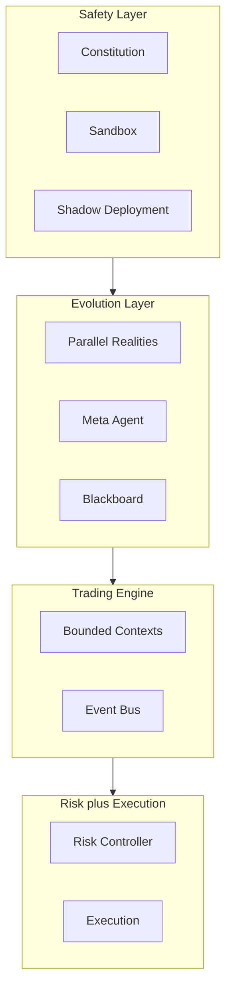

**Leesrichting:** veiligheid en observability gaan **voor** evolutie; de trading engine coördineert domeinen via events; risk en execution zijn de laatste poorten naar de markt.

---

## 3. Bounded Contexts Overzicht

LUMINA gebruikt **bounded contexts** als domeingrenzen onder `lumina_core/` (zie [ADR 0001](adr/0001-bounded-contexts-central-event-bus.md)). Context-overstijgende signalen lopen waar mogelijk via de centrale **Event Bus** — niet via onbeperkte cross-imports.

| Context | Verantwoordelijkheid | Primaire paden | Opmerking |
|---------|---------------------|----------------|-----------|
| **Safety** | Constitutionele principes, sandboxed uitvoering, promotion gates | [`lumina_core/safety/`](../lumina_core/safety/) | Fail-closed; REAL strengst |
| **Evolution** | DNA, orchestratie, shadow runs, fitness | [`lumina_core/evolution/`](../lumina_core/evolution/) | SIM kan agressiever; REAL vereist shadow + approval waar van toepassing |
| **Trading Engine** | Kern trading: engine, marktdata, operaties, valuation | [`lumina_core/trading_engine/`](../lumina_core/trading_engine/), [`lumina_core/engine/`](../lumina_core/engine/) | `engine/` is composition root + compat-laag; nieuwe domeinlogica gaat naar bounded contexts |
| **Risk Management** | Risk gates, allocatie, Kelly-achtige begrenzing | [`lumina_core/risk/`](../lumina_core/risk/) | Via mixins/engine geïntegreerd; canoniek onder `risk/` |
| **Agent Orchestration** | Event bus, engine↔blackboard bindingen | [`lumina_core/agent_orchestration/`](../lumina_core/agent_orchestration/) | Pub/sub en bindings centraliseren |

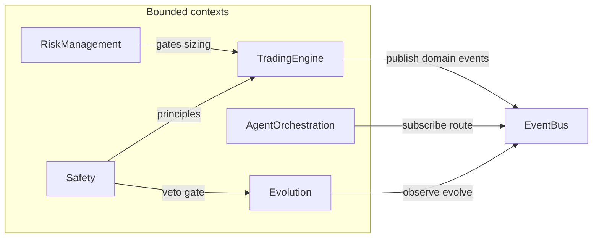

### 3.1 Evolution-laag componenten

`lumina_core/evolution/evolution_orchestrator.py` is nu een dunne compatibiliteitslaag. De implementatie is opgesplitst in losse eenheden met expliciete contracts zodat mutation, fitness en promotion afzonderlijk getest kunnen worden.

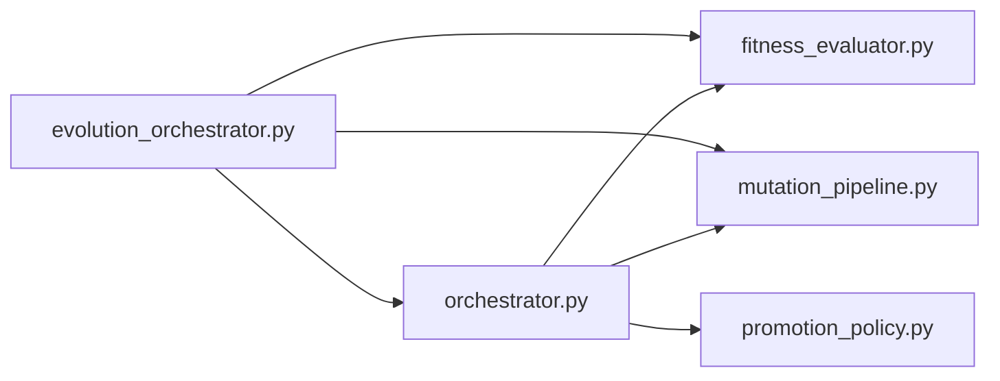

- `orchestrator.py` bewaart een backward-compatible exportlaag voor bestaande imports.
- `orchestrator_core.py` bevat `EvolutionOrchestrator` + generation-coordinatie en runtime wiring.
- `fitness_evaluator.py` bevat deterministische score- en seedlogica voor kandidaten.
- `mutation_pipeline.py` bevat candidate-generatie + bootstrap via een protocolgestuurde pipeline.
- `promotion_policy.py` bevat shadow-run policy, veto-window checks en promotion-statusafhandeling.
- `evolution_orchestrator.py` blijft import-stabiel voor bestaande callers en test monkeypatches.

### 3.2 Self-evolution meta-agent componenten

`lumina_core/engine/self_evolution_meta_agent.py` is nu een dunne compatibiliteitslaag. De implementatie is opgesplitst in losse modules zodat proposal-generatie, anomaliedetectie en auditlogica apart testbaar zijn.

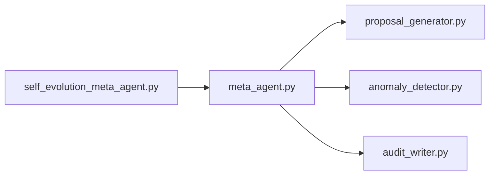

- `meta_agent.py` bewaart een backward-compatible exportlaag voor bestaande imports.
- `meta_agent_core.py` houdt de `SelfEvolutionMetaAgent` orchestratie en runtime flow.
- `proposal_generator.py` bevat challenger/genetic candidate-opbouw en DNA-registratie.
- `anomaly_detector.py` bevat drift/acceptance meta-review en auto-fine-tune triggers.
- `audit_writer.py` beheert append-only hash-chained evolution logging en decision-log forwarding.
- `self_evolution_meta_agent.py` bewaart backward-compatible imports voor bestaande callers en tests.

### 3.3 Dashboard componenten

`lumina_core/engine/dashboard_service.py` is nu een dunne compatibiliteitslaag. De implementatie is opgesplitst zodat metrics-verzameling, state-visualisatie en Dash-admin endpoints afzonderlijk testbaar zijn.

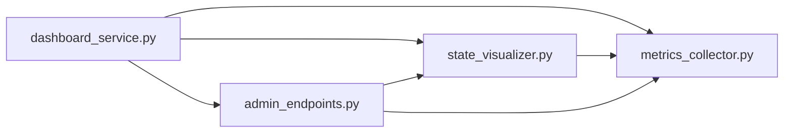

- `dashboard_service.py` bewaart de publieke en protected API als delegatie/proxy-laag.
- `metrics_collector.py` bevat performance-samenvattingen, heatmap-opbouw en blackboard health metingen.
- `state_visualizer.py` bevat figuur/panel-opbouw voor swarm, inference, parity, blackboard trend en drawdown.
- `admin_endpoints.py` bewaart een backward-compatible exportlaag.
- `admin_endpoints_core.py` bevat Dash-layout, callbacks en dashboard runtime-start.

### 3.4 Trading engine service split

`lumina_core/engine/lumina_engine.py` is verder opgesplitst naar een dunnere orchestrator. De engine beheert nu vooral service-compositie en delegatie; state-serialisatie, runtime-counters en snapshot-opbouw zijn uit de kernklasse gehaald.

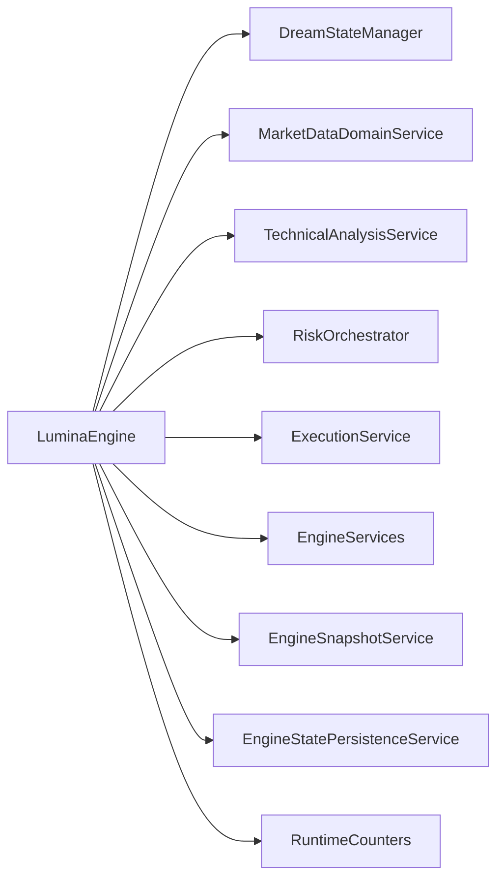

- `DreamStateManager` beheert dream snapshots + event-bus publicatie.
- `MarketDataDomainService` biedt price-action/candle helpers op `MarketDataManager` (optioneel alias `MarketDataService` in `market_data_domain_service.py` voor oude imports).
- `TechnicalAnalysisService` bevat regime/structure/confluence/significance logica.
- `RiskOrchestrator` beheert risk-policy, hard controller, final arbitration en Kelly sizing, met canonieke owner in `lumina_core/risk/orchestration.py` en een compatibele re-export in `lumina_core/engine/risk_orchestrator.py`.
- `ExecutionService` routeert RL-signalen naar blackboard of dream state fallback.
- `EngineSnapshotService` bouwt deterministische state-snapshots (`build_state_contexts` + `serialize_state_snapshot`).
- `EngineStatePersistenceService` beheert `hydrate_from_legacy`, `save_state`, `load_state`.
- `RuntimeCounters` is de owner van operationele counters (`cost_tracker`, rate-limit backoff, dashboard throttling).
- `EngineServices` is een typed registry voor optionele runtime-handles die door de container worden ingespoten.
- `engine_state_facade.py` installeert compacte property-proxies op `LuminaEngine` voor state/service compatibiliteit, zodat de engine dun blijft zonder brede API-breaks.
- `LuminaEngine` blijft nu onder de 350 regels en fungeert als orchestrator in plaats van god-object.
- Legacy app-delegatie via `LuminaEngine.__getattr__/__setattr__` is verwijderd; callsites gebruiken nu expliciete engine-velden of `engine.app`.
- Websocket/historische ingest blijft `MarketDataIngestService` in `market_data_service.py`; domeinhelpers blijven `MarketDataDomainService` in `market_data_domain_service.py`.

**Importrichtlijn (nieuwe code)**

1. Live feeds, REST bars, gap recovery of tape → importeer `MarketDataIngestService` uit `lumina_core.engine.market_data_service`.
2. PA-summary en candle-pattern helpers op engine-marktdata → importeer `MarketDataDomainService` uit `lumina_core.engine.market_data_domain_service` (niet de ingest-service).
3. Alleen als je een brede engine-export nodig hebt → `from lumina_core.engine import MarketDataIngestService, MarketDataDomainService` en kies expliciet; vermijd verwarrende korte namen tenzij je `MarketDataService` als alias voor de domain-laag gebruikt (legacy-compat).

### 3.4.1 Resterende overlap en ownership-plan

De overlap tussen `engine/` en bounded contexts is nu via typed ports afgebakend. Ownership per capability is:

- **Risk ownership**: `lumina_core/risk/` is canoniek voor riskbeslissingen, policy, arbitratie en sizing (`RiskOrchestrator`, `FinalArbitration`, `HardRiskController`, `SessionGuard`, `RegimeDetector`, mode capabilities).
- **Safety ownership**: constitutionele veto/promotion-gates blijven in `lumina_core/safety/`; `engine/` mag safety alleen aanroepen, niet dupliceren.
- **Evolution ownership**: mutatie-, fitness- en promotion-policy en meta-agent lifecycle blijven in `lumina_core/evolution/`.
- **Audit ownership**: decision/audit logging, replay-validatie en hash-chain transparantie blijven in `lumina_core/audit/`.
- **Broker ownership**: broker bridge contracten en order-submit backends blijven in `lumina_core/broker/`.
- **Reasoning ownership**: LLM reasoning, policy gateway en contracthandhaving blijven in `lumina_core/reasoning/`.
- **Orchestration ownership**: typed event contracts en pub/sub-flow blijven in `lumina_core/agent_orchestration/`; engine-blackboard bindingen zijn adapters, niet domeinlogica.

### 3.4.2 EngineServicePorts (hexagonal ownership registry)

`LuminaEngine` krijgt een typed service registry (`services_ports`) als canonical ownership-map:

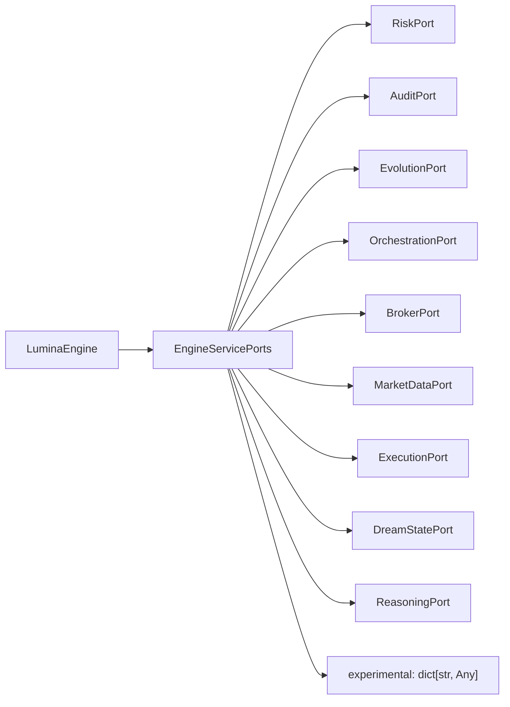

- `EngineServicePorts` gebruikt Pydantic v2 met `extra="forbid"` zodat onbekende servicevelden fail-closed worden geweigerd.
- Iedere port is `@runtime_checkable`, zodat runtime `isinstance` contractvalidatie mogelijk is voor container-wiring.
- `experimental` bewaart expliciete ruimte voor emergent lagen zonder `LuminaEngine` API-expansie.
- De legacy service-facade blijft tijdelijk aanwezig voor migratie, maar nieuwe code gebruikt primair `engine.services_ports`.

### 3.5 State manager component

`lumina_core/state/state_manager.py` centraliseert de kritieke evolutie-state writes zodat JSONL en SQLite ook bij multi-process workloads consistent blijven.

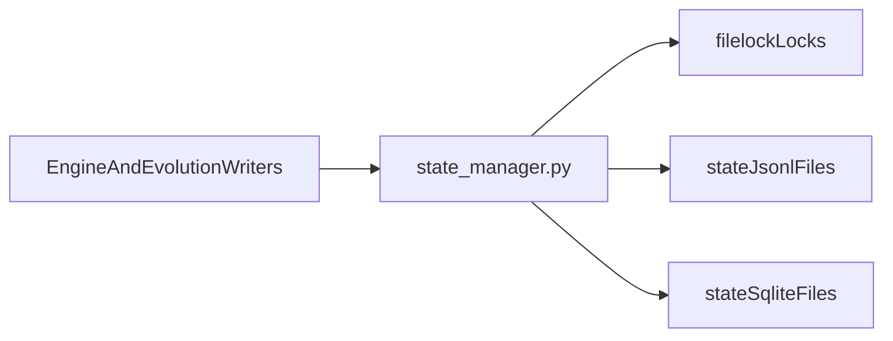

- `safe_append_jsonl(...)` doet atomische append met lock, retry/backoff en optionele hash-chain (`prev_hash` + `entry_hash`).
- `safe_sqlite_connect(...)` forceert WAL + busy timeout voor veilige concurrente writes.
- `safe_with_file_lock(...)` ondersteunt geavanceerde write-transacties (zoals decision-log hash herberekening binnen dezelfde lock scope).
- Lockbestanden staan onder `state/.locks/` (of `LUMINA_STATE_LOCK_DIR`) en worden niet gecommit.

---

## 4. Event Bus & Blackboard Flow

Een typische **trade decision** loopt eerst door **constitutionele** en **shadow**-logica waar van toepassing; daarna wordt status en context **gepubliceerd** zodat subscribers (risk, evolution, blackboard) kunnen reageren zonder alles synchroon aan elkaar te koppelen.

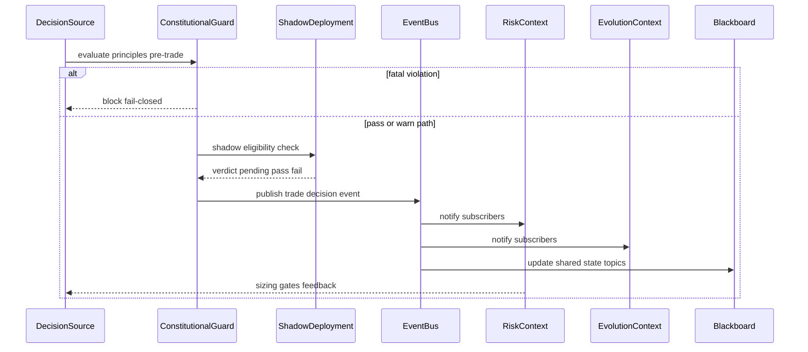

> Dit diagram is **conceptueel**: exacte methodenamen en topics staan in code ([`event_bus.py`](../lumina_core/agent_orchestration/event_bus.py), [`engine_bindings.py`](../lumina_core/agent_orchestration/engine_bindings.py)).

### 4.0 Channel ownership (Blackboard versus EventBus)

| Stroom | Kanaal | Contract |
|--------|--------|----------|
| Trade intent, **execution aggregate** (pre-dream consensus), risk verdict, final arbitration result, constitution audit (samenvatting), shadow verdict, promotion decision | **EventBus** | `CRITICAL_EVENT_BUS_TOPICS` in [`schemas.py`](../lumina_core/agent_orchestration/schemas.py): strikt `extra="forbid"`; registry-model is leidend (geen zwakkere `payload_model`-override); op kritieke topics gooit `publish_validated` bij validatiefout **`ValidationError` door** (fail-closed, REAL-veilig). |
| Agent proposals, market/tape context voor agents, meta-reflectie en overige meta-blackboard topics | **Blackboard** | Flexibele Pydantic-modellen (`extra="allow"` waar gedocumenteerd) zodat agent- en meta-lagen emergent kunnen blijven. |

Het canonieke execution-snapshot-topic is **`trading_engine.execution.aggregate`** (`TradingEngineExecutionAggregate`). Het vroegere blackboard-topic **`execution.aggregate` is verwijderd** als primair pad (één dominante bron per onderwerp).

### 4.1 Typed topics (Event Bus & Blackboard)

Om schema-drift te beperken gebruiken Event Bus en Blackboard Pydantic contracten uit [`schemas.py`](../lumina_core/agent_orchestration/schemas.py).

**Event Bus topics:**
- `trading_engine.trade_signal.emitted` -> `TradeIntent`
- `trading_engine.execution.aggregate` -> `TradingEngineExecutionAggregate`
- `trading_engine.dream_state.updated` -> `DreamStateEventPayload`
- `risk.policy.decision` -> `RiskVerdict`
- `risk.final_arbitration.result` -> `FinalArbitrationResult`
- `evolution.proposal.created` -> `EvolutionProposal`
- `evolution.shadow.verdict` -> `ShadowResult`
- `evolution.promotion.decision` -> `EvolutionPromotionDecision`
- `safety.constitution.violation` -> `ConstitutionViolation`
- `safety.constitution.audit` -> `ConstitutionAudit`
- `meta.agent.reflection` -> `AgentReflection`
- `meta.agent.thought` -> `MetaAgentThought`
- `meta.community.knowledge` -> `CommunityKnowledgeSnippet`
- `inference.llm.decision_context` -> `LLMDecisionContext`

**Blackboard topics:**
- `agent.rl.proposal`, `agent.news.proposal`, `agent.emotional_twin.proposal`, `agent.swarm.proposal`, `agent.tape.proposal`, `agent.swarm.snapshot` -> `AgentProposalPayload`
- `market.tape` -> `MarketTapePayload`
- `meta.reflection` -> `AgentReflection`
- `meta.hyperparameters` -> `MetaHyperparametersPayload`
- `meta.retraining` -> `MetaRetrainingPayload`
- `meta.bible_update` -> `MetaBibleUpdatePayload`
- `meta.evolution_result` -> `MetaEvolutionResultPayload`
- `meta.dna_lineage` -> `MetaDnaLineagePayload`
- `agent.meta.proposal` -> `AgentMetaProposalPayload`

**Validatiegedrag en migratiepad:**
- Voor geregistreerde Event Bus- en Blackboard-topics wordt validatie afgedwongen via het topic-registry, ook zonder expliciete `payload_model`.
- **Kritieke EventBus-topics** (`CRITICAL_EVENT_BUS_TOPICS`): `TradeIntent`, `TradingEngineExecutionAggregate`, `RiskVerdict`, `FinalArbitrationResult`, `ConstitutionAudit`, `ShadowResult`, `EvolutionPromotionDecision` — strikt `extra="forbid"`; `publish` gebruikt altijd het registry-model; `publish_validated` **re-raised** `ValidationError` (geen stille `None`).
- Tier B (flexibel, `extra="allow"`): o.a. `EvolutionProposal`, `DreamState`, `MetaAgentThought`, `CommunityKnowledgeSnippet`, `LLMDecisionContext`, `ConstitutionViolation`, plus blackboard/meta-contracten.
- `publish_validated(...)` op **niet-kritieke** geregistreerde topics: bij schemafout nog steeds `None` (legacy soft pad voor experimentele topics).
- Niet-geregistreerde EventBus-topics: backward-compatible legacy dict payloads.

**Roadmap contractstriktheid vs. experimenteerruimte:**
- Fase 1 (huidig): Tier A strict voor REAL-veiligheid; Tier B flexibel zodat emergent agent- en LLM-gedrag kan blijven ontstaan zonder execution-rand te versoepelen.
- Fase 2: blackboard/meta payloads incrementeel aanscherpen met expliciete veldinventarisatie per topic.
- Fase 3: `ConstitutionViolation` uitbreiden met first-class velden (zoals `dna_hash`) en daarna naar striktere contractmodus.
- Fase 4: dream-state keys stapsgewijs expliciet modelleren; daarna beslissing via ADR over `extra="forbid"` op dream-topic.

---

## 5. Data Flow Example — Volledige trade cyclus

Van tick tot order: **data in**, **checks**, **leren observeren**, **risico**, **uitvoering**.

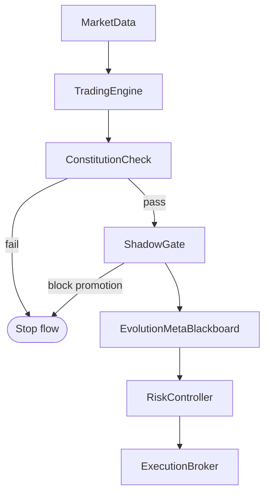

**Interpretatie:** als een stap **faalt**, gaat het organisme **fail-closed** — liever geen trade dan een ongeteste promotie of een risico dat de Noordster schendt.

### 5.1 Final order arbitration

Voor orderuitvoering gebruikt Lumina nu een expliciete **laatste gate**:

- `RiskPolicy.get_effective_policy(mode, instrument)` is de centrale resolver voor risk-limieten.
- Overlay-volgorde is nu strikt: `base (risk_controller) -> mode_overlay (sim/real/paper/sim_real_guard) -> instrument_overlay (risk_instrument_overrides)`.
- Voor config hot-reload zonder procesrestart wordt `ConfigLoader.invalidate()` gebruikt vóór de volgende policy-resolutie.
- `FinalArbitration` valideert elke orderintentie op constitution + risk policy + live account state.
- In REAL mode wordt live account state gevoed via `EquitySnapshotProvider` (`lumina_core/risk/equity_snapshot.py`) met een harde max-cache van 30 seconden.
- Zonder verse broker-equity/margin snapshot draait de gate fail-closed: geen risk-increasing orderintenties richting broker.
- Deze check draait vóór broker submit in zowel engine- als brokerpaden, zodat geen agent-route de risicogrens kan omzeilen.

### 5.2 AdmissionChain — beschermer van het organisme

Pre-trade toelating loopt nu canoniek via [`lumina_core/risk/admission_chain.py`](../lumina_core/risk/admission_chain.py), aangeroepen vanuit [`lumina_core/order_gatekeeper.py`](../lumina_core/order_gatekeeper.py).

- De keten blijft modulair (`AdmissionChain(steps=...)`), zodat nieuwe experimentele lagen als extra stap kunnen worden ingeplugd zonder de kernchecks te herschrijven.
- De canonieke volgorde is: `SessionGuard+EquitySnapshot(sync) -> RiskPolicy+VaR/ES/MC -> FinalArbitration -> Constitution -> AuditWrite`.
- Deze keten beschermt het levende organisme met een vaste volgorde: eerst markttoegang en account-context syncen, dan risicodruk meten, dan arbitreren, daarna constitutioneel toetsen, en pas als laatste audit-write committen.
- Pre-chain hygiene (stale contract + broker metadata/control-plane checks) blijft in de gatekeeper-entrypoint, zodat contractvalidatie nooit kan wegvallen bij experimentele stapvarianten.
- In **SIM/PAPER** zijn experimentele bypasses toegestaan via expliciete stapconfiguratie; elke bypass wordt gelogd met mode/step/symbol voor transparantie.
- In **REAL** zijn experimentele bypasses fail-closed verboden.

---

## 6. Technische Principes

- **Fail-closed design** — Onzekerheid, exceptions of ontbrekende checks leiden tot **blokkeren** en audit, niet tot stille acceptatie (zie ook [AGI_SAFETY.md](AGI_SAFETY.md)).
- **Event-driven communicatie** — Domeinen publiceren en subscriben via [`EventBus` / `DomainEvent`](../lumina_core/agent_orchestration/event_bus.py); zo blijven grenzen scherp en uitbreidingen testbaar.
- **Dependency Injection via ApplicationContainer** — [`ApplicationContainer`](../lumina_core/container.py) is het bootstrap-object: services en wiring zijn expliciet i.p.v. verborgen global state. In de promotion flow wiret de container de canonieke `EventBus` **en** `market_data_service` naar `EvolutionOrchestrator` (`bind_promotion_event_bus`, `bind_market_data_service`), en [`SelfEvolutionMetaAgent`](../lumina_core/engine/meta_agent_core.py) herbindt die dependencies expliciet vóór iedere multi-generation cycle. Hierdoor publiceert `PromotionPolicy` constitution-violation events deterministisch zonder impliciete runtime lookups.
- **ADR-gedreven ontwikkeling** — Belangrijke keuzes staan in [`docs/adr/`](adr/README.md); wijzigingen aan grenzen of contracts gaan samen met een ADR.

---

## 7. Links

### Documentatie

- **ADR-index:** [docs/adr/README.md](adr/README.md)
- **AGI Safety (drie lagen):** [docs/AGI_SAFETY.md](AGI_SAFETY.md)

### Belangrijkste modules in `lumina_core/`

| Module / gebied | Pad |
|-----------------|-----|
| DI bootstrap | [`lumina_core/container.py`](../lumina_core/container.py) |
| Event Bus | [`lumina_core/agent_orchestration/event_bus.py`](../lumina_core/agent_orchestration/event_bus.py) |
| Blackboard | [`lumina_core/engine/agent_blackboard.py`](../lumina_core/engine/agent_blackboard.py) |
| Engine bindings | [`lumina_core/agent_orchestration/engine_bindings.py`](../lumina_core/agent_orchestration/engine_bindings.py) |
| Trading context | [`lumina_core/trading_engine/`](../lumina_core/trading_engine/) |
| Centrale engine | [`lumina_core/engine/lumina_engine.py`](../lumina_core/engine/lumina_engine.py) |
| Engine services registry | [`lumina_core/trading_engine/engine_services.py`](../lumina_core/trading_engine/engine_services.py) |
| Engine state facade | [`lumina_core/trading_engine/engine_state_facade.py`](../lumina_core/trading_engine/engine_state_facade.py) |
| Engine snapshot service | [`lumina_core/trading_engine/engine_snapshot.py`](../lumina_core/trading_engine/engine_snapshot.py) |
| Engine persistence service | [`lumina_core/trading_engine/engine_state_persistence.py`](../lumina_core/trading_engine/engine_state_persistence.py) |
| Risk | [`lumina_core/risk/`](../lumina_core/risk/) |
| Evolution | [`lumina_core/evolution/`](../lumina_core/evolution/) |
| Evolution orchestrator (compat) | [`lumina_core/evolution/orchestrator.py`](../lumina_core/evolution/orchestrator.py) |
| Evolution orchestrator core | [`lumina_core/evolution/orchestrator_core.py`](../lumina_core/evolution/orchestrator_core.py) |
| Evolution fitness evaluator | [`lumina_core/evolution/fitness_evaluator.py`](../lumina_core/evolution/fitness_evaluator.py) |
| Evolution mutation pipeline | [`lumina_core/evolution/mutation_pipeline.py`](../lumina_core/evolution/mutation_pipeline.py) |
| Evolution promotion policy | [`lumina_core/evolution/promotion_policy.py`](../lumina_core/evolution/promotion_policy.py) |
| Self-evolution meta agent (compat) | [`lumina_core/engine/meta_agent.py`](../lumina_core/engine/meta_agent.py) |
| Self-evolution meta agent core | [`lumina_core/engine/meta_agent_core.py`](../lumina_core/engine/meta_agent_core.py) |
| Self-evolution proposal generator | [`lumina_core/engine/proposal_generator.py`](../lumina_core/engine/proposal_generator.py) |
| Self-evolution anomaly detector | [`lumina_core/engine/anomaly_detector.py`](../lumina_core/engine/anomaly_detector.py) |
| Self-evolution audit writer | [`lumina_core/engine/audit_writer.py`](../lumina_core/engine/audit_writer.py) |
| Dashboard service (split) | [`lumina_core/engine/dashboard_service.py`](../lumina_core/engine/dashboard_service.py) |
| Dashboard metrics collector | [`lumina_core/engine/metrics_collector.py`](../lumina_core/engine/metrics_collector.py) |
| Dashboard state visualizer | [`lumina_core/engine/state_visualizer.py`](../lumina_core/engine/state_visualizer.py) |
| Dashboard admin endpoints (compat) | [`lumina_core/engine/admin_endpoints.py`](../lumina_core/engine/admin_endpoints.py) |
| Dashboard admin endpoints core | [`lumina_core/engine/admin_endpoints_core.py`](../lumina_core/engine/admin_endpoints_core.py) |
| Runtime counters | [`lumina_core/monitoring/runtime_counters.py`](../lumina_core/monitoring/runtime_counters.py) |
| State manager | [`lumina_core/state/state_manager.py`](../lumina_core/state/state_manager.py) |
| Safety | [`lumina_core/safety/`](../lumina_core/safety/) |

### Cost model calibration en reality gap

LUMINA kalibreert execution-cost aannames dagelijks op basis van gereconcilieerde fills. Zo blijven risk-inschattingen aligned met live marktfrictie in plaats van statisch op paper-aannames.

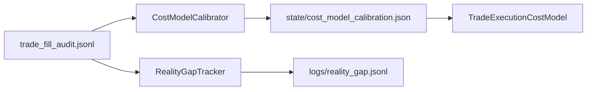

- [`lumina_core/risk/cost_model_calibrator.py`](../lumina_core/risk/cost_model_calibrator.py) vergelijkt per `reconciled` event `model_cost` versus `real_fill_cost` en schrijft running bias-statistiek naar `state/cost_model_calibration.json`.
- [`lumina_core/risk/cost_model.py`](../lumina_core/risk/cost_model.py) past de bias toe via `apply_calibration()` (ticks-bias + optionele sigma-update).
- [`lumina_core/monitoring/reality_gap_tracker.py`](../lumina_core/monitoring/reality_gap_tracker.py) meet dagelijks de gap tussen live fills en baseline-metrics, en appendt records naar `logs/reality_gap.jsonl`.
- [`scripts/validation/run_cost_model_calibration.py`](../scripts/validation/run_cost_model_calibration.py) is de dagelijkse validation-entrypoint voor beide stappen.

**V1-beperkingen (expliciet):**
- Reconciler-audit bevat nog geen ATR-snapshot of directe `model_cost`; de calibrator gebruikt daarom een expliciete ATR-fallback.
- De kostenvergelijking is een conservatieve exit-leg proxy (slippage + commissie) en geen volledige trade-TCA.

---

## Golden Ledger Path + Broker-Confirmed Fills as Single Source of Truth

**Financiële waarheid** (positie, gerealiseerde PnL, risk-state die daarop leunt) komt **uitsluitend** uit **broker-bevestigde fills** (REST/WS fills live, `PaperBroker`-fills in paper, synthetische fill-records in sim/backtest die door dezelfde ledger-functie lopen). Geen `expected_pnl`, chart-snapshot exits of latency-modellen in dat pad.

- **Canonieke formule + façade**: [`lumina_core/engine/golden_ledger.py`](../lumina_core/engine/golden_ledger.py) — `fills → commissies (fill-velden) → realized PnL`. [`EconomicPnLService`](../lumina_core/engine/economic_pnl_service.py) delegeert hiernaartoe en weigert RL-keys (`training_reward`) op economische payloads. [`ValuationEngine`](../lumina_core/engine/valuation_engine.py) blijft de rekenmachine (ticks, point value, `pnl_dollars`) zodra **prijzen commissies uit fills** komen.
- **Trade reconciler**: [`TradeReconciler`](../lumina_core/engine/trade_reconciler.py) finaliseert economische events **alleen** bij een gematchte broker-fill; timeouts zonder fill → **observability-only** audit (`reconciliation_no_broker_fill`), geen league-push met snapshot-PnL.
- **Paper / runtime supervisor**: [`runtime_workers`](../lumina_core/runtime_workers.py) synct `sim_position_qty` / entry uit [`PaperBroker`](../lumina_core/broker/broker_bridge.py) (`get_positions`, `last_fill_for_symbol`); sluiten gebeurt met **close-orders** + `EconomicPnLService.round_turn_realized_usd_from_broker_fills`. [`OperationsService`](../lumina_core/engine/operations_service.py) zet `live_position_qty` / `last_entry_price` van **order-/fill-resultaat**, niet van geschatte entry. [`trade_workers.reflect_on_trade`](../lumina_core/trade_workers.py) geeft `PnlProvenance` door naar de risk-controller (REAL: alleen `broker_reconciled`).
- **Pending state**: `pending_trade_reconciliations` en snapshot-velden blijven beschikbaar voor **observability** en promotie-gates; [`EconomicTruth`](../lumina_core/engine/economic_truth.py) versioneert gemengde bronnen met expliciete namen (`runtime_pnl_history_close_sum_usd`, `reconciliation_pending_expected_pnl_observability`, enz.) — geen claim dat die keys broker-economische waarheid zijn.
- **RL (training-laag)**: canoniek [`lumina_core/rl/`](../lumina_core/rl/); Meta-RL variant [`engine/rl/rl_trading_environment.py`](../lumina_core/engine/rl/rl_trading_environment.py). `info` bevat `rl_close_accounting_net_usd` (model/sim sluiting, **geen** broker `economic_pnl`) en `training_reward` (shaping); de Gym-`reward` is uitsluitend train-signaal. [`ppo_trainer.evaluate_policy_zip_rollouts`](../lumina_core/ppo_trainer.py) rapporteert `shadow_total_training_reward` (som van Gym-stappen), expliciet **geen** broker-PnL.

---

*LUMINA v5 — gebouwd voor **extreme intellectual honesty**, **rigoureuze testing** en **radicale creativiteit** binnen harde veiligheidsgrenzen.*
