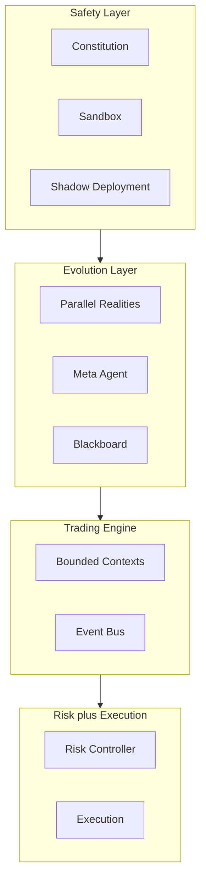
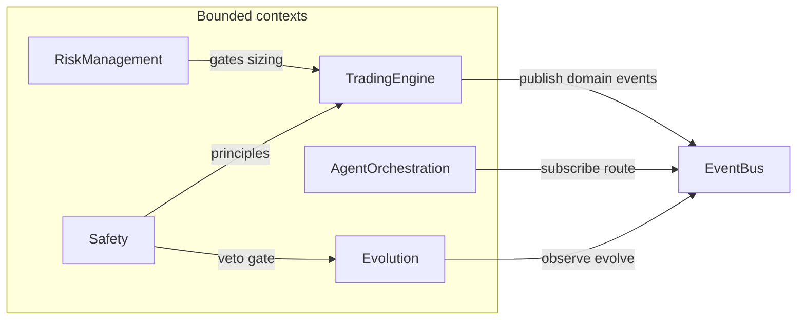
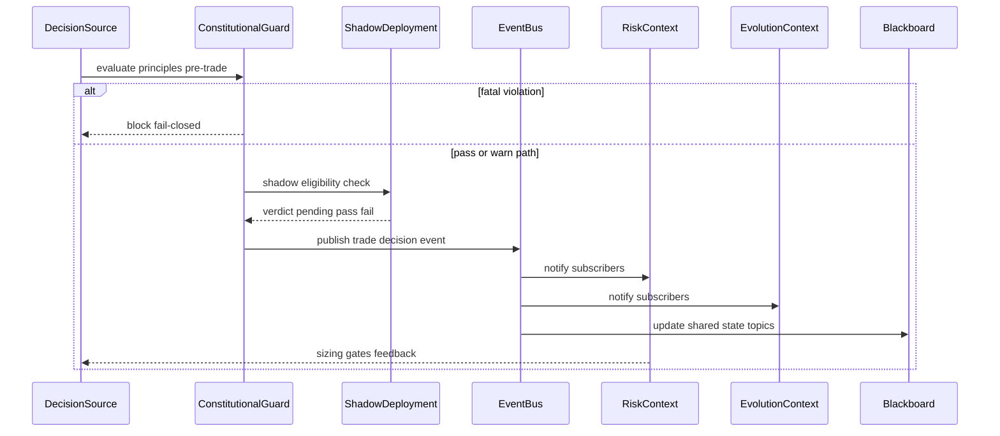

# LUMINA — Architecture Overview

> **Mission-aligned.** Dit document beschrijft hoe Lumina als systeem is opgebouwd: een **levend organisme** dat leert, muteert en handelt — met harde veiligheidsgrenzen voordat echte kapitaalstromen worden geraakt.

---

## 1. Inleiding

LUMINA is geen statische rule-set: het is een **zelflerend, zelf-evoluerend** trading-organisme dat op NinjaTrader draait en continu probeert te behoren tot de **1%** die structureel overleeft — niet door geluk, maar door architectuur.

Drie principes vormen het ruggengraat:

| Principe | Wat het betekent in Lumina |
|----------|------------------------------|
| **Safety First** | In **REAL** mode is kapitaalbehoud heilig: mutaties, promoties en orders gaan door constitutionele checks, sandboxing en shadow gates voordat ze live impact krijgen. In **SIM/PAPER** mag het organisme radicaal experimenteren binnen fysieke grenzen. |
| **Self-Evolving** | DNA-mutaties, parallel realities en meta-agents laten het systeem zich aanpassen — maar **niet** zonder de safety-laag en observeerbare feedback (metrics, audit, blackboard). |
| **Intellectual Honesty** | Geen optimisme over backtests of risico: beslissingen zijn traceerbaar, principes zijn machine-enforced waar mogelijk, en architectuurkeuzes worden **ADR-gedreven** vastgelegd. |

Samengevat: Lumina **ademt** marktdata in, **denkt** via engine en agents, **muteert** in evolution — en **sluit** af als iets de Noordster bedreigt.

---

## 2. High-Level Architecture

De stack is bewust **top-down**: eerst wat het systeem **niet** mag breken, dan hoe het **leren** gebeurt, dan **handelen** en **risico** aan de onderkant.

**Leesrichting:** veiligheid en observability gaan **voor** evolutie; de trading engine coördineert domeinen via events; risk en execution zijn de laatste poorten naar de markt.

---

## 3. Bounded Contexts Overzicht

LUMINA gebruikt **bounded contexts** als domeingrenzen onder `lumina_core/` (zie [ADR 0001](adr/0001-bounded-contexts-central-event-bus.md)). Context-overstijgende signalen lopen waar mogelijk via de centrale **Event Bus** — niet via onbeperkte cross-imports.

| Context | Verantwoordelijkheid | Primaire paden | Opmerking |
|---------|---------------------|----------------|-----------|
| **Safety** | Constitutionele principes, sandboxed uitvoering, promotion gates | [`lumina_core/safety/`](../lumina_core/safety/) | Fail-closed; REAL strengst |
| **Evolution** | DNA, orchestratie, shadow runs, fitness | [`lumina_core/evolution/`](../lumina_core/evolution/) | SIM kan agressiever; REAL vereist shadow + approval waar van toepassing |
| **Trading Engine** | Kern trading: engine, marktdata, operaties, valuation | [`lumina_core/trading_engine/`](../lumina_core/trading_engine/), [`lumina_core/engine/`](../lumina_core/engine/) | `engine/` bevat nog veel legacy surface; migratie is geleidelijk |
| **Risk Management** | Risk gates, allocatie, Kelly-achtige begrenzing | [`lumina_core/risk/`](../lumina_core/risk/) | Via mixins/engine geïntegreerd; canoniek onder `risk/` |
| **Agent Orchestration** | Event bus, engine↔blackboard bindingen | [`lumina_core/agent_orchestration/`](../lumina_core/agent_orchestration/) | Pub/sub en bindings centraliseren |

---

## 4. Event Bus & Blackboard Flow

Een typische **trade decision** loopt eerst door **constitutionele** en **shadow**-logica waar van toepassing; daarna wordt status en context **gepubliceerd** zodat subscribers (risk, evolution, blackboard) kunnen reageren zonder alles synchroon aan elkaar te koppelen.

> Dit diagram is **conceptueel**: exacte methodenamen en topics staan in code ([`event_bus.py`](../lumina_core/agent_orchestration/event_bus.py), [`engine_bindings.py`](../lumina_core/agent_orchestration/engine_bindings.py)).

### 4.1 Event Bus payload contracts

Om schema-drift te beperken gebruikt de centrale Event Bus typed payload-contracten op geselecteerde kritieke topics. Validatie gebeurt fail-closed op publish-pad voor deze topics.

**Typed topics (Pydantic contracten):**
- `trading_engine.trade_signal.emitted` -> `TradeSignal`
- `trading_engine.dream_state.updated` -> `TradeSignal`
- `risk.policy.decision` -> `RiskDecision`
- `evolution.proposal.created` -> `EvolutionProposal`
- `evolution.shadow.verdict` -> `ShadowVerdict`
- `safety.constitution.violation` -> `ConstitutionViolation`
- `meta.agent.reflection` -> `AgentReflection`

**Legacy topics (nog zonder hard contract):**
- Niet-geregistreerde topics blijven legacy dict-payloads accepteren via `EventBus.publish(...)`.
- Dit houdt migraties backward-compatible voor bestaande producers en subscribers.

**Migratieregel:**
- Nieuwe safety-, risk- of execution-kritieke topics krijgen direct een Pydantic payload-contract in `event_bus.py`.
- `publish_validated(...)` blijft het fail-closed compatibiliteitspad voor topic-gebaseerde validatie.

---

## 5. Data Flow Example — Volledige trade cyclus

Van tick tot order: **data in**, **checks**, **leren observeren**, **risico**, **uitvoering**.

**Interpretatie:** als een stap **faalt**, gaat het organisme **fail-closed** — liever geen trade dan een ongeteste promotie of een risico dat de Noordster schendt.

### 5.1 Final order arbitration

Voor orderuitvoering gebruikt Lumina nu een expliciete **laatste gate**:

- `RiskPolicy` laadt mode-aware limieten uit `config.yaml` met prioriteit `mode-overlay -> risk_controller -> defaults`.
- `FinalArbitration` valideert elke orderintentie op constitution + risk policy + live account state.
- Deze check draait vóór broker submit in zowel engine- als brokerpaden, zodat geen agent-route de risicogrens kan omzeilen.

---

## 6. Technische Principes

- **Fail-closed design** — Onzekerheid, exceptions of ontbrekende checks leiden tot **blokkeren** en audit, niet tot stille acceptatie (zie ook [AGI_SAFETY.md](AGI_SAFETY.md)).
- **Event-driven communicatie** — Domeinen publiceren en subscriben via [`EventBus` / `DomainEvent`](../lumina_core/agent_orchestration/event_bus.py); zo blijven grenzen scherp en uitbreidingen testbaar.
- **Dependency Injection via ApplicationContainer** — [`ApplicationContainer`](../lumina_core/container.py) is het bootstrap-object: services en wiring zijn expliciet i.p.v. verborgen global state.
- **ADR-gedreven ontwikkeling** — Belangrijke keuzes staan in [`docs/adr/`](adr/README.md); wijzigingen aan grenzen of contracts gaan samen met een ADR.

---

## 7. Links

### Documentatie

- **ADR-index:** [docs/adr/README.md](adr/README.md)
- **AGI Safety (drie lagen):** [docs/AGI_SAFETY.md](AGI_SAFETY.md)

### Belangrijkste modules in `lumina_core/`

| Module / gebied | Pad |
|-----------------|-----|
| DI bootstrap | [`lumina_core/container.py`](../lumina_core/container.py) |
| Event Bus | [`lumina_core/agent_orchestration/event_bus.py`](../lumina_core/agent_orchestration/event_bus.py) |
| Blackboard | [`lumina_core/engine/agent_blackboard.py`](../lumina_core/engine/agent_blackboard.py) |
| Engine bindings | [`lumina_core/agent_orchestration/engine_bindings.py`](../lumina_core/agent_orchestration/engine_bindings.py) |
| Trading context | [`lumina_core/trading_engine/`](../lumina_core/trading_engine/) |
| Centrale engine | [`lumina_core/engine/lumina_engine.py`](../lumina_core/engine/lumina_engine.py) |
| Risk | [`lumina_core/risk/`](../lumina_core/risk/) |
| Evolution | [`lumina_core/evolution/`](../lumina_core/evolution/) |
| Safety | [`lumina_core/safety/`](../lumina_core/safety/) |

---

*LUMINA v5 — gebouwd voor **extreme intellectual honesty**, **rigoureuze testing** en **radicale creativiteit** binnen harde veiligheidsgrenzen.*
