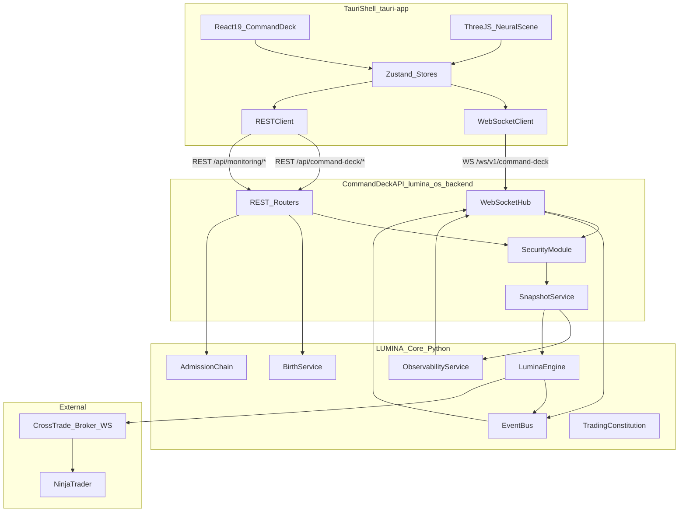
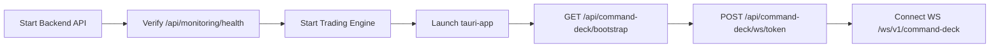
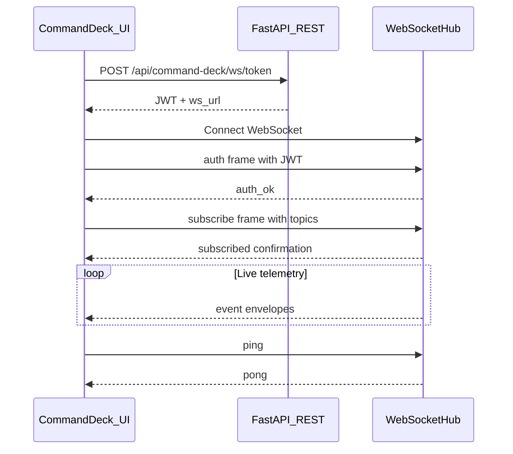
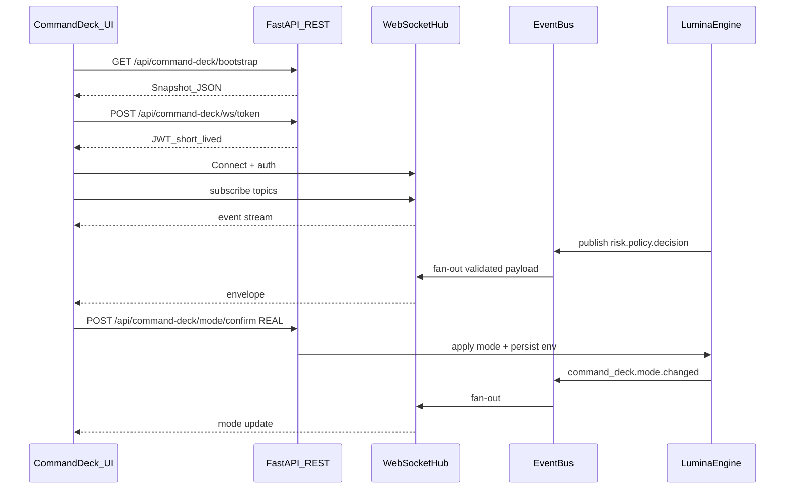
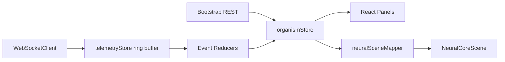
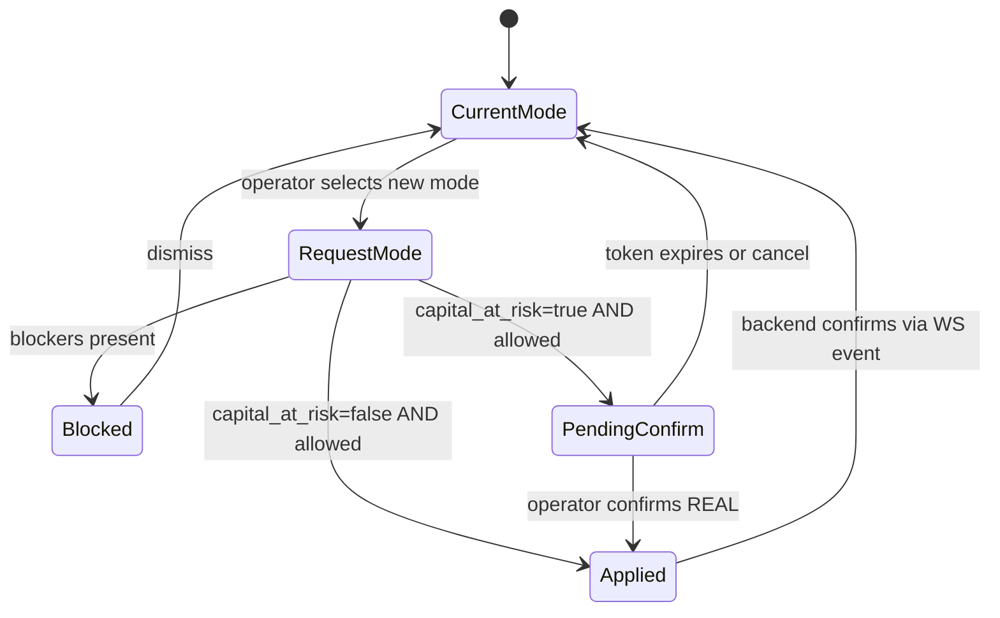

# LUMINA Neural Command Deck — Architecture Specification

> **Version:** 1.0  
> **Status:** Draft — greenfield specification  
> **Scope:** Brand-new native desktop UI (`tauri-app/`) for the LUMINA trading organism  
> **Audience:** Frontend engineers, backend engineers, operators, security reviewers

---

## Table of Contents

1. [Executive Summary](#1-executive-summary)
2. [High-Level Architecture](#2-high-level-architecture)
3. [Process Topology and Deployment](#3-process-topology-and-deployment)
4. [REST API Contract](#4-rest-api-contract)
5. [WebSocket API Contract](#5-websocket-api-contract)
6. [Data Flow: Python Backend ↔ Tauri Frontend](#6-data-flow-python-backend--tauri-frontend)
7. [Mode Handling (SIM vs REAL)](#7-mode-handling-sim-vs-real)
8. [Security and Fail-Closed Principles](#8-security-and-fail-closed-principles)
9. [`tauri-app/` Folder Structure](#9-tauri-app-folder-structure)
10. [Implementation Phases](#10-implementation-phases)
11. [Related Documents](#11-related-documents)

---

## 1. Executive Summary

The **LUMINA Neural Command Deck** (internally: **The Core**) is a brand-new, native desktop trading organism interface. It replaces nothing — it is a greenfield product built from scratch to give operators a **spaceship-cockpit** experience over the LUMINA engine.

### Goals

| Goal | Description |
|------|-------------|
| **Native performance** | Desktop shell via Tauri v2; no browser tab dependency in production |
| **Live organism visibility** | Real-time telemetry from the Event Bus, risk chain, and intelligence layer |
| **Capital safety** | Fail-closed UX: REAL mode requires explicit confirmation; constitution violations block actions |
| **Visual identity** | Three.js neural core scene reacts to organism health, mode, and intelligence tier |

### Technology Stack

| Layer | Technology |
|-------|------------|
| Desktop shell | **Tauri v2** (Rust) |
| UI framework | **React 19** + **TypeScript** |
| Build tool | **Vite** |
| 3D visualization | **Three.js** via **React Three Fiber (R3F)** |
| Client state | **Zustand** + **TanStack Query** |
| Backend | **FastAPI** (Python) in `lumina_os/backend/` |
| Trading engine | **lumina_core** (Python) |

### Repository Layout

```
NinjaTraderAI_Bot/
├── lumina_core/          # Trading organism (engine, risk, safety, evolution)
├── lumina_os/backend/    # FastAPI Command Deck API layer (REST + WebSocket)
├── tauri-app/            # NEW — Neural Command Deck (this document's frontend)
└── docs/
    └── lumina-core-architecture.md   # This file
```

### Architectural Decision Record

**REST for commands and bootstrap snapshots; WebSocket for live organism telemetry.**

The Tauri frontend never connects to the broker (CrossTrade) or NinjaTrader directly. All market interaction flows through the Python engine and its admission chain.

---

## 2. High-Level Architecture

### 2.1 System Diagram



### 2.2 Layer Responsibilities

| Layer | Location | Responsibility |
|-------|----------|----------------|
| **Presentation** | `tauri-app/src/` | Cockpit UI, Three.js scene, operator interactions |
| **Command Deck API** | `lumina_os/backend/` | Auth, REST snapshots, WebSocket fan-out, mode persistence |
| **Trading Organism** | `lumina_core/` | Engine, Event Bus, risk admission, constitution, evolution |
| **External** | CrossTrade / NinjaTrader | Broker connectivity (engine-only) |

### 2.3 Backend Modules (to be added)

| Module | Path | Purpose |
|--------|------|---------|
| Command Deck REST router | `lumina_os/backend/command_deck_endpoints.py` | `/api/command-deck/*` namespace |
| WebSocket hub | `lumina_os/backend/command_deck_ws.py` | Event Bus → authenticated client fan-out |
| Snapshot aggregator | `lumina_os/backend/command_deck_snapshot.py` | Bootstrap and periodic snapshot assembly |

These modules integrate with existing infrastructure:

- [`lumina_core/security.py`](../lumina_core/security.py) — authentication, rate limiting, JWT
- [`lumina_core/engine/mode_capabilities.py`](../lumina_core/engine/mode_capabilities.py) — mode matrix
- [`lumina_core/agent_orchestration/schemas.py`](../lumina_core/agent_orchestration/schemas.py) — typed Event Bus payloads
- [`lumina_os/backend/monitoring_endpoints.py`](../lumina_os/backend/monitoring_endpoints.py) — existing metrics surface

---

## 3. Process Topology and Deployment

### 3.1 Runtime Processes

| Process | Command | Default Bind | Role |
|---------|---------|--------------|------|
| Backend API | `python -m uvicorn backend.app:app --host 127.0.0.1 --port 8000` | `127.0.0.1:8000` | REST + WebSocket hub |
| Trading engine | Started via backend or headless entrypoint | In-process or worker | Organism runtime |
| Command Deck (dev) | `npm run tauri dev` in `tauri-app/` | `localhost:1420` (Vite) | Native UI shell |
| Command Deck (prod) | `npm run tauri build` → `.exe` / `.app` | N/A (embedded assets) | Packaged desktop app |

### 3.2 Startup Order



1. Backend API must be reachable before the Tauri app connects.
2. Engine may start independently; bootstrap reports engine lifecycle state.
3. Command Deck calls `GET /api/setup/onboarding` on cold start — **`app_surface`** selects Setup, Birth, or Deck (see [command-deck-startup-runbook.md](command-deck-startup-runbook.md)).
4. Command Deck connects REST first (bootstrap), then WebSocket (live stream).

### 3.3 Environment Variables

| Variable | Default | Purpose |
|----------|---------|---------|
| `LUMINA_BACKEND_URL` | `http://127.0.0.1:8000` | Base URL for REST and WebSocket |
| `LUMINA_ADMIN_API_KEY` | — | Admin API key → `X-API-Key` header |
| `LUMINA_BACKEND_API_KEY` | — | Read-only API key (fallback) |
| `LUMINA_MODE` / `TRADE_MODE` | `sim` | Runtime trade mode |
| `BROKER_BACKEND` | `paper` | `paper` or `live` |
| `ENABLE_SIM_REAL_GUARD` | `false` | Feature flag for `sim_real_guard` mode |
| `LUMINA_EXTRA_CORS_ORIGINS` | — | Comma-separated Tauri origins |
| `LUMINA_CONFIG` | `config.yaml` | Path to main config file |

### 3.4 CORS Configuration for Tauri

Add Tauri dev and production origins to [`config.yaml`](../config.yaml) `security.cors_allowed_origins` or via `LUMINA_EXTRA_CORS_ORIGINS`:

```
http://localhost:1420
http://127.0.0.1:1420
http://tauri.localhost
tauri://localhost
```

Wildcard `*` is forbidden by the security module.

---

## 4. REST API Contract

REST endpoints are organized in three tiers: **existing (reuse)**, **new Command Deck namespace**, and **admin emergency**.

All authenticated requests use the `X-API-Key` header (configurable via `security.api_key_header` in config). Admin-only routes require a key with `role: admin`.

### 4.1 Existing Endpoints (Reuse As-Is)

The Command Deck consumes these endpoints from the current FastAPI backend without redesign.

#### Monitoring — `/api/monitoring`

| Method | Path | Auth | Response | Purpose |
|--------|------|------|----------|---------|
| GET | `/api/monitoring/health` | Public | JSON health object | Liveness probe |
| GET | `/api/monitoring/metrics` | Public | Prometheus text | Scraper metrics |
| GET | `/api/monitoring/metrics/json` | API key | Full metrics snapshot | Dashboard metrics |
| GET | `/api/monitoring/metrics/history` | API key | `[{ ts, value }]` | Metric time series |
| GET | `/api/monitoring/regime/history` | API key | Regime flip rows | Regime transitions |
| GET | `/api/monitoring/adaptive-intelligence/latest` | API key | Intelligence state | Current tier + health |
| GET | `/api/monitoring/adaptive-intelligence/history` | API key | Transition log | Tier change history |

#### Birth — `/api/birth`

| Method | Path | Auth | Purpose |
|--------|------|------|---------|
| GET | `/api/birth/status` | Public | Birth phase progress |
| POST | `/api/birth/start` | Public | Start birth/training phase |
| POST | `/api/birth/stop` | Public | Stop birth phase |

Query parameters for `POST /api/birth/start`:

| Param | Type | Default | Description |
|-------|------|---------|-------------|
| `target_trades` | int | — | Target trade count |
| `force` | bool | false | Force restart |
| `practice_mode` | bool | false | Practice mode flag |
| `explicit_user_start` | bool | false | User-initiated start |
| `continue_training` | bool | false | Continue existing training |

#### Evolution — `/api/evolution`

| Method | Path | Auth | Purpose |
|--------|------|------|---------|
| GET | `/api/evolution/proposals` | API key | List pending mutation proposals |
| POST | `/api/evolution/approve` | Admin | Approve a proposal |
| POST | `/api/evolution/reject` | Admin | Reject a proposal |

#### Emergency and Orders — root paths

| Method | Path | Auth | Purpose |
|--------|------|------|---------|
| POST | `/orders/emergency-stop` | Admin | Activate kill switch |
| POST | `/orders/flatten` | Admin | Flatten all open positions |
| POST | `/orders/cancel-all` | Admin | Cancel all working orders |
| GET | `/reconciliation-status` | API key | Fill reconciliation status |

### 4.2 New Command Deck Namespace — `/api/command-deck/*`

These endpoints are **new** and will be implemented in `lumina_os/backend/command_deck_endpoints.py`.

#### Bootstrap and System

| Method | Path | Auth | Purpose |
|--------|------|------|---------|
| GET | `/api/command-deck/bootstrap` | API key | Single-shot initial UI state |
| GET | `/api/command-deck/system/status` | API key | Engine lifecycle state |
| POST | `/api/command-deck/system/start` | Admin | Start engine (respects birth gate) |
| POST | `/api/command-deck/system/stop` | Admin | Graceful engine stop |
| POST | `/api/command-deck/ws/token` | API key | Issue short-lived JWT for WebSocket |

#### Mode Management

| Method | Path | Auth | Purpose |
|--------|------|------|---------|
| GET | `/api/command-deck/mode` | API key | Current mode + capabilities |
| POST | `/api/command-deck/mode/request` | Admin | Request mode change |
| POST | `/api/command-deck/mode/confirm` | Admin | Confirm REAL transition |

#### Risk, Constitution, Positions

| Method | Path | Auth | Purpose |
|--------|------|------|---------|
| GET | `/api/command-deck/risk/snapshot` | API key | VaR/ES, drawdown, daily PnL |
| GET | `/api/command-deck/constitution/status` | API key | Constitution audit state |
| GET | `/api/command-deck/positions` | API key | Open positions + exposure |
| GET | `/api/command-deck/orders/open` | API key | Working orders |
| GET | `/api/command-deck/agents/blackboard/snapshot` | API key | Latest blackboard topics |

### 4.3 Bootstrap Response Schema

`GET /api/command-deck/bootstrap` returns a single JSON document that hydrates the entire UI on first load.

```json
{
  "schema_version": "1.0",
  "ts": 1716123456.789,
  "mode": {
    "current": "sim",
    "broker_backend": "live",
    "capabilities": {
      "requires_live_broker": true,
      "risk_enforced": false,
      "session_guard_enforced": true,
      "eod_force_close_enabled": false,
      "is_learning_mode": true,
      "capital_at_risk": false,
      "account_mode_hint": "sim"
    }
  },
  "health": {
    "status": "healthy",
    "uptime_s": 3600.5,
    "kill_switch_active": false,
    "websocket_connected": true,
    "issues": []
  },
  "intelligence": {
    "tier": "standard",
    "tier_label": "Tier 2 — Standard",
    "health": "ok",
    "model_name": "qwen2.5:14b",
    "gpu_available": false
  },
  "birth": {
    "phase": "complete",
    "progress_pct": 100,
    "target_trades": 500,
    "trades_completed": 500
  },
  "risk": {
    "daily_pnl_usd": 42.50,
    "var_95_usd": null,
    "var_99_usd": null,
    "es_95_usd": null,
    "mc_drawdown_pct": null,
    "session_guard_active": true,
    "last_arbitration": "approved"
  },
  "constitution": {
    "violations_open": 0,
    "last_audit_ok": true,
    "last_audit_ts": 1716123400.0
  },
  "regime": {
    "current_regime": "normal",
    "regime_confidence": 0.82,
    "fast_path_weight": 0.65
  },
  "operator": {
    "role": "admin",
    "api_key_name": "launcher-admin"
  }
}
```

Field semantics:

- `mode.capabilities` mirrors [`ModeCapabilities`](../lumina_core/engine/mode_capabilities.py) dataclass fields exactly.
- `health.status` is one of: `healthy`, `degraded`, `critical`, `unknown`.
- `intelligence.tier` is one of: `light`, `standard`, `high` (see [AdaptiveIntelligenceManager.md](../AdaptiveIntelligenceManager.md)).
- `birth.phase` gates mode selector: disabled until `complete`.

### 4.4 Mode Request and Confirm Contract

Mode changes use a two-step flow for modes where `capital_at_risk=true` (REAL).

#### Step 1: Request

```
POST /api/command-deck/mode/request
Content-Type: application/json
X-API-Key: <admin-key>

{
  "target_mode": "real"
}
```

Response (allowed):

```json
{
  "allowed": true,
  "requires_confirmation": true,
  "pending_token": "eyJ...",
  "expires_at": 1716127056.789,
  "blockers": [],
  "checklist": [
    "Birth phase complete",
    "Broker backend is live",
    "CrossTrade token configured",
    "No open constitution violations"
  ]
}
```

Response (blocked):

```json
{
  "allowed": false,
  "requires_confirmation": false,
  "pending_token": null,
  "blockers": [
    { "code": "BIRTH_INCOMPLETE", "message": "Birth phase is not complete" },
    { "code": "CONSTITUTION_VIOLATION", "message": "2 open constitution violations" }
  ]
}
```

#### Step 2: Confirm (REAL only)

```
POST /api/command-deck/mode/confirm
Content-Type: application/json
X-API-Key: <admin-key>

{
  "pending_token": "eyJ...",
  "operator_ack": "REAL",
  "target_mode": "real"
}
```

On success:

1. Backend writes `TRADE_MODE=real`, `LUMINA_MODE=real`, `BROKER_BACKEND=live` to `.env`.
2. Backend emits `command_deck.mode.changed` on WebSocket.
3. Response: `{ "success": true, "mode": "real", "ts": 1716123456.789 }`.

For modes where `capital_at_risk=false` (`paper`, `sim`, `sim_real_guard`), Step 2 is skipped — `POST /mode/request` applies immediately when `allowed=true`.

### 4.5 WebSocket Token Endpoint

```
POST /api/command-deck/ws/token
X-API-Key: <api-key>
```

Response:

```json
{
  "token": "eyJ...",
  "expires_in_s": 300,
  "ws_url": "ws://127.0.0.1:8000/ws/v1/command-deck"
}
```

The JWT is signed with `security.jwt_secret_key` from config. Token lifetime: 5 minutes (configurable). Production builds must use first-frame auth, not query-string tokens.

### 4.6 HTTP Error Codes

| Code | Meaning | UI Behavior |
|------|---------|-------------|
| 401 | Missing or invalid API key | Show auth configuration panel |
| 403 | Insufficient role (non-admin) | Hide admin controls |
| 409 | Mode change conflict (engine running) | Show conflict modal |
| 422 | Validation error (invalid mode) | Show field errors |
| 503 | Engine or service unavailable | Degraded banner + retry |

---

## 5. WebSocket API Contract

All WebSocket endpoints are **new**. No WebSocket HTTP upgrade routes exist in the current backend.

### 5.1 Endpoints

| Endpoint | Auth | Purpose |
|----------|------|---------|
| `WS /ws/v1/command-deck` | JWT (first frame or query param in dev) | Primary multiplexed event stream |
| `WS /ws/v1/market-tape` | Same | Optional v2: high-frequency `market.tape` only |

### 5.2 Connection Lifecycle



1. Client obtains JWT via REST.
2. Client opens WebSocket to `/ws/v1/command-deck`.
3. Client sends auth frame within 5 seconds or connection closes with code `4401`.
4. Client sends subscribe frame with desired topics.
5. Server streams validated event envelopes.
6. Client sends ping every 30 seconds; server responds with pong.

### 5.3 Wire Protocol

#### Client → Server Frames

**Authentication** (required first frame):

```json
{
  "type": "auth",
  "token": "eyJ..."
}
```

**Subscribe:**

```json
{
  "type": "subscribe",
  "topics": [
    "risk.policy.decision",
    "inference.adaptive_intelligence.state",
    "safety.constitution.violation"
  ]
}
```

**Unsubscribe:**

```json
{
  "type": "unsubscribe",
  "topics": ["meta.agent.thought"]
}
```

**Ping:**

```json
{
  "type": "ping",
  "ts": 1716123456
}
```

#### Server → Client Envelopes

**Auth OK:**

```json
{
  "type": "auth_ok",
  "operator": { "role": "admin", "name": "launcher-admin" },
  "ts": 1716123456.789
}
```

**Subscribed:**

```json
{
  "type": "subscribed",
  "topics": ["risk.policy.decision", "inference.adaptive_intelligence.state"],
  "ts": 1716123456.789
}
```

**Event:**

```json
{
  "type": "event",
  "topic": "risk.policy.decision",
  "seq": 1042,
  "ts": 1716123456.789,
  "payload": {
    "decision": "allow",
    "reason_code": "within_limits",
    "var_95_usd": 850.0
  }
}
```

**Pong:**

```json
{
  "type": "pong",
  "ts": 1716123456
}
```

**Error:**

```json
{
  "type": "error",
  "code": "SCHEMA_VIOLATION",
  "message": "Critical topic payload failed validation",
  "topic": "risk.policy.decision",
  "ts": 1716123456.789
}
```

**Heartbeat** (server-initiated, every 15s):

```json
{
  "type": "heartbeat",
  "ts": 1716123456.789,
  "connected_clients": 1
}
```

### 5.4 Default Topic Subscriptions

Topics sourced from [`EVENT_BUS_TOPIC_MODELS`](../lumina_core/agent_orchestration/schemas.py):

| Topic | Payload Model | UI Consumer |
|-------|---------------|-------------|
| `inference.adaptive_intelligence.state` | `AdaptiveIntelligenceState` | Intelligence tier badge, Three.js glow |
| `risk.policy.decision` | `RiskVerdict` | Risk panel verdict strip |
| `risk.final_arbitration.result` | `FinalArbitrationResult` | Final arbitration indicator |
| `trading_engine.trade_signal.emitted` | `TradeIntent` | Signal feed ticker |
| `trading_engine.execution.aggregate` | `TradingEngineExecutionAggregate` | PnL / fill ticker |
| `trading_engine.dream_state.updated` | `DreamStateEventPayload` | Dream-state visualization |
| `safety.constitution.violation` | `ConstitutionViolation` | Full-screen red alert |
| `safety.constitution.audit` | `ConstitutionAudit` | Constitution health dot |
| `evolution.proposal.created` | `EvolutionProposal` | Evolution queue panel |
| `evolution.shadow.verdict` | `ShadowResult` | Shadow run status |
| `evolution.promotion.decision` | `EvolutionPromotionDecision` | Promotion gate indicator |
| `meta.agent.thought` | `MetaAgentThought` | Agent thought stream (rate-limited) |
| `meta.agent.reflection` | `AgentReflection` | Reflection panel |

Blackboard topics (optional subscribe, from `BLACKBOARD_TOPIC_MODELS`):

| Topic | UI Consumer |
|-------|-------------|
| `market.tape` | Price tape / chart overlay |
| `agent.swarm.snapshot` | Swarm agent panel |
| `agent.rl.proposal` | RL agent proposal feed |

### 5.5 Synthetic Command Deck Topics

Backend-generated topics (not raw Event Bus):

| Topic | Trigger | Payload |
|-------|---------|---------|
| `command_deck.mode.changed` | Mode confirm success | `{ from, to, operator, ts }` |
| `command_deck.system.status` | Engine start/stop | `{ status, uptime_s, ts }` |
| `command_deck.health.degraded` | Health check failure | `{ reason, issues, ts }` |
| `command_deck.ws.heartbeat` | Periodic | `{ ts, seq }` |

### 5.6 WebSocket Hub Implementation

Module: `lumina_os/backend/command_deck_ws.py`

Responsibilities:

1. Accept authenticated WebSocket connections.
2. Subscribe to Event Bus topics via internal listener.
3. Validate outbound payloads against Pydantic models for critical topics.
4. Fan-out validated envelopes to subscribed clients.
5. Rate-limit high-frequency topics (`meta.agent.thought`: max 10/s per client).
6. On critical schema violation: disconnect client (code `4403`), log audit event.

Connection limits:

- Max 10 concurrent WebSocket clients (configurable).
- Max 50 subscribed topics per client.
- Max message size: 64 KB.

### 5.7 Close Codes

| Code | Meaning |
|------|---------|
| 4401 | Authentication failed or expired |
| 4403 | Schema violation on critical topic |
| 4429 | Rate limit exceeded |
| 4500 | Internal server error |

---

## 6. Data Flow: Python Backend ↔ Tauri Frontend

### 6.1 Startup Sequence



### 6.2 Client-Side Data Pipeline



1. **Bootstrap** hydrates `organismStore` with authoritative snapshot.
2. **WebSocket events** append to `telemetryStore` ring buffer (max 1000 events).
3. **Event reducers** update derived state in `organismStore` (mode, risk, intelligence).
4. **React components** subscribe to store slices via Zustand selectors.
5. **neuralSceneMapper** converts store state to Three.js parameters (never reads raw events).

### 6.3 Polling Fallback

When WebSocket disconnects:

1. UI shows `DEGRADED` banner immediately.
2. Polls `GET /api/monitoring/metrics/json` every 5 seconds.
3. Polls `GET /api/command-deck/bootstrap` every 30 seconds for mode/risk refresh.
4. Attempts WebSocket reconnect with exponential backoff (1s, 2s, 4s, 8s, max 30s).
5. **Never** displays optimistic mode or order state — always reflects last confirmed backend snapshot.

### 6.4 Three.js Data Binding

File: `tauri-app/src/lib/neuralSceneMapper.ts`

Maps organism state to visual parameters:

| Input | Visual Parameter | Range |
|-------|------------------|-------|
| `intelligence.tier` | Particle count | light: 500, standard: 2000, high: 8000 |
| `intelligence.health` | Glow intensity | ok: 1.0, degraded: 0.5, error: 0.1 |
| `mode.capital_at_risk` | Border color | false: cyan, true: red |
| `health.status` | Pulse rate | healthy: 1.0 Hz, degraded: 0.3 Hz, critical: 0.1 Hz |
| `risk.daily_pnl_usd` | Core color temperature | negative: cool blue, positive: warm gold |
| `regime.current_regime` | Ring rotation speed | normal: 1x, high_risk: 3x |
| `constitution.violations_open > 0` | Alert overlay | pulsing red sphere |

Raw WebSocket events never pass directly to Three.js. The mapper runs on store state changes only.

---

## 7. Mode Handling (SIM vs REAL)

### 7.1 Mode Capability Matrix

Source: [`lumina_core/engine/mode_capabilities.py`](../lumina_core/engine/mode_capabilities.py)

| Mode | Broker | Risk Enforced | Session Guard | EOD Force Close | Capital at Risk | Learning |
|------|--------|---------------|---------------|-------------------|-----------------|----------|
| `paper` | paper (internal) | No | No | No | No | No |
| `sim` | live (demo) | No | Yes | No | No | Yes |
| `sim_real_guard` | live (demo) | Yes | Yes | Yes | No | No |
| `real` | live | Yes | Yes | Yes | **Yes** | No |

Mode resolution order:

1. `LUMINA_MODE` / `TRADE_MODE` environment variables
2. `config.yaml` top-level `mode:` key
3. Fallback: `paper` or inferred from `BROKER_BACKEND`

### 7.2 Command Deck Visual Treatment

| Mode | UI Label | Visual Treatment | Actions Allowed |
|------|----------|------------------|-----------------|
| `paper` | PAPER | Cool blue palette, low alert level | Full sim controls |
| `sim` | SIM / Learning | Green neural pulse animation | Birth, training, evolution approve |
| `sim_real_guard` | SIM·GUARD | Amber warning ring around core | REAL-equivalent gates, no capital badge |
| `real` | **REAL** | Red persistent border + capital-at-risk badge | Emergency stop always visible; mode switch requires confirm |

### 7.3 UI Fail-Closed Rules

| Rule | Enforcement |
|------|-------------|
| Admin controls hidden until verified | `bootstrap.operator.role === "admin"` |
| Mode selector disabled until birth complete | `bootstrap.birth.phase !== "complete"` |
| `sim_real_guard` requires feature flag | Backend returns blocker if `ENABLE_SIM_REAL_GUARD !== true` |
| UI never sends orders directly | All execution through engine admission chain |
| Displayed mode from backend only | localStorage is display cache, never authoritative |
| REAL confirm disabled when degraded | Telemetry stale > 10s → disable confirm button |
| Constitution violation blocks REAL | Open violations → full-screen modal, no dismiss without ack |

### 7.4 Admission Chain

Every order intent passes through the canonical gate sequence defined in [`lumina_core/order_gatekeeper.py`](../lumina_core/order_gatekeeper.py) and [`lumina_core/risk/admission_chain.py`](../lumina_core/risk/admission_chain.py):

```
session_equity_sync → risk_policy → final_arbitration → constitution → audit_write
```

Mode-aware behavior:

- **Session/equity**: Fresh equity snapshot required for `real`, `paper`, `sim_real_guard`.
- **Risk policy**: Hard stops when `ModeCapabilities.risk_enforced=true` (`sim_real_guard`, `real`).
- **FinalArbitration**: Mandatory for `real`, `paper`, `sim_real_guard`.
- **Constitution**: `TRADING_CONSTITUTION.audit()` on every order intent.
- **Audit write**: In REAL, failed audit log → trade blocked (fail-closed).

The Command Deck displays admission chain status but never bypasses it.

### 7.5 Mode Transition State Machine



---

## 8. Security and Fail-Closed Principles

Aligned with [`lumina_core/security.py`](../lumina_core/security.py) and the [Trading Constitution ADR](../docs/adr/ADR-001-constitutional-principles.md).

### 8.1 Authentication and Authorization

| Principle | Command Deck Behavior |
|-----------|----------------------|
| Fail-closed auth | Missing/invalid API key → HTTP 401; WS auth failure → close 4401 |
| No CORS wildcard | Tauri origins explicitly listed in config |
| Admin separation | Mode confirm, emergency stop, evolution approve require `admin` role |
| Rate limiting | Inherited from SecurityModule (60 req/min default, burst 10) |
| JWT for WebSocket | Short-lived (5 min); no API key in WS URL in production |
| Secret hygiene | API keys from env only; never bundled in Tauri binary |

### 8.2 Operational Safety

| Principle | Command Deck Behavior |
|-----------|----------------------|
| Constitution violations | `safety.constitution.violation` → full-screen modal, blocks REAL actions |
| Degraded telemetry | Stale snapshot > 10s → `DEGRADED` state, disables REAL confirm |
| Kill switch visibility | Emergency stop button always visible in REAL mode for admins |
| Audit trail | All mode changes and admin actions logged via audit logger |
| No optimistic UI | Never show state that hasn't been confirmed by backend |
| Schema validation | Critical WS topics validated against Pydantic models before delivery |

### 8.3 Tauri-Specific Hardening

**Content Security Policy** (`tauri-app/src-tauri/tauri.conf.json`):

```json
{
  "app": {
    "security": {
      "csp": "default-src 'self'; connect-src 'self' http://127.0.0.1:8000 ws://127.0.0.1:8000; script-src 'self'; style-src 'self' 'unsafe-inline'"
    }
  }
}
```

Production CSP uses environment-injected backend URL, not hardcoded localhost.

**Capabilities** (`tauri-app/src-tauri/capabilities/default.json`):

- Filesystem: read/write app config dir only
- Shell: disabled by default
- HTTP: allowed only to `LUMINA_BACKEND_URL`

**API Key Storage**:

- Development: `.env` file or environment variable injection
- Production: OS keychain via `@tauri-apps/plugin-stronghold` or Tauri secure storage
- Never commit API keys to source control

### 8.4 REAL Mode Additional Gates

Beyond UI confirmation, backend validates before applying REAL:

| Gate | Source |
|------|--------|
| Birth phase complete | BirthService |
| Broker backend is `live` | ConfigLoader |
| CrossTrade token present | Environment |
| No open constitution violations | TradingConstitution |
| FinalArbitration available | Engine init check |
| `ENABLE_SIM_REAL_GUARD` not required for REAL | Mode-specific |

---

## 9. `tauri-app/` Folder Structure

Greenfield project scaffold. No code copied from any existing frontend.

```
tauri-app/
├── package.json                      # Dependencies: react, three, @react-three/fiber, zustand, etc.
├── vite.config.ts                    # Vite + Tauri plugin config
├── tsconfig.json                     # Base TypeScript config
├── tsconfig.app.json                 # App-specific TS config
├── tsconfig.node.json                # Node/build TS config
├── index.html                        # HTML entry point
├── public/
│   └── fonts/                        # Cockpit typography (monospace + display)
├── src/
│   ├── main.tsx                      # React 19 entry point
│   ├── App.tsx                       # Root shell layout
│   ├── app/
│   │   ├── routes.tsx                # Route definitions
│   │   └── providers.tsx             # QueryClient, theme, backend config context
│   ├── components/
│   │   ├── cockpit/
│   │   │   ├── CockpitShell.tsx      # Main layout grid
│   │   │   ├── ModeSelector.tsx      # Mode switch with REAL confirm flow
│   │   │   ├── AlertOverlay.tsx      # Constitution violation modal
│   │   │   ├── StatusBar.tsx         # Health, uptime, connection status
│   │   │   └── DegradedBanner.tsx    # WS disconnect warning
│   │   ├── intelligence/
│   │   │   ├── IntelligenceTierBadge.tsx
│   │   │   ├── IntelligenceHealthDot.tsx
│   │   │   └── IntelligenceTierStatusCard.tsx
│   │   ├── risk/
│   │   │   ├── RiskPanel.tsx         # VaR/ES, drawdown display
│   │   │   ├── ArbitrationStrip.tsx  # Final arbitration indicator
│   │   │   ├── KillSwitchButton.tsx  # Emergency stop
│   │   │   └── PositionsTable.tsx    # Open positions
│   │   └── evolution/
│   │       ├── EvolutionQueue.tsx    # Pending proposals
│   │       └── ProposalCard.tsx      # Approve/reject actions
│   ├── scenes/
│   │   ├── NeuralCoreScene.tsx       # R3F Canvas root
│   │   ├── nodes/
│   │   │   ├── NeuralCore.tsx        # Central particle sphere
│   │   │   ├── RegimeRing.tsx        # Rotating regime indicator
│   │   │   └── AlertSphere.tsx       # Constitution violation pulse
│   │   └── materials/
│   │       ├── glowMaterial.ts       # Custom glow shader
│   │       └── pulseMaterial.ts      # Pulse animation shader
│   ├── hooks/
│   │   ├── useCommandDeckBootstrap.ts  # Bootstrap fetch + cache
│   │   ├── useCommandDeckSocket.ts     # WS connect, subscribe, reconnect
│   │   ├── useModeTransition.ts        # Mode request/confirm flow
│   │   └── useDegradedState.ts         # Stale telemetry detection
│   ├── stores/
│   │   ├── organismStore.ts          # Mode, health, intelligence, risk
│   │   ├── telemetryStore.ts         # WS event ring buffer
│   │   └── uiStore.ts               # Panel layout, alert state, sidebar
│   ├── lib/
│   │   ├── apiClient.ts             # REST client + X-API-Key header
│   │   ├── wsClient.ts              # WebSocket protocol implementation
│   │   ├── neuralSceneMapper.ts     # Store state → Three.js parameters
│   │   ├── modeCapabilities.ts      # Frontend mirror of backend mode matrix
│   │   └── types/
│   │       ├── bootstrap.ts         # Bootstrap response interfaces
│   │       ├── events.ts            # WS event envelope types
│   │       ├── mode.ts              # Mode and capabilities types
│   │       └── risk.ts              # Risk snapshot types
│   └── styles/
│       ├── cockpit.css              # CSS variables, glow tokens, grid layout
│       └── tokens.css               # Color palette, spacing, typography
└── src-tauri/
    ├── Cargo.toml                    # Rust dependencies
    ├── tauri.conf.json               # Tauri v2 app config
    ├── capabilities/
    │   └── default.json              # Permission capabilities
    ├── icons/                        # App icons (generated)
    └── src/
        ├── main.rs                   # Tauri entry point
        ├── lib.rs                    # Tauri commands library
        └── commands/
            ├── keychain.rs           # Secure API key storage
            └── logs.rs               # Open logs directory (optional)
```

### 9.1 Key Dependencies (package.json)

| Package | Purpose |
|---------|---------|
| `@tauri-apps/api` | Tauri v2 JS API |
| `react` / `react-dom` | UI framework (v19) |
| `three` / `@react-three/fiber` / `@react-three/drei` | 3D scene |
| `zustand` | Client state management |
| `@tanstack/react-query` | Server state / REST caching |
| `typescript` | Type safety |

### 9.2 Naming Conventions

| Context | Convention | Example |
|---------|------------|---------|
| React components | PascalCase | `ModeSelector.tsx` |
| Hooks | camelCase with `use` prefix | `useCommandDeckSocket.ts` |
| Stores | camelCase with `Store` suffix | `organismStore.ts` |
| Types | PascalCase interfaces | `BootstrapResponse` |
| CSS variables | `--cockpit-*` prefix | `--cockpit-glow-primary` |

### 9.3 Glass & Glow Taxonomy (max 3 levels)

| Layer | Class / token | Use |
|-------|---------------|-----|
| Surface | `.lumina-glass` | Official glass recipe: `backdrop-filter` + `--lumina-glass-border` + inset highlight only. No `bg-black/*` stacking. |
| Edge accent | `.lumina-glow-edge` / `--lumina-glow-edge` | HUD signal underlines, active tabs, status dots, interactive chrome hover |
| Halo | `.lumina-glow-halo` / `--lumina-glow-halo` | Living Core shell, Evolution Arena, Citadel core field |
| Ambient | `.lumina-glow-ambient` / `--lumina-glow-ambient` | `.cockpit-shell` background only — never on cards |
| Annex muted | `.lumina-surface-muted` | Ops/PPO inner sections — no blur, no glow |

Helpers: [`glassGlowTaxonomy.ts`](tauri-app/src/lib/glassGlowTaxonomy.ts) (`glassSurfaceClass`, `luminaGlowClass`).

**Rule:** glow levels are mutually exclusive per element; glass never carries outer glow by default.
| API paths | kebab-case | `/api/command-deck/risk/snapshot` |
| WS topics | dot-separated | `risk.policy.decision` |

---

## 10. Implementation Phases

| Phase | Scope | Deliverable |
|-------|-------|-------------|
| **0 — Scaffold** | Tauri v2 + React 19 + R3F empty scene | Runnable empty cockpit with neural core placeholder |
| **1 — REST Bootstrap** | Bootstrap endpoint + static cockpit layout | UI hydrates from `/api/command-deck/bootstrap` |
| **2 — WebSocket Live** | WS hub + intelligence/risk panels | Real-time tier badge, risk panel, event ticker |
| **3 — Mode Transition** | Mode request/confirm UX + REAL gate | Mode selector with two-step REAL confirmation |
| **4 — Neural Core** | Three.js reactive scene | Core visual responds to telemetry via scene mapper |
| **5 — Admin Controls** | Emergency stop, evolution approval | Kill switch, flatten, evolution queue |

Each phase ends with a verification run: `npm run tauri dev` with backend on `:8000`, zero console errors.

---

## 11. Related Documents

| Document | Path | Relevance |
|----------|------|-----------|
| LUMINA organism architecture | [docs/architecture.md](architecture.md) | Python core bounded contexts, Event Bus |
| Constitutional principles ADR | [docs/adr/ADR-001-constitutional-principles.md](adr/ADR-001-constitutional-principles.md) | Fail-closed safety rules |
| Event Bus contract ADR | [docs/adr/ADR-003-event-bus-contract.md](adr/ADR-003-event-bus-contract.md) | Typed event payloads |
| SIM/REAL operator card | [docs/OPERATOR_CARD_SIM_REAL_v52.md](OPERATOR_CARD_SIM_REAL_v52.md) | Operator procedures for mode switching |
| Adaptive Intelligence design | [AdaptiveIntelligenceManager.md](../AdaptiveIntelligenceManager.md) | Intelligence tier semantics |
| Mode capabilities source | [lumina_core/engine/mode_capabilities.py](../lumina_core/engine/mode_capabilities.py) | Authoritative mode matrix |
| Security module source | [lumina_core/security.py](../lumina_core/security.py) | Auth, rate limiting, JWT |
| Event Bus schemas | [lumina_core/agent_orchestration/schemas.py](../lumina_core/agent_orchestration/schemas.py) | Pydantic payload models |
| Admission chain source | [lumina_core/risk/admission_chain.py](../lumina_core/risk/admission_chain.py) | Pre-trade gate sequence |

---

*This document specifies the LUMINA Neural Command Deck as a greenfield system. Implementation begins with Phase 0 scaffolding in `tauri-app/`.*
