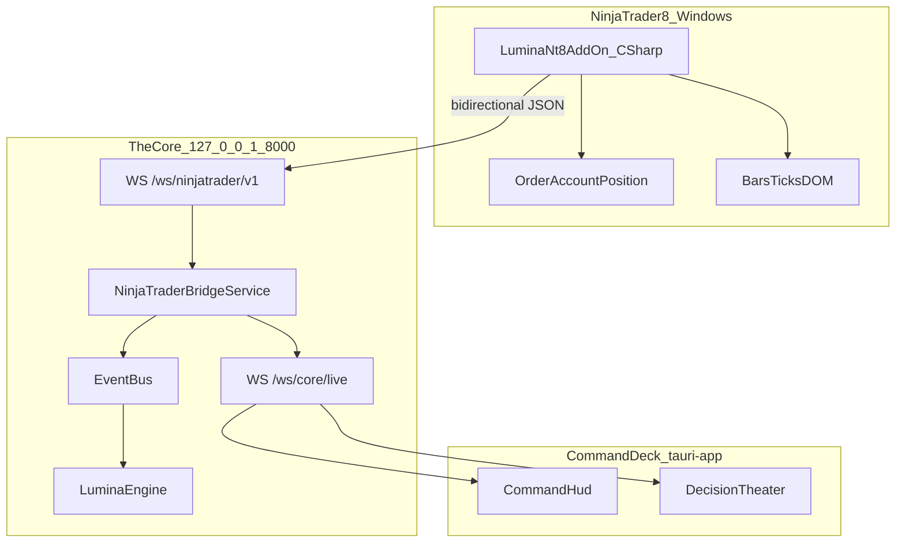
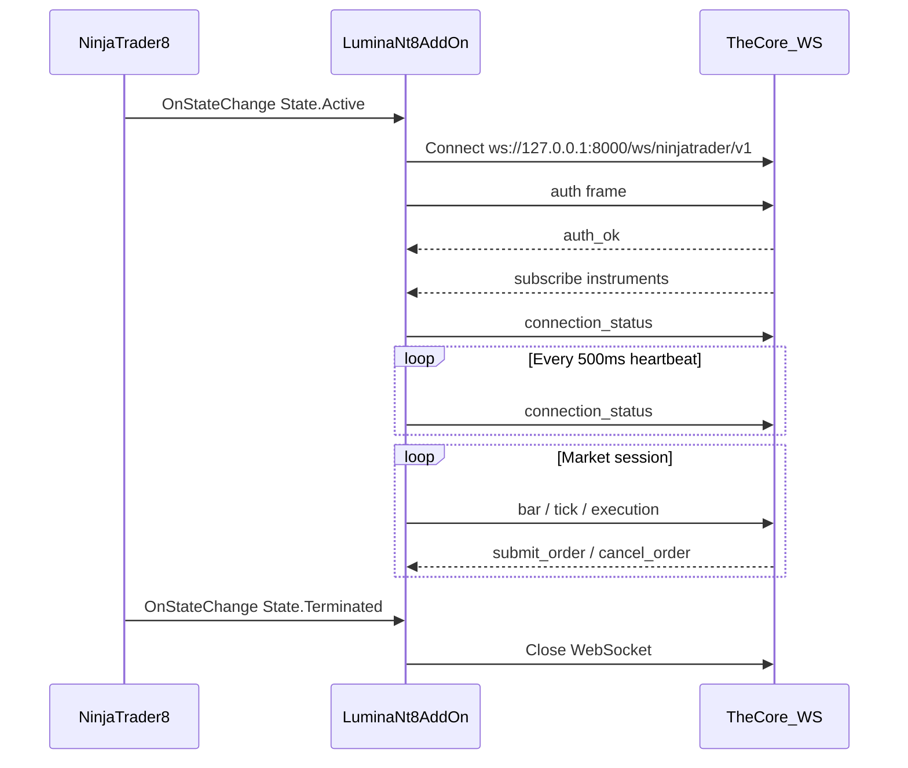

# NinjaTrader 8 Integration — Architecture & Implementation Plan

> **Version:** 0.1 (planned)  
> **Status:** Forward-looking specification — **not yet implemented**  
> **Scope:** Native NT8 Add-on communicating with LUMINA The Core over WebSocket  
> **Audience:** Backend engineers, NT8/C# developers, operators, security reviewers  
> **Companion:** [lumina-core-architecture.md](lumina-core-architecture.md), [lumina-core-api-contracts.md](lumina-core-api-contracts.md)

---

## Table of Contents

1. [Purpose and Scope](#1-purpose-and-scope)
2. [System Context](#2-system-context)
3. [NT8 Add-on Design (C#)](#3-nt8-add-on-design-c)
4. [WebSocket Endpoint — `/ws/ninjatrader/v1`](#4-websocket-endpoint--wsninjatraderv1)
5. [Core-Side Bridge Service](#5-core-side-bridge-service)
6. [Command Deck Telemetry](#6-command-deck-telemetry)
7. [Security and Constitution](#7-security-and-constitution)
8. [Phased Rollout](#8-phased-rollout)
9. [Testing Strategy](#9-testing-strategy)
10. [Configuration](#10-configuration)
11. [Migration from CrossTrade](#11-migration-from-crosstrade)
12. [Risks and Open Questions](#12-risks-and-open-questions)
13. [Related Documents](#13-related-documents)

---

## 1. Purpose and Scope

### 1.1 Goal

Build a **native NinjaTrader 8 Add-on** that acts as the execution and market-data bridge between NT8 and **The Core** — the Python trading organism (`lumina_core`) exposed via FastAPI (`lumina_os/backend`).

The Add-on connects **only to The Core**, never to the Tauri Command Deck directly. This preserves the architectural boundary defined in [lumina-core-architecture.md](lumina-core-architecture.md):

> *The Tauri frontend never connects to the broker (CrossTrade) or NinjaTrader directly. All market interaction flows through the Python engine and its admission chain.*

### 1.2 Current State (Today)

| Component | Role | Location |
|-----------|------|----------|
| **CrossTrade REST broker** | Order placement and account snapshots via HTTP | [`lumina_core/broker/broker_bridge.py`](../lumina_core/broker/broker_bridge.py) (`CrossTradeBroker`) |
| **Command Deck telemetry** | Aggregated organism state every 500 ms | [`lumina_os/backend/core_websocket.py`](../lumina_os/backend/core_websocket.py) — `WS /ws/core/live` |
| **Launch NinjaTrader button** | Opens NT8 executable from Command HUD | [`tauri-app/src/components/cockpit/LaunchNinjaTraderButton.tsx`](../tauri-app/src/components/cockpit/LaunchNinjaTraderButton.tsx) |
| **Decision Theater chart** | Placeholder — no live NT8 embed yet | [`tauri-app/src/components/DecisionTheater.tsx`](../tauri-app/src/components/DecisionTheater.tsx) |
| **NT8 Add-on (C#)** | Does not exist in this repository | — |

### 1.3 Target State

```
NinjaTrader 8 Add-on  ←→  WS /ws/ninjatrader/v1  ←→  NinjaTraderBridgeService
                                                          ↓
                                                     Event Bus
                                                          ↓
                                                     LuminaEngine
                                                          ↓
                                              WS /ws/core/live → Command Deck
```

CrossTrade remains an **optional fallback** during migration (`BROKER_BACKEND=crosstrade`). The native bridge becomes the preferred path for lower latency, direct fill reconciliation, and richer market-data telemetry.

---

## 2. System Context

### 2.1 Architecture Diagram



### 2.2 Data Flow Summary

| Direction | Content | Consumer |
|-----------|---------|----------|
| NT8 → Core | Connection status, account, positions, bars/ticks, order updates, executions | `NinjaTraderBridgeService`, Event Bus, engine |
| Core → NT8 | Subscribe/unsubscribe, submit/cancel orders, flatten | NT8 `OrderExecutor` |
| Core → Command Deck | Aggregated telemetry including NT8 connection health | `tauri-app` via `WS /ws/core/live` |

### 2.3 Process Topology

| Process | Default bind | Notes |
|---------|--------------|-------|
| Backend API | `127.0.0.1:8000` | Hosts both `/ws/core/live` and `/ws/ninjatrader/v1` |
| Trading engine | In-process or worker | Consumes Event Bus; drives order admission |
| NinjaTrader 8 | Local Windows desktop | Add-on auto-connects on NT startup when enabled |
| Command Deck | Tauri shell | Reads Core telemetry only |

---

## 3. NT8 Add-on Design (C#)

> **Status:** Planned — no C# source exists in the repository yet.

### 3.1 Proposed Project Layout

```
integrations/ninjatrader8/LuminaNt8AddOn/
├── LuminaNt8AddOn.csproj
├── AddOn.cs                    # AddOnBase entry point
├── LuminaWebSocketClient.cs    # WS connect, auth, reconnect, frame I/O
├── MarketDataPublisher.cs      # Bars, ticks, throttling
├── OrderExecutor.cs            # submit_order / cancel / flatten handlers
├── FrameModels.cs              # JSON DTOs matching Core schema
├── Config.cs                   # account, instruments, Core URL
└── README.md                   # Build + deploy instructions
```

### 3.2 NinjaTrader 8 Primitives

| NT8 API | Usage in Add-on |
|---------|-----------------|
| `AddOnBase` | Lifecycle: `OnStateChange`, enable/disable, cleanup |
| `Account` | Selected account from config; balance/equity snapshots |
| `Instrument` | Resolve symbols from Core `subscribe` frames |
| `Order` / `Execution` | Map Core `submit_order` to NT orders; emit fills |
| `OnBarUpdate` / `OnMarketData` | Publish throttled bar/tick frames |
| `Dispatcher.InvokeAsync` | Marshal WS callbacks onto NT UI thread |

### 3.3 Add-on Lifecycle



1. **Enable** — Operator enables Add-on in NT8 Control Center or via auto-enable flag in config.
2. **Connect** — Background thread opens WebSocket to Core; sends `auth` within 5 seconds.
3. **Handshake** — Receive `auth_ok`; Core sends initial `subscribe` for configured instruments.
4. **Publish** — Stream connection status, account snapshots, market data, order lifecycle events.
5. **Execute** — Handle inbound `submit_order`, `cancel_order`, `flatten` from Core.
6. **Reconnect** — Exponential backoff (1 s → 30 s cap); publish `connection_status: reconnecting` during gaps.
7. **Terminate** — Clean WS close on NT shutdown.

### 3.4 Deployment

1. Build Release `.dll` from `integrations/ninjatrader8/`.
2. Copy to `%USERPROFILE%\Documents\NinjaTrader 8\bin\Custom\AddOns\`.
3. Restart NinjaTrader 8 (or use NT8 Tools → Reload NinjaScript).
4. Enable **LUMINA NT8 Add-on** in Control Center → Add-ons.
5. Use **Launch NinjaTrader** in the Command HUD to open NT8; verify green connection indicator once Phase 1 is complete.

Environment variable `NINJATRADER8_PATH` (used by the Tauri launcher) points to `NinjaTrader.exe` — unrelated to Add-on path but part of the operator workflow.

---

## 4. WebSocket Endpoint — `/ws/ninjatrader/v1`

> **Status:** Planned — future module: `lumina_os/backend/ninjatrader_websocket.py`

### 4.1 Endpoint Properties

| Property | Value |
|----------|-------|
| URL | `ws://127.0.0.1:8000/ws/ninjatrader/v1` |
| Bind | localhost only (same host policy as Core API) |
| Auth | First client frame within 5 s: `{ "type": "auth", "token": "<jwt>" }` or API key variant |
| Heartbeat | Client `{ "type": "ping" }` → server `{ "type": "pong", "ts": "<iso>" }` (same pattern as [`core_websocket.py`](../lumina_os/backend/core_websocket.py)) |
| Schema dialect | JSON Schema Draft 2020-12; `additionalProperties: false` on all objects |
| Version field | `"schema_version": "1.0"` on every frame |

Authentication mirrors [lumina-core-api-contracts.md](lumina-core-api-contracts.md) §1.2: JWT via `POST /api/command-deck/ws/token` or dedicated add-on API key in `config.yaml`.

### 4.2 Frame Type Registry

| Direction | `type` | Purpose |
|-----------|--------|---------|
| NT → Core | `auth` | Credentials |
| Core → NT | `auth_ok` / `auth_failed` | Handshake result |
| NT → Core | `connection_status` | NT version, account, connection state |
| NT → Core | `bar` | OHLCV bar close or update |
| NT → Core | `tick` | Last/bid/ask tick |
| NT → Core | `account_snapshot` | Balance, equity, margin |
| NT → Core | `position_update` | Open position delta |
| NT → Core | `order_update` | Order state change |
| NT → Core | `execution` | Fill event |
| Core → NT | `subscribe` | Instrument list to watch |
| Core → NT | `unsubscribe` | Remove instruments |
| Core → NT | `submit_order` | New order after admission chain |
| Core → NT | `cancel_order` | Cancel by broker order id |
| Core → NT | `flatten` | Close all or symbol-specific |
| Both | `ack` | Correlation id confirmation |
| Both | `error` | Structured failure (incl. constitution codes) |
| Both | `ping` / `pong` | Keepalive |

Every frame includes:

- `schema_version` (string, `"1.0"`)
- `type` (string enum)
- `correlation_id` (string, UUID) — required on command/response pairs
- `ts` (ISO 8601 UTC string)

### 4.3 Example Frames

#### Auth (NT → Core)

```json
{
  "schema_version": "1.0",
  "type": "auth",
  "correlation_id": "550e8400-e29b-41d4-a716-446655440000",
  "ts": "2026-05-19T14:30:00.000Z",
  "token": "<jwt-or-api-key>",
  "client": {
    "name": "LuminaNt8AddOn",
    "version": "0.1.0",
    "ninjatrader_version": "8.1.2.0"
  }
}
```

#### Auth OK (Core → NT)

```json
{
  "schema_version": "1.0",
  "type": "auth_ok",
  "correlation_id": "550e8400-e29b-41d4-a716-446655440000",
  "ts": "2026-05-19T14:30:00.050Z",
  "session_id": "nt8-sess-abc123",
  "account_name": "Sim101"
}
```

#### Connection Status (NT → Core)

```json
{
  "schema_version": "1.0",
  "type": "connection_status",
  "correlation_id": "660e8400-e29b-41d4-a716-446655440001",
  "ts": "2026-05-19T14:30:01.000Z",
  "state": "connected",
  "account_name": "Sim101",
  "connection_name": "My Sim101",
  "ninjatrader_version": "8.1.2.0"
}
```

`state` enum: `connected` | `reconnecting` | `disconnected` | `error`

#### Submit Order (Core → NT)

Maps to [`Order`](../lumina_core/broker/broker_bridge.py) dataclass fields:

```json
{
  "schema_version": "1.0",
  "type": "submit_order",
  "correlation_id": "770e8400-e29b-41d4-a716-446655440002",
  "ts": "2026-05-19T14:31:00.000Z",
  "client_order_id": "lumina-a1b2c3d4",
  "symbol": "MES 06-26",
  "side": "BUY",
  "quantity": 1,
  "order_type": "MARKET",
  "stop_loss": 5234.50,
  "take_profit": 5248.00,
  "mode_context": "sim"
}
```

#### Execution (NT → Core)

Maps to [`Fill`](../lumina_core/broker/broker_bridge.py):

```json
{
  "schema_version": "1.0",
  "type": "execution",
  "correlation_id": "880e8400-e29b-41d4-a716-446655440003",
  "ts": "2026-05-19T14:31:00.450Z",
  "execution_id": "nt-exec-998877",
  "order_id": "nt-order-112233",
  "client_order_id": "lumina-a1b2c3d4",
  "symbol": "MES 06-26",
  "side": "BUY",
  "quantity": 1,
  "price": 5240.25,
  "commission": 0.62
}
```

#### Error — Constitution Blocked (Core → NT)

```json
{
  "schema_version": "1.0",
  "type": "error",
  "correlation_id": "770e8400-e29b-41d4-a716-446655440002",
  "ts": "2026-05-19T14:31:00.100Z",
  "code": "CONSTITUTION_BLOCKED",
  "message": "FinalArbitration rejected execution order",
  "blockers": [
    {
      "code": "KELLY_FRACTION_EXCEEDED",
      "message": "Kelly fraction 0.45 exceeds REAL limit 0.25"
    }
  ]
}
```

### 4.4 Mapping to Existing Core Types

| WS frame field | Core type | Module |
|----------------|-----------|--------|
| `submit_order.*` | `Order` | `broker_bridge.py` |
| `execution.*` | `Fill` | `broker_bridge.py` |
| `account_snapshot.*` | `AccountInfo` | `broker_bridge.py` |
| `position_update.*` | `Position` | `broker_bridge.py` |
| Event Bus payloads | Pydantic models | [`agent_orchestration/schemas.py`](../lumina_core/agent_orchestration/schemas.py) |

Future Pydantic v2 models (`extra=forbid`) should be added under `lumina_core/broker/ninjatrader_schemas.py` and registered with the Event Bus per the event-bus contract.

### 4.5 Connection Lifecycle

1. NT Add-on obtains JWT via REST (or reads API key from secure local config).
2. Connect WebSocket to `/ws/ninjatrader/v1`.
3. Send `auth` frame within 5 seconds.
4. Receive `auth_ok` or close with code `4401`.
5. Core sends initial `subscribe` for configured instruments.
6. Bidirectional traffic; client sends `ping` every 30 seconds.
7. On schema violation, server closes with code `4403`.

---

## 5. Core-Side Bridge Service

> **Status:** Planned

### 5.1 New Components

| Component | Path | Responsibility |
|-----------|------|----------------|
| WebSocket router | `lumina_os/backend/ninjatrader_websocket.py` | `/ws/ninjatrader/v1` endpoint, frame validation |
| Bridge service | `lumina_core/broker/ninjatrader_bridge_service.py` | Session state, inbound/outbound queues |
| Broker implementation | `lumina_core/broker/ninjatrader_broker.py` | `BrokerBridge` subclass |
| Frame schemas | `lumina_core/broker/ninjatrader_schemas.py` | Pydantic v2 models for all frame types |

### 5.2 `NinjaTraderBroker(BrokerBridge)`

Implements the same interface as `CrossTradeBroker` and `PaperBroker`:

| Method | Behavior |
|--------|----------|
| `connect()` | Wait for NT8 WS `connection_status: connected` |
| `submit_order(order)` | Enqueue `submit_order` frame; await `ack` or `error` |
| `get_fills()` | Return deduplicated fill ledger from inbound `execution` frames |
| `get_account_info()` | Latest `account_snapshot` |
| `cancel_all_orders()` | Send `flatten` frame; fail-closed if disconnected |

Orders **must not** be sent to NT8 until they pass the existing admission chain in the engine (`enforce_pre_trade_gate` → `FinalArbitration`).

### 5.3 Bridge Service Responsibilities

- Maintain **one** active NT8 WebSocket session (v1: single account only).
- Deduplicate fills by `execution_id`.
- Queue outbound commands with timeout and correlation id tracking.
- Publish Event Bus events with typed payloads:
  - `BrokerConnectionChanged`
  - `MarketTickReceived`
  - `OrderSubmitted`
  - `OrderFilled`
- Update observability metric `lumina_websocket_connected` (already read by [`monitoring_endpoints.py`](../lumina_os/backend/monitoring_endpoints.py)).

### 5.4 Fail-Closed Disconnect Policy

| Mode | NT8 disconnect behavior |
|------|-------------------------|
| `paper` | Log warning; engine may continue with last known state |
| `sim` | Block new orders; allow learning telemetry to degrade gracefully |
| `sim_real_guard` | Block new orders immediately; trigger reconciler alert |
| `real` | Block new orders; honor kill-switch and EOD flatten rules |

---

## 6. Command Deck Telemetry

The Command Deck **does not** connect to `/ws/ninjatrader/v1`. It continues to consume `WS /ws/core/live` via [`tauri-app/src/lib/websocket.ts`](../tauri-app/src/lib/websocket.ts).

### 6.1 Extended Telemetry Payload (Planned)

Extend `CoreLiveTelemetryReader.build_snapshot()` in [`core_websocket.py`](../lumina_os/backend/core_websocket.py):

```json
{
  "type": "telemetry",
  "seq": 42,
  "ts": "2026-05-19T14:30:00.000Z",
  "payload": {
    "mode": "sim",
    "equity": 100000.0,
    "regime": "TRENDING",
    "risk_level": "NORMAL",
    "active_mutations": [],
    "source_ts": "2026-05-19T14:29:59.500Z",
    "ninjatrader": {
      "connected": true,
      "account": "Sim101",
      "last_bar_ts": "2026-05-19T14:29:58.000Z",
      "state": "connected"
    }
  }
}
```

Frontend changes (planned):

- Extend `CoreLiveTelemetry` in `websocket.ts` and `coreStore.ts`.
- Add **NT8** transport pill or extend existing Transport metric in [`CommandHud.tsx`](../tauri-app/src/components/cockpit/CommandHud.tsx).
- Show connected state near **Launch NinjaTrader** button.

### 6.2 Decision Theater Chart Embed (Phase 5)

Current placeholder in [`DecisionTheater.tsx`](../tauri-app/src/components/DecisionTheater.tsx):

> *NinjaTrader Chart — embed pending*

Phase 5 options (spike required):

1. **Status overlay only** — Core streams bar subset; Tauri renders lightweight chart (Recharts/Canvas).
2. **NT window capture** — OS-level window embed (high complexity on Windows).
3. **Screenshot stream** — NT Add-on publishes periodic chart PNG over WS (bandwidth-heavy; dev only).

Recommendation: start with option 1; defer true NT8 window embed until operator demand is validated.

---

## 7. Security and Constitution

### 7.1 Network Boundary

- v1: **localhost only** — Core binds `127.0.0.1`; Add-on connects to `ws://127.0.0.1:8000`.
- No remote NT8 connections, no TLS required for loopback.
- Future remote desk scenario requires ADR + mTLS.

### 7.2 Authentication

| Client | Method |
|--------|--------|
| NT8 Add-on | JWT from `POST /api/command-deck/ws/token` or dedicated `LUMINA_NT8_API_KEY` |
| Command Deck | Existing Core live WS (separate channel) |

Add-on API key should have `role: ninjatrader_bridge` in `config.yaml` `security.api_keys` — scoped to `/ws/ninjatrader/v1` only.

### 7.3 Order Admission Chain

Every `submit_order` frame from Core to NT8 represents an order that **already passed**:

1. `enforce_pre_trade_gate` ([`order_gatekeeper.py`](../lumina_core/order_gatekeeper.py))
2. `FinalArbitration` ([`broker_bridge.py`](../lumina_core/broker/broker_bridge.py))
3. Mode capabilities ([`mode_capabilities.py`](../lumina_core/engine/mode_capabilities.py))

The Add-on must **not** accept orders from any source other than the authenticated Core WebSocket.

### 7.4 REAL Mode Safeguards

- Configured `account_name` must match NT8 connected account before REAL orders flow.
- Constitution violations return `CONSTITUTION_BLOCKED` on WS error frames (same codes as REST `/api/core/approve-mutation` in API contracts).
- **ADR required** before first REAL-mode order via native bridge (`docs/adr/NNNN-ninjatrader-native-bridge.md`).

---

## 8. Phased Rollout

| Phase | Deliverable | Files (planned) | Success criteria |
|-------|-------------|-----------------|------------------|
| **0 — Spec** | JSON Schema + ADR | `docs/schemas/ninjatrader/v1/*.json`, ADR | Schema validated in CI |
| **1 — Read-only** | Add-on publishes connection + account | `ninjatrader_websocket.py`, `AddOn.cs`, `LuminaWebSocketClient.cs` | `lumina_websocket_connected` true in `/api/core/live` |
| **2 — Market data** | Bars/ticks for configured symbols | `MarketDataPublisher.cs`, bridge service | Engine receives live quotes without CrossTrade |
| **3 — Paper/sim orders** | Order round-trip | `OrderExecutor.cs`, `ninjatrader_broker.py` | Fills in `state/` and Event Bus |
| **4 — REAL guarded** | Full admission + sim_real_guard | Constitution tests, account guard | pytest blocks REAL violations |
| **5 — Operator UX** | Command Deck NT status; chart path | `CommandHud.tsx`, `DecisionTheater.tsx` | Launch button + connected indicator |

### Phase 0 Detail

- Publish JSON Schema under `docs/schemas/ninjatrader/v1/`.
- Add schema validation tests in `tests/test_ninjatrader_websocket.py`.
- Write ADR documenting native bridge vs CrossTrade trade-offs.

### Phase 1 Detail

- Add-on connects, authenticates, sends `connection_status` every 500 ms.
- Core updates `ninjatrader.connected` in telemetry snapshot.
- No orders, no market data beyond heartbeat.

### Phase 2 Detail

- Core sends `subscribe` for instruments from config.
- Add-on publishes throttled `bar` (e.g. 1 s minimum interval) and optional `tick`.
- Engine `live_quotes` populated from Event Bus.

### Phase 3 Detail

- `NinjaTraderBroker.submit_order()` sends WS frame; NT8 executes on sim account.
- Inbound `execution` frames update fill ledger; reconciler compares with engine state.

### Phase 4 Detail

- Enable `BROKER_BACKEND=ninjatrader` in staging with `sim_real_guard`.
- Verify fail-closed on disconnect, kill-switch, EOD flatten.
- Constitution violation codes propagated on WS `error` frames.

### Phase 5 Detail

- Command Deck shows NT8 connection pill.
- Decision Theater shows bar chart from Core stream (not NT embed).
- Operator runbook updated.

---

## 9. Testing Strategy

### 9.1 Python (CI)

**File:** `tests/test_ninjatrader_websocket.py`

| Test | Marker | Description |
|------|--------|-------------|
| WS auth handshake | `unit` | Valid JWT → `auth_ok`; invalid → close 4401 |
| Schema rejection | `unit` | Unknown fields → close 4403 |
| Ping/pong | `unit` | Keepalive round-trip |
| Disconnect fail-closed | `integration` | Drop WS during `real` → new orders blocked |
| Fill deduplication | `unit` | Duplicate `execution_id` ignored |
| Order correlation | `integration` | `submit_order` ↔ `ack` matching |

Use FastAPI `TestClient` WebSocket and a mock NT8 client script.

### 9.2 C# (Manual / NT8 Harness)

- Mock WS server (Python `websockets` or Node) for Add-on development without full Core.
- NT8 **Strategy Analyzer** not applicable; use Add-on enabled on sim connection.
- No NT8 CI in v1 — document manual checklist in `integrations/ninjatrader8/README.md`.

### 9.3 End-to-End Staging

Add section to [sim_real_guard_rollout_b_staging_runbook.md](requests/sim_real_guard_rollout_b_staging_runbook.md):

1. Start Core backend + engine with `BROKER_BACKEND=ninjatrader`.
2. Launch NT8 via Command Deck; enable Add-on.
3. Verify telemetry `ninjatrader.connected: true`.
4. Place sim order; confirm fill in logs and Command Deck equity update.
5. Kill NT8 process; confirm fail-closed within one telemetry interval.

---

## 10. Configuration

### 10.1 `config.yaml` Block (Planned)

```yaml
ninjatrader:
  enabled: true
  websocket_path: /ws/ninjatrader/v1
  account_name: "Sim101"
  instruments:
    - "MES 06-26"
  reconnect_backoff_ms: 1000
  max_reconnect_ms: 30000
  bar_throttle_ms: 1000
  tick_enabled: false
```

### 10.2 Environment Variables

| Variable | Default | Purpose |
|----------|---------|---------|
| `BROKER_BACKEND` | `paper` | `paper` \| `crosstrade` \| `ninjatrader` |
| `LUMINA_NT8_API_KEY` | — | Add-on authentication |
| `NINJATRADER8_PATH` | — | Path to `NinjaTrader.exe` (Tauri launcher) |
| `LUMINA_BACKEND_URL` | `http://127.0.0.1:8000` | Core REST/WS base URL for Add-on |

### 10.3 Add-on Local Config (Planned)

Stored in `%APPDATA%\LUMINA\nt8-addon.json` (not committed):

```json
{
  "core_ws_url": "ws://127.0.0.1:8000/ws/ninjatrader/v1",
  "api_key_ref": "lumina_nt8_key",
  "account_name": "Sim101"
}
```

---

## 11. Migration from CrossTrade

### 11.1 Feature Flag

```
BROKER_BACKEND=crosstrade   # current production path
BROKER_BACKEND=ninjatrader  # native bridge (after Phase 3+)
BROKER_BACKEND=paper        # offline / dev
```

Factory in `broker_bridge.py` selects implementation at engine startup.

### 11.2 Parallel Run (SIM)

During migration:

1. Run both backends in shadow mode (native submits to sim; CrossTrade logs comparison only) — **ADR required**.
2. Compare fill timestamps, prices, and PnL drift over 5+ sessions.
3. Accept ≤ 1 tick slippage delta on market orders; investigate larger gaps.

### 11.3 CrossTrade Deprecation Criteria

- Native bridge stable for 30 days in `sim` and `sim_real_guard`.
- Zero unexplained fill mismatches in reconciliation logs.
- Operator sign-off on latency improvement.
- ADR marked **Accepted**; CrossTrade path moved to legacy maintenance mode.

---

## 12. Risks and Open Questions

| Risk | Mitigation |
|------|------------|
| NT8 UI thread blocking | WS I/O on background thread; `Dispatcher.InvokeAsync` for order submission |
| .NET runtime mismatch with NT8 | Target NT8-documented .NET Framework version; test on clean NT install |
| Multi-account ambiguity | v1: single configured account; reject mismatch with `error` frame |
| Chart embed complexity | Defer to Phase 5 spike; start with Core-streamed bars in Decision Theater |
| Add-on not enabled after NT update | Command Deck install dialog + docs; detect missing WS within 60 s |
| Fill duplication on reconnect | Dedupe by `execution_id`; idempotent `client_order_id` |

**Open questions (resolve in ADR):**

1. Should native bridge replace CrossTrade entirely or remain optional indefinitely?
2. Tick streaming default: off (bars only) vs on for scalping strategies?
3. Who issues NT8 instrument rollover updates — operator manual config or Core auto-roll?

---

## 13. Related Documents

| Document | Relevance |
|----------|-----------|
| [lumina-core-architecture.md](lumina-core-architecture.md) | Command Deck ↔ Core boundaries |
| [lumina-core-api-contracts.md](lumina-core-api-contracts.md) | WS auth, schema strictness, mode enums |
| [architecture.md](architecture.md) | LUMINA organism overview |
| [sim_real_guard_rollout_b_staging_runbook.md](requests/sim_real_guard_rollout_b_staging_runbook.md) | Staging validation template |
| Future: `docs/adr/NNNN-ninjatrader-native-bridge.md` | ADR before REAL execution |

### Implementation Checklist (Summary)

- [ ] Phase 0: JSON Schema + ADR
- [ ] Phase 1: Read-only Add-on + WS endpoint
- [ ] Phase 2: Market data pipeline
- [ ] Phase 3: Sim order round-trip
- [ ] Phase 4: REAL guarded + constitution tests
- [ ] Phase 5: Command Deck UX + chart path

---

*This document describes planned work. No NT8 Add-on or `/ws/ninjatrader/v1` endpoint exists in the repository at the time of writing.*
