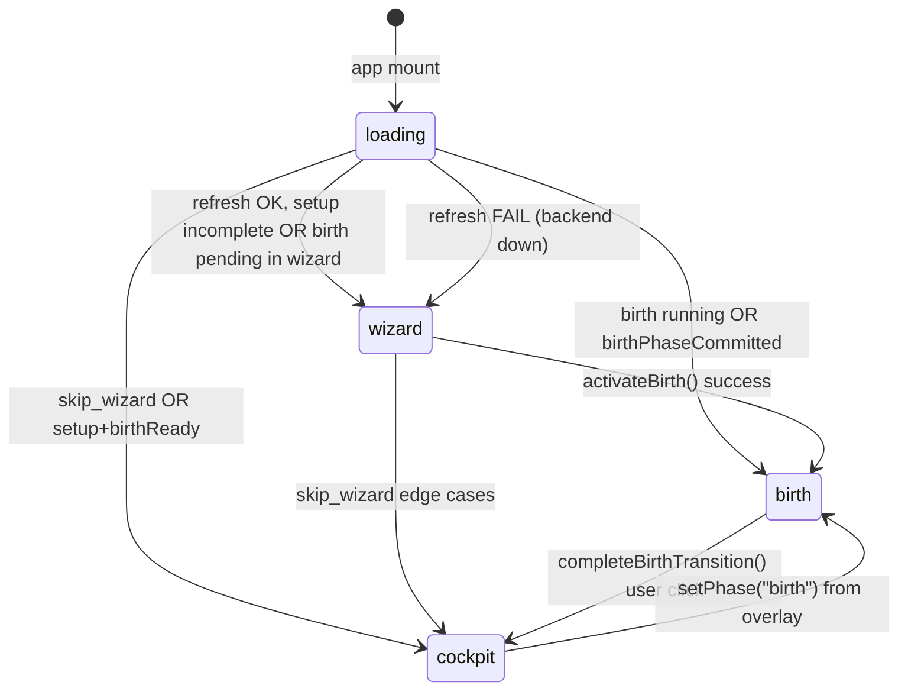
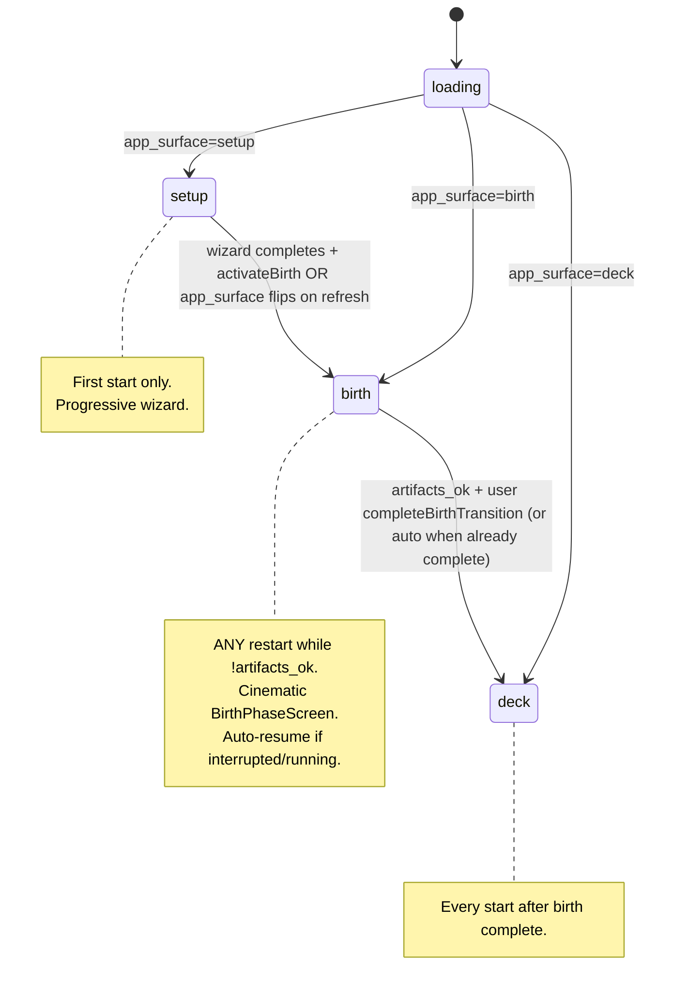

# Tauri Startup Gate — Analyse & Implementatieplan

**Datum:** 2026-06-11  
**Scope:** LUMINA Neural Command Deck (Tauri/React) + backend gate (`/api/setup/onboarding`, birth service)  
**Status:** Fase 0–5 afgerond — startup gate live  
**Mindset:** First principles — één waarheid, drie oppervlakken, nul bypasses

---

## 0. Noordster (operator-waarheid)

Bij elke cold start moet de app **exact één** van deze drie oppervlakken tonen:

| # | Oppervlak | Wanneer | UI-component |
|---|-----------|---------|--------------|
| 1 | **Setup** | Eerste start, of setup nog niet compleet | `OnboardingWizard` (progressive wizard) |
| 2 | **Birth** | Setup compleet, birth **niet** afgerond (`artifacts_ok === false`) | `BirthPhaseScreen` (cinematic monitor) |
| 3 | **Deck** | Setup compleet **en** birth afgerond (`artifacts_ok === true`) | `CockpitShell` + Command Deck |

**Invariant (fail-closed):** Zonder geldige PPO-artifacts (`lumina_agents/ppo/lumina_ppo_policy.zip` + completion flags) kom je **nooit** op het dashboard — ook niet bij `error`, `interrupted`, of backend-glitch.

---

## 1. Hoe het nu werkt (as-is)

### 1.1 Architectuur — geen router, wel phase gate

```
main.tsx → AppErrorBoundary → App.tsx → OnboardingGate → (wizard | birth | children)
```

| Bestand | Rol |
|---------|-----|
| `tauri-app/src/components/onboarding/OnboardingGate.tsx` | Enige “router”; switch op `onboardingStore.phase` |
| `tauri-app/src/store/onboardingStore.ts` | Client phase machine + wizard actions |
| `tauri-app/src/store/birthStore.ts` | Birth polling, milestones, UI sub-phase |
| `lumina_os/backend/setup_endpoints.py` | `GET /api/setup/onboarding` — backend payload |
| `lumina_launcher/core/onboarding.py` | Wizard steps + `should_skip_wizard()` |
| `lumina_launcher/services/birth_service.py` | Birth status, artifacts, start/stop |

**Cold start:** geen localStorage voor phase. Bij mount roept `OnboardingGate` `refresh()` → `fetchOnboardingStatus()` → `mapAppPhase()` (backend `app_surface` SSOT).

### 1.2 Client phase resolver (target — geïmplementeerd)

```typescript
// onboardingPhase.ts — mapAppPhase (vereenvoudigd)
if (activating) return priorPhase;
if (priorPhase === "birth" && birthPhaseCommitted) return "birth";
switch (payload.app_surface) {
  case "setup": return "wizard";
  case "birth": return "birth";
  case "deck": return "cockpit";
}
```

Geen `priorPhase === "cockpit"` sticky bypass. Deck defense-in-depth: `useDeckLifecycleGuard` + `DeckBlockingOverlay`.

### 1.3 Backend wizard steps

`compute_onboarding_steps()` in `lumina_launcher/core/onboarding.py` bepaalt welke wizard-stappen pending zijn. Birth telt als pending wanneer:

```python
birth_idle = birth_status in {"idle", "not_started", "", "interrupted", "error"}
if setup_complete and birth_idle and not artifacts_ok:
    required.append("birth")
```

### 1.4 Twee birth-UI’s (architectuur-split)

| UI | Wanneer | Component |
|----|---------|-----------|
| **Wizard birth step** | Setup klaar, birth nog niet gestart / idle | `BirthActivateStep` inside `OnboardingWizard` |
| **Cinematic birth** | Na `activateBirth()` of `status === "running"` | `BirthPhaseScreen` |

### 1.5 Persisted state (disk SSOT)

| Marker | Pad | Betekenis |
|--------|-----|-----------|
| Setup compleet | `state/lumina_setup_complete.json` (+ fallbacks) | Wizard mag credentials/config overslaan |
| Birth progress | `state/lumina_birth_progress.json` | Checkpoint / fase |
| Birth completed | `state/lumina_birth_completed.flag` | Historische completion |
| PPO policy | `lumina_agents/ppo/lumina_ppo_policy.zip` | **`artifacts_ok` vereist dit** |

### 1.6 As-is flow diagram



---

## 2. Gap-analyse vs. gewenste logica

| Scenario | Gewenst | Huidig gedrag | Severity |
|----------|---------|---------------|----------|
| Allereerste start | Setup wizard | ✅ Wizard (full path) | OK |
| Setup compleet, birth never started, **herstart app** | Birth phase screen | ❌ Wizard met alleen `BirthActivateStep` — gebruiker moet opnieuw activeren | **High** |
| Birth `running`, herstart | Birth phase | ✅ `BirthPhaseScreen` | OK |
| Birth `interrupted` + checkpoint, herstart | Birth phase + recovery | ❌ Wizard birth step; geen auto-resume naar cinematic | **High** |
| Birth `completed` + `artifacts_ok` | Deck | ✅ Cockpit | OK |
| Birth `error`, geen artifacts | Birth phase (recovery) | ❌ `should_skip_wizard` → **cockpit** (dashboard zonder policy!) | **Critical** |
| Backend down bij start | Sensible fallback | ❌ Altijd wizard step 0, zelfs na voltooide setup | Medium |
| In-session `refresh()` terwijl in cockpit | Deck blijft | ⚠️ `priorPhase === "cockpit"` sticky — kan incomplete birth maskeren | Medium |
| `shouldEnterCockpit()` vs `resolveAppPhase()` | Identiek | ❌ Twee verschillende regels in client | Medium |

### Root causes (first principles)

1. **Dubbele waarheid** — backend `should_skip_wizard`, client `resolveAppPhase`, client `shouldEnterCockpit`, deck `birthActive` detectie: vier plekken, vier semantieken.
2. **Wizard ≠ lifecycle** — wizard is een *setup-tool*, maar fungeert ook als *birth entry* bij herstart. Birth is een apart lifecycle-stadium.
3. **`skip_wizard` te permissief** — `birth_status in {"completed", "error"}` zonder `artifacts_ok` is een bypass naar het dashboard.
4. **Geen expliciet `app_surface` contract** — client moet afleiden uit compositie van flags i.p.v. één enum van backend.

---

## 3. Target state — Elon-aanpak

### 3.1 Principe: delete complexity, add truth

**Verwijderen / consolideren:**

- Client-side `resolveAppPhase` heuristiek → vervangen door backend `app_surface`
- `shouldEnterCockpit()` als parallel gate → verwijderen of pure test-spiegel van backend
- Wizard `birth` step bij **herstart** → niet tonen; direct naar `BirthPhaseScreen`
- `priorPhase === "cockpit"` sticky bypass → verwijderen voor cold-start paths
- `should_skip_wizard` error-bypass → verwijderen

**Behouden:**

- Progressive wizard voor **setup** (stappen 1–5)
- `BirthActivateStep` **alleen** als laatste wizard-stap bij **first path** (setup net afgerond, nog nooit geactiveerd)
- `BirthPhaseScreen` als enige birth monitor surface
- `completeBirthTransition()` als expliciete user consent vóór deck (optioneel behouden voor cinematic payoff)

### 3.2 Canonieke lifecycle enum (backend SSOT)

Voeg toe aan `GET /api/setup/onboarding` response:

```json
{
  "app_surface": "setup" | "birth" | "deck",
  "app_surface_reason": "fresh_install" | "setup_incomplete" | "birth_pending" | "birth_running" | "birth_interrupted" | "birth_error" | "birth_complete" | "backend_unreachable"
}
```

**Resolutie-regels (fail-closed):**

```python
def resolve_app_surface(*, setup_complete, birth_status, artifacts_ok, backend_reachable, required_setup_steps) -> tuple[str, str]:
    if not backend_reachable:
        return "setup", "backend_unreachable"  # BackendStep fallback; preserve last known phase in client cache (optional)

    if not setup_complete or _has_pending_setup_steps(required_setup_steps):
        return "setup", "setup_incomplete" if setup_complete else "fresh_install"

    if not artifacts_ok:
        # Birth lifecycle — NO deck until artifacts exist
        if birth_status == "running":
            return "birth", "birth_running"
        if birth_status == "interrupted":
            return "birth", "birth_interrupted"
        if birth_status == "error":
            return "birth", "birth_error"
        return "birth", "birth_pending"  # idle / not_started

    return "deck", "birth_complete"
```

**Client wordt dom:**

```typescript
function mapSurface(payload: OnboardingPayload): AppPhase {
  switch (payload.app_surface) {
    case "setup": return "wizard";
    case "birth": return "birth";
    case "deck": return "cockpit";
  }
}
```

### 3.3 Target flow diagram



### 3.4 Wizard vs. birth — scherpe grens

| Moment | Surface | Birth activate UI |
|--------|---------|-------------------|
| Eerste keer setup afgerond | `setup` → wizard step `birth` | `BirthActivateStep` (CTA) |
| Herstart, `!artifacts_ok` | `birth` direct | `BirthPhaseScreen` + `BirthRecoveryPanel` |
| `running` / `interrupted` | `birth` direct | Auto-poll, geen re-activate click |

---

## 4. Implementatieplan (gefaseerd)

### Fase 1 — Backend SSOT ✅ (2026-06-11)

| # | Taak | Status |
|---|------|--------|
| 1.1 | `resolve_app_surface()` | ✅ (Phase 0) |
| 1.2 | `app_surface` + `app_surface_reason` in payload | ✅ `setup_endpoints.py` |
| 1.3 | `should_skip_wizard` fail-closed via `resolve_app_surface` | ✅ |
| 1.4 | API contract doc | ✅ `docs/lumina-core-api-contracts.md` §9 |
| 1.5 | Unit tests groen | ✅ 34+ passed (incl. skip_wizard ↔ app_surface contract) |

### Fase 5 — Cleanup & docs ✅ (2026-06-11)

| # | Taak | Status |
|---|------|--------|
| 5.1 | `tauri-app/README.md` — drie oppervlakken + restart | ✅ |
| 5.2 | Dode `enterCockpit()` verwijderd | ✅ `onboardingStore.ts` |
| 5.3 | Operator runbook herstart | ✅ `docs/command-deck-startup-runbook.md` |
| 5.4 | ADR lifecycle gate SSOT | ✅ `docs/adr/0011-tauri-lifecycle-gate-ssot.md` |

### Fase 4 — Deck fail-closed ✅ (2026-06-11)

| # | Taak | Status |
|---|------|--------|
| 4.1 | `resolveDeckBirthGate()` + overlay birth/incomplete blocking | ✅ `deckBirthGate.ts`, `DeckBlockingOverlay.tsx` |
| 4.2 | Blocking kind `birth_incomplete` in orchestrator | ✅ `deckStatusOrchestrator.ts`, `deckStatusModel.ts` |
| 4.3 | Cockpit mount guard via `useDeckLifecycleGuard` | ✅ `CockpitShell.tsx` |

### Fase 3 — Birth herstart & auto-resume ✅ (2026-06-11)

| # | Taak | Status |
|---|------|--------|
| 3.1 | `app_surface=birth` → `BirthPhaseScreen` + hydrate target trades | ✅ `OnboardingGate.tsx` |
| 3.2 | Auto-resume `continue_training` bij interrupted | ✅ `useBirthPhaseMonitor` + `birthStore.bootstrapSession` |
| 3.3 | Wizard guard bij `app_surface=birth` | ✅ `OnboardingWizard.tsx` |
| 3.4 | `interrupted` ≠ failure; recovery panel | ✅ `birthPhaseModel` + `BirthRecoveryPanel` |

### Fase 2 — Client gate vereenvoudigen ✅ (2026-06-11)

| # | Taak | Status |
|---|------|--------|
| 2.1 | `mapAppPhase()` vervangt `resolveAppPhase` | ✅ `onboardingPhase.ts` |
| 2.2 | `priorPhase === "cockpit"` sticky verwijderd | ✅ |
| 2.3 | `refresh()` failure behoudt phase + payload | ✅ `resolvePhaseOnRefreshError` |
| 2.4 | `app_surface` verplicht in `OnboardingPayload` | ✅ |
| 2.5 | `shouldEnterCockpit()` → `app_surface === "deck"` | ✅ |
| 2.6 | Vitest matrix groen (geen `it.fails`) | ✅ 323+ passed incl. `onboardingStore.refresh.test.ts` |

### Fase 0 — Characterize ✅ (2026-06-11)

| # | Taak | Status |
|---|------|--------|
| 0.1 | Matrix-test T1–T8 + regressions | ✅ `tauri-app/src/lib/onboardingPhase.test.ts` (6× `it.fails` tot Phase 2) |
| 0.2 | Backend xfail: `skip_wizard` bypass zonder artifacts | ✅ `test_setup_endpoints.py` |
| 0.3 | `resolve_app_surface()` + groene tests | ✅ `lumina_launcher/core/onboarding.py` |
| 0.4 | Dev script `-PartialBirth` | ✅ `scripts/reset-onboarding-dev.ps1` |

**Extract:** `mapAppPhase()` in `tauri-app/src/lib/onboardingPhase.ts`.

**Run characterization:**
```bash
cd tauri-app && npm run test -- src/lib/onboardingPhase.test.ts
python -m pytest lumina_os/tests/test_setup_endpoints.py -q
```

### Fase 0 — Characterize (0.5 dag, geen productie-logic change)

**Doel:** Vastleggen wat nu stuk is, zodat elke fix meetbaar is.

| # | Taak | Bestand |
|---|------|---------|
| 0.1 | Matrix-test: 8 cold-start scenario’s documenteren | `tauri-app/src/store/onboardingStore.phase.test.ts` (nieuw) |
| 0.2 | Backend test: `error` status + `!artifacts_ok` mag **niet** `skip_wizard=true` | `lumina_os/tests/test_setup_endpoints.py` |
| 0.3 | Backend test: `interrupted` + `!artifacts_ok` → `app_surface=birth` | idem |
| 0.4 | Dev script: reset partial states | uitbreiden `scripts/reset-onboarding-dev.ps1` met `-PartialBirth` |

**Acceptatie:** Tests falen op huidige bugs (rood vóór fix).

---

### Fase 1 — Backend SSOT (1 dag)

| # | Taak | Bestand |
|---|------|---------|
| 1.1 | Implementeer `resolve_app_surface()` | `lumina_launcher/core/onboarding.py` |
| 1.2 | Voeg `app_surface` + `app_surface_reason` toe aan payload | `lumina_os/backend/setup_endpoints.py` |
| 1.3 | Strak `should_skip_wizard`: alleen `artifacts_ok` of `running` (niet `error`) | `onboarding.py` |
| 1.4 | Update API contract doc | `docs/lumina-core-api-contracts.md` |
| 1.5 | Unit tests voor alle surface transitions | `lumina_os/tests/test_setup_endpoints.py` |

**Acceptatie:** `GET /api/setup/onboarding` retourneert deterministische `app_surface` voor alle scenario’s.

---

### Fase 2 — Client gate vereenvoudigen (1 dag)

| # | Taak | Bestand |
|---|------|---------|
| 2.1 | Vervang `resolveAppPhase` door `mapSurface(payload)` | `onboardingStore.ts` |
| 2.2 | Verwijder `priorPhase === "cockpit"` sticky (behoud alleen `activating` + `birthPhaseCommitted` voor in-flight UX) | idem |
| 2.3 | Bij `refresh()` failure: toon **BackendStep** overlay i.p.v. full wizard reset als `setup_complete` cached | idem + `OnboardingGate` |
| 2.4 | Type `app_surface` in `OnboardingPayload` | `onboardingSteps.ts` |
| 2.5 | Align / verwijder `shouldEnterCockpit()` | `onboardingSteps.ts` |
| 2.6 | Vitest matrix groen | `onboardingStore.phase.test.ts` |

**Acceptatie:** Cold start scenario’s 2–4 uit gap-tabel gedrag-correct.

---

### Fase 3 — Birth herstart & auto-resume (1 dag)

| # | Taak | Bestand |
|---|------|---------|
| 3.1 | Bij `app_surface=birth` + `interrupted`: mount `BirthPhaseScreen` direct | `OnboardingGate.tsx` |
| 3.2 | `useBirthPhaseMonitor`: bij interrupted + checkpoint → toon recovery, optioneel auto `startBirth(continue=true)` | `useBirthPhaseMonitor.ts`, `birthClient.ts` |
| 3.3 | Wizard: skip `birth` step render als payload zegt `app_surface=birth` (shouldn't happen, guard) | `OnboardingWizard.tsx` |
| 3.4 | `activateBirth()` alleen vanuit wizard; herstart gebruikt bestaande session | `onboardingStore.ts` |

**Acceptatie:** Herstart midden in birth → cinematic screen, geen wizard tussenstop.

---

### Fase 5 — Cleanup & docs (0.5 dag)

| # | Taak |
|---|------|
| 5.1 | Update `tauri-app/README.md` first-boot sectie (3 surfaces) |
| 5.2 | Verwijder dode `enterCockpit()` of documenteer dev-only |
| 5.3 | Operator runbook entry: “wat gebeurt bij herstart” |
| 5.4 | Optioneel ADR: `docs/adr/0011-tauri-lifecycle-gate-ssot.md` |

**Acceptatie:** Documentatie en ADR aligned met geïmplementeerde gate; geen dode bypass API in store.

---

### Fase 4 — Deck fail-closed (0.5 dag)

| # | Taak | Bestand |
|---|------|---------|
| 4.1 | `birthActive` in overlay: include `interrupted`, `error` when `!artifacts_ok` | `DeckBlockingOverlay.tsx` |
| 4.2 | `resolveDeckStatus`: blocking kind `birth_incomplete` | `deckStatusOrchestrator.ts` |
| 4.3 | Cockpit mount guard: if refresh says not deck → redirect (defense in depth) | `App.tsx` of `CockpitShell` |

**Acceptatie:** Geen scenario meer waar operator op leeg dashboard zit zonder policy.

---

### Fase 5 — Cleanup & docs (0.5 dag)

| # | Taak |
|---|------|
| 5.1 | Update `tauri-app/README.md` first-boot sectie (3 surfaces) |
| 5.2 | Verwijder dode `enterCockpit()` of documenteer dev-only |
| 5.3 | Operator runbook entry: “wat gebeurt bij herstart” |
| 5.4 | Optioneel ADR: `docs/adr/0011-tauri-lifecycle-gate-ssot.md` |

---

## 5. Testmatrix (handmatig + automated)

| # | State setup | Verwacht surface | Verwacht component |
|---|-------------|------------------|-------------------|
| T1 | Fresh install | setup | Full wizard |
| T2 | Setup complete, birth idle | birth | `BirthPhaseScreen` (niet wizard) |
| T3 | Birth running | birth | `BirthPhaseScreen`, progress live |
| T4 | Birth interrupted + checkpoint | birth | Recovery panel zichtbaar |
| T5 | Birth error, no artifacts | birth | Error + retry (geen deck) |
| T6 | Birth complete + artifacts | deck | Command Deck |
| T7 | T6 + herstart app | deck | Direct deck, geen flash wizard |
| T8 | Backend down, setup was complete | setup (backend step) | BackendStep, geen wizard step 0 |

Automated: Fase 0–5 tests dekken T1–T8 (incl. `onboardingStore.refresh.test.ts` voor T8 fetch failure).

---

## 6. Risico’s & mitigatie

| Risico | Mitigatie |
|--------|-----------|
| Breaking change API payload | Backward compat: client fallback `app_surface ?? legacyResolve()` max 1 release |
| Auto-resume birth zonder user consent | Alleen `continue` bij bestaand checkpoint; fresh start blijft explicit CTA |
| Race: birth completes during wizard | `refresh()` na elke major action; surface from backend wins |
| Streamlit launcher divergeert | Zelfde `resolve_app_surface()` in Python — shared module |

---

## 7. Success criteria (Definition of Done)

- [x] Operator kan de 3-stappen lifecycle in 1 zin uitleggen
- [x] Eén backend functie bepaalt startup surface
- [x] Client `mapAppPhase` is SSOT mapper (geen sticky cockpit bypass)
- [x] Geen deck toegang zonder `artifacts_ok`
- [x] Herstart tijdens incomplete birth landt op `BirthPhaseScreen`
- [x] Alle tests in Fase 0–5 groen (Vitest + pytest setup)
- [x] Geautomatiseerde matrix T1–T8 in `onboardingPhase.test.ts` + refresh integration

---

## 8. Wat we bewust **niet** doen (scope discipline)

- Geen React Router introductie — phase gate blijft, wordt alleen waar
- Geen auto-start deck zonder user “Enter command deck” (cinematic payoff behouden)
- Geen wijziging birth training algoritme — alleen gate/routing
- Geen Streamlit launcher verwijderen in deze fase

---

## 9. Geschatte effort

| Fase | Effort | Model-keuze |
|------|--------|-------------|
| 0–1 | 1.5 dag | Agent + unit tests |
| 2–3 | 2 dagen | Agent |
| 4–5 | 1 dag | Agent + handmatige verify |
| **Totaal** | **~4.5 dag** | Medium complexity |

---

## 10. Referenties (code)

| Onderdeel | Pad |
|-----------|-----|
| Phase gate | `tauri-app/src/components/onboarding/OnboardingGate.tsx` |
| Client resolver | `tauri-app/src/lib/onboardingPhase.ts` → `mapAppPhase()` |
| Wizard | `tauri-app/src/components/onboarding/OnboardingWizard.tsx` |
| Birth cinematic | `tauri-app/src/components/birth/BirthPhaseScreen.tsx` |
| Birth activate (wizard) | `tauri-app/src/components/onboarding/steps/BirthActivateStep.tsx` |
| Backend payload | `lumina_os/backend/setup_endpoints.py` → `build_onboarding_payload` |
| Step computation | `lumina_launcher/core/onboarding.py` |
| Birth service | `lumina_launcher/services/birth_service.py` |
| Deck overlay | `tauri-app/src/components/cockpit/DeckBlockingOverlay.tsx` |
| Dev reset | `scripts/reset-onboarding-dev.ps1` |

---

*“The best part is no part. The best process is no process. If it doesn’t need to exist, delete it.”*  
→ Vier gate-resolvers worden één. Twee birth-UI’s worden één lifecycle met twee entry points. Wizard doet setup; birth doet birth; deck doet trading.
