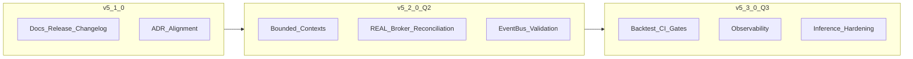

# LUMINA — Roadmap

> **Deze roadmap leeft.** Ze is geen statisch marketingdocument: ze volgt **releases**, **ADR’s** en wat we hard kunnen **bewijzen** (tests, audits, runbooks). Historische waarheid staat in [`CHANGELOG.md`](../CHANGELOG.md); architectuursporen in [`docs/adr/README.md`](adr/README.md).

---

## 1. Inleiding

LUMINA evolueert als **organisme**: prioriteiten verschuiven wanneer nieuwe risico’s, kansen of metingen dat rechtvaardigen. Wat hier staat is de **Noordster-richting** — kapitaalbehoud in REAL blijft leidend ([`.cursorrules`](../.cursorrules)).

- **Koppeling aan releases:** elke kolom *Target Versie* verwacht een semver die overeenkomt met [`pyproject.toml`](../pyproject.toml) en [release-discipline](RELEASE_CHECKLIST.md).
- **Koppeling aan ADR’s:** blijvende domein- of safety-keuzes krijgen een **ADR** voordat ze “af” zijn op deze roadmap (zie §5).
- **Intellectual honesty:** 🔜 betekent *intentie met datum*, geen belofte zonder scope in een ADR.

---

## 2. Huidige status — v5.1.0

**Theme:** documentatie-, governance- en release-rails naast een volwassen core (bounded contexts, constitution, shadow, event bus).

Onderstaande bundelt de **opgeleverde prompt-lijn (1–13)** — van architectuur tot changelog-automatisering — als één release-wave:

| # | Oplevering |
|---|------------|
| 1 | [`docs/architecture.md`](architecture.md) — high-level architectuur, bounded contexts, Event Bus & Blackboard (Mermaid) |
| 2 | [`CONTRIBUTING.md`](../CONTRIBUTING.md) — onboarding, ADR-werkflow, safety-cultuur |
| 3 | [`docs/RELEASE_CHECKLIST.md`](RELEASE_CHECKLIST.md) — pre-release, release, post-release |
| 4 | [`scripts/prepare_release.py`](../scripts/prepare_release.py) — draft changelog + reminder |
| 5 | [`scripts/generate_changelog.py`](../scripts/generate_changelog.py) — Keep a Changelog uit ADR’s + `git log` |
| 6 | [`CHANGELOG.md`](../CHANGELOG.md) — versioneerde release notes |
| 7 | [`.github/workflows/generate-changelog.yml`](../.github/workflows/generate-changelog.yml) — changelog artifact op release-tag |
| 8 | **README** — Development-sectie uitgebreid (Contributing, Release checklist, links) |
| 9 | **Release-integriteit** — expliciete checks: ruff/mypy/pytest, ADR-review, geen TODO’s in kritieke paden |
| 10 | **ADR-index** — canonieke `000x`-reeks als bron van waarheid ([`docs/adr/README.md`](adr/README.md)) |
| 11 | **Risk / Trading context** — voortzetting bounded-context migratie (zie roadmap-tabel) |
| 12 | **Safety narrative** — alignment met [`AGI_SAFETY.md`](AGI_SAFETY.md) en constitutionele sporen |
| 13 | **Roadmap transparantie** — dit document (`docs/roadmap.md`) |

**Kernboodschap v5.1.0:** we versnellen **niet** ten koste van REAL — we versnellen **documentatie, auditbaarheid en release-kwaliteit** zodat elke volgende feature traceerbaar blijft.

---

## 3. Roadmap-tabel

### Legenda (status)

| Symbool | Betekenis |
|---------|-----------|
| ✅ | Grotendeels afgerond in de huidige codebase / release |
| 🔄 | Actief in ontwikkeling |
| 🔜 | Gepland; scope nog te verankeren in ADR waar nodig |
| 📋 | Backlog / kritiek pad, nog niet gestart |

### Prioriteiten & owners

| Prioriteit | Onderwerp | Status | Target versie | Gekoppeld ADR | Owner |
|------------|-----------|--------|---------------|---------------|-------|
| **P0** | Migratie resterende `engine/`-oppervlak naar bounded contexts | 🔄 | v5.2.0 | [0001](adr/0001-bounded-contexts-central-event-bus.md), [ADR-005](adr/ADR-005-bounded-contexts-event-bus.md) | LUMINA Core |
| **P0** | REAL: broker-connectiviteit, reconciliatie, production-runbooks | 🔜 | v5.2.0 | *ADR gepland* | LUMINA Core |
| **P1** | Test suite: markers, timeouts, isolated fixtures consequent | 🔄 | v5.2.0 | [0005](adr/0005-test-suite-overhaul-markers-timeouts-isolated-fixtures.md) | LUMINA Core |
| **P1** | Event Bus: strikte payload-validatie (Pydantic) op kritieke topics | 🔄 | v5.2.0 | [0001](adr/0001-bounded-contexts-central-event-bus.md), [ADR-003](adr/ADR-003-event-bus-contract.md) | LUMINA Core |
| **P2** | CI/nightly: backtest-realism stack als gate (purged CV, replay, gap) | 🔄 | v5.3.0 | [0004](adr/0004-backtest-realism-purged-cv-orderbook-replay-reality-gap.md) | LUMINA Core |
| **P2** | Observability: dashboards, audit-first operator workflows (`journal/`) | 🔄 | v5.3.0 | *ADR optioneel* | LUMINA Core |
| **P3** | Model pipeline: Unsloth / GGUF / inference productie-hardening | 🔜 | v5.3.0 | *ADR optioneel* | LUMINA Core |
| **—** | Multi-broker support (abstractie naast NinjaTrader) | 🔜 | ≥ v5.4.0 | *ADR vereist vóór build* | LUMINA Core |
| **—** | Cloud deployment (images, secrets, observability) | 🔜 | TBD | *ADR vereist* | LUMINA Core |
| **—** | Public demo / read-only sandbox | 🔜 | TBD | *ADR vereist (abuse & safety)* | Community + Core |
| **—** | Operator API / automation hardening | 🔜 | v5.2–5.3 | *ADR optioneel* | LUMINA Core |

### Visueel: release-lijn

---

## 4. Volgende drie releases

| Release | Venster | Focus | Exit-criteria (samenvatting) |
|---------|---------|-------|-------------------------------|
| **v5.1.0** | **Huidig — afgerond** | Documentatie-rails, changelog, contributing, release-checklist, roadmap-transparantie | [`RELEASE_CHECKLIST`](RELEASE_CHECKLIST.md) groen; [`CHANGELOG.md`](../CHANGELOG.md) bijgewerkt |
| **v5.2.0** | **Q2 2026** | Bounded-context afronding, REAL broker pad, event-bus contracts, test-suite discipline | ADR’s voor nieuwe REAL-scope; geen regressie op constitution/shadow gates |
| **v5.3.0** | **Q3 2026** | Backtest-realism in CI waar haalbaar, observability/audit, inference-pad hardening | Meetbare gates + operator UX; intellectual honesty over “groene CI” |

> Datums zijn **richtinggevend**. Slip naar rechts is acceptabel als het **expliciet** is en vastgelegd (ADR + changelog), niet stilletjes.

---

## 5. Hoe deze roadmap wordt bijgewerkt

1. **Geen stille scope creep** — nieuwe roadmap-items die architectuur, safety of kapitaalstromen raken komen **alleen** binnen via een **ADR** ([`docs/adr/0000-template.md`](adr/0000-template.md)) en worden daarna in deze tabel gezet.
2. **Patch-level** (kleine correcties in deze markdown) mag zonder ADR — maar inhoudelijke nieuwe **thema’s** (multi-broker, cloud, public demo) **vereisen** eerst een besluitdocument.
3. **Release = waarheid** — bij het taggen van `vX.Y.Z` moeten roadmap-status en `CHANGELOG` **eerlijk** zijn over wat wél en niet zit.

---

*LUMINA — radicaal in ambitie, conservatief in REAL.*
