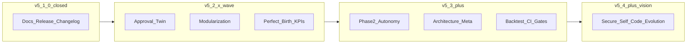

# LUMINA — Roadmap

> **Deze roadmap leeft.** Ze is geen statisch marketingdocument: ze volgt **releases**, **ADR’s** en wat we hard kunnen **bewijzen** (tests, audits, runbooks). Historische waarheid staat in [`CHANGELOG.md`](../CHANGELOG.md); architectuursporen in [`docs/adr/README.md`](adr/README.md).
>
> **Versie-eerlijkheid:** de *installable* package-versie staat in [`pyproject.toml`](../pyproject.toml). Roadmap-golven (v5.1.x, v5.2.x, …) beschrijven **capability-thema’s**, niet automatisch een getagde release.

---

## 1. Inleiding

LUMINA evolueert als **organisme**: prioriteiten verschuiven wanneer nieuwe risico’s, kansen of metingen dat rechtvaardigen. Wat hier staat is de **Noordster-richting** — kapitaalbehoud in REAL blijft leidend ([`.cursorrules`](../.cursorrules)).

- **Koppeling aan releases:** elke kolom *Target Versie* verwacht een semver die overeenkomt met release-discipline wanneer we taggen; tot die tijd is de golf-label een thema.
- **Koppeling aan ADR’s:** blijvende domein- of safety-keuzes krijgen een **ADR** voordat ze “af” zijn op deze roadmap (zie §5).
- **Intellectual honesty:** 🔜 betekent *intentie met scope*, geen belofte zonder bewijs of ADR waar nodig.
- **Unieke differentiator:** de **Approval Twin** (user-trained human replacement *judgment*) — zie §6. Hard gates (constitution, sandbox, shadow, REAL PromotionGate) blijven onaantastbaar.

---

## 2. Huidige status — v5.2.x (wave)

**Theme:** modularisatie + **Approval Twin** als primaire auto-approval in birth/SIM, met Perfect Birth → Phase 2 Autonomy als volgende horizon.

### Wat is reëel vandaag

| Domein | Stand | Bron |
|--------|-------|------|
| **Approval Twin** | Train/review CLI, calibrated confidence, Event Bus topics, primary auto-approval in birth/SIM/autonomy when high-conf + clean | [ADR-0031](adr/0031-approval-twin-event-bus.md), [ADR-0032](adr/0032-approval-twin-human-replacement-layer.md) |
| **Modularisatie** | Thin orchestrators, birth decomposition, bounded evolution/risk surfaces; residual god surfaces remain | architecture + project-dna |
| **Never-stall / adaptive wall** | Escalation ladder + recovery UI in birth adaptive mode | [`progress.md`](progress.md), adaptive wall design |
| **Perfect Birth KPIs** | Meetbare twin/autonomy/shadow metrics; unlock-pad naar Phase 2 | [birth-phase-live-validation-runbook](birth-phase-live-validation-runbook.md) §8–9 |
| **REAL hard gates** | Constitution, sandbox, shadow aperture, PromotionGate — **Twin short-circuited deze niet** | ADR-0003, 0007, AGI_SAFETY |

### Wat we *niet* claimen

- Phase 2 Autonomy (dynamic spawn, advanced wall triggers, full never-stop at scale) is **niet** “done” — zie §7.
- Twin is **geen** solo REAL-promoter.
- Package-tag `5.2.0` is pas waar als release-process dat tagt (check `pyproject.toml` / tags).

### Gesloten golf — v5.1.0 (docs / release rails)

Documentatie-, governance- en release-rails (architecture overview, CONTRIBUTING, RELEASE_CHECKLIST, changelog-automatisering, ADR-index start). Kern: we versnelden **auditbaarheid** zonder REAL te verzwakken. Details: eerdere roadmap-wave + [`CHANGELOG.md`](../CHANGELOG.md).

**Kernboodschap v5.2.x:** 24/7 evolutie-snelheid in SIM/birth via een **getrainde digitale conscience**, modulariteit zodat het organisme blijft evolueerbaar, en een helder pad naar Phase 2 — **zonder** de fort-structuur van REAL te openen.

---

## 3. Roadmap-tabel

### Legenda (status)

| Symbool | Betekenis |
|---------|-----------|
| ✅ | Grotendeels afgerond in de huidige codebase / wave |
| 🔄 | Actief in ontwikkeling |
| 🔜 | Gepland; scope te verankeren in ADR/runbook waar nodig |
| 📋 | Backlog / visie, nog niet gestart |

### Prioriteiten & owners

| Prioriteit | Onderwerp | Status | Target | Gekoppeld ADR | Owner |
|------------|-----------|--------|--------|---------------|-------|
| **P0** | Approval Twin — human replacement *judgment* (SIM/birth) | ✅ core | v5.2.x | [0031](adr/0031-approval-twin-event-bus.md), [0032](adr/0032-approval-twin-human-replacement-layer.md) | LUMINA Core |
| **P0** | Modularisatie: resterende god-oppervlakken → bounded contexts | 🔄 | v5.2–5.3 | [0001](adr/0001-bounded-contexts-central-event-bus.md), [0008](adr/0008-lumina-engine-service-decomposition.md), [0009](adr/0009-thin-engine-orchestrator-and-app-shim-removal.md) | LUMINA Core |
| **P0** | REAL: broker-connectiviteit, reconciliatie, production-runbooks | 🔜 | v5.2–5.3 | *ADR gepland* | LUMINA Core |
| **P0** | PromotionGate REAL: purged/cpcv + reality gap + stress DD + significantie | ✅ | v5.2.x | [0007](adr/0007-promotion-gate-real-mode.md) | LUMINA Core |
| **P1** | **Phase 2 Autonomy** (wall triggers, self-adaptive params, never-stop, dynamic spawn) | 🔜 foundation | v5.3+ | birth runbook §8–9; [ADR-0034](adr/0034-phase2-autonomy-foundation.md) | LUMINA Core |
| **P1** | Architecture Meta-Controller (sandbox + human marker) | 🔜 | v5.3+ | [0030](adr/0030-architecture-meta-controller.md) | LUMINA Core |
| **P1** | Test suite: markers, timeouts, isolated fixtures | 🔄 | v5.2–5.3 | [0005](adr/0005-test-suite-overhaul-markers-timeouts-isolated-fixtures.md) | LUMINA Core |
| **P1** | Event Bus: strikte payload-validatie op kritieke topics | 🔄 | v5.2–5.3 | [0001](adr/0001-bounded-contexts-central-event-bus.md), [ADR-003](adr/ADR-003-event-bus-contract.md) | LUMINA Core |
| **P2** | CI/nightly: backtest-realism stack als gate | 🔄 | v5.3.0 | [0004](adr/0004-backtest-realism-purged-cv-orderbook-replay-reality-gap.md) | LUMINA Core |
| **P2** | Observability: dashboards, audit-first operator workflows | 🔄 | v5.3.0 | *ADR optioneel* | LUMINA Core |
| **P2** | **Secure self-code evolution** (sandbox + Twin + Constitution) | 🔜 v1 prototype (evaluate-only) | ≥ v5.4 | [0033](adr/0033-trading-code-evolution-prototype.md); [0030](adr/0030-architecture-meta-controller.md) arch scaffold; zie §8 | LUMINA Core |
| **P3** | Model pipeline: Unsloth / GGUF / inference productie-hardening | 🔜 | v5.3+ | *ADR optioneel* | LUMINA Core |
| **—** | Multi-broker support | 🔜 | ≥ v5.4.0 | *ADR vereist vóór build* | LUMINA Core |
| **—** | Cloud deployment | 🔜 | TBD | *ADR vereist* | LUMINA Core |
| **—** | Public demo / read-only sandbox | 🔜 | TBD | *ADR vereist (abuse & safety)* | Community + Core |

### Visueel: release-lijn


```mermaid
flowchart LR
    subgraph r510 [v5_1_0_closed]
        docRel[Docs_Release_Changelog]
    end
    subgraph r520 [v5_2_x_wave]
        twin[Approval_Twin]
        mod[Modularization]
        birth[Perfect_Birth_KPIs]
    end
    subgraph r530 [v5_3_plus]
        p2[Phase2_Autonomy]
        archMeta[Architecture_Meta]
        ciGate[Backtest_CI_Gates]
    end
    subgraph vision [v5_4_plus_vision]
        selfCode[Secure_Self_Code_Evolution]
    end
    r510 --> r520
    r520 --> r530
    r530 --> vision
```

---

## 4. Volgende releases (richtinggevend)

| Release / wave | Venster | Focus | Exit-criteria (samenvatting) |
|----------------|---------|-------|-------------------------------|
| **v5.1.0** | **Gesloten** | Docs/release rails | Checklist + changelog-discipline |
| **v5.2.x** | **Huidige wave** | Twin core, modularisatie, Perfect Birth metriek | ADR-0031/32 geaccepteerd; Twin trainbaar; geen regressie op constitution/shadow/PromotionGate |
| **v5.3.0** | **Volgende** | Phase 2 Autonomy start + observability + CI realism gates | Perfect Birth conjunction waar van toepassing; ADR voor autonomy-scope; meetbare recovery/spawn metrics |
| **≥ v5.4** | **Visie** | Secure self-code evolution in sandbox | v1 evaluate-only prototype (ADR-0033); later: Twin + Constitution + sandbox op *elke* code-mutatie + controlled apply; REAL multi-gate intact |

> Datums zijn **richtinggevend**. Slip naar rechts is acceptabel als het **expliciet** is (ADR + changelog), niet stilletjes.

---

## 5. Hoe deze roadmap wordt bijgewerkt

1. **Geen stille scope creep** — nieuwe items die architectuur, safety of kapitaalstromen raken komen **alleen** via een **ADR** ([`docs/adr/0000-template.md`](adr/0000-template.md)) en daarna in deze tabel.
2. **Patch-level** (kleine correcties in deze markdown) mag zonder ADR — inhoudelijke nieuwe **thema’s** vereisen eerst een besluitdocument.
3. **Release = waarheid** — bij taggen van `vX.Y.Z` moeten roadmap-status, `CHANGELOG` en `pyproject.toml` **eerlijk** zijn over wat wél en niet zit.
4. **Historische analyses** in [`docs/history/`](history/) zijn **geen** SSOT — zie banner daar.

---

## 6. Approval Twin Agent (Human Replacement Layer)

> **Core unique differentiator.** Niet “nog een RL-score”, maar een **user-trained mimic** van de operator (Steve) die *judgment* levert zodat het organisme 24/7 kan evolueren zonder permanent menselijke bottleneck — **binnen** de safety-gates.

### Wat het is

- Klein lokaal model getraind op **expliciete** approve/veto-labels (`SteveValuesRegistry` → `rlhf_light_update`).
- Features: DNA-inhoud, emotional twin profile, lineage, Steve-vocabulary; confidence **gekalibreerd** tegen recente prediction error.
- High-confidence pad: `confidence >= 0.80` + recommendation + clean → primary auto-approval in birth/SIM/autonomy (`organism_autonomy`, promotion policy, evolution guard).

### Training (radicaal eenvoudig)

```text
python -m lumina_launcher twin review --limit 5
python -m lumina_launcher twin train
python -m lumina_launcher twin metrics
```

Command Deck: Intelligence → Approvals → **Twin train** (labels + light RLHF via `/api/twin/*`; **Approval Gym** drills via `/api/twin/gym/*`; data stays local under `state/`).

### Judgment modes (shadow → assisted → full_auto)

| Mode | Authority | Behavior |
|------|-----------|----------|
| **shadow** (default) | propose_only | Twin proposes + logs agreement; never sole-auto-approves |
| **assisted** | veto_only | Twin may block (veto); approve does not sole-auto |
| **full_auto** | execute_judgment | High-conf + clean may auto-approve **within** hard gates |

Promotion only via fail-closed `TwinModePromotionGate` (agreement %, false-positive rate, constitution adherence, sample size). CLI: `twin mode`, `twin promote assisted|full_auto`. Metrics: agreement %, risk flags caught, false positives.

### Observability

- Event Bus: `evolution.twin.decision`, `evolution.twin.training_update`, `evolution.twin.shadow_observation`, `evolution.twin.mode_promotion` (best-effort)
- Monitoring JSONL + API metrics (reward, error, steps, mode metrics)
- Perfect Birth KPIs: twin↔Steve agreement, % auto-approved, shadow/twin alignment — zie [birth runbook](birth-phase-live-validation-runbook.md) §8

### Hard boundaries (non-negotiable)

De Twin **vervangt geen gate**, alleen de *menselijke judgment-stap* binnen de gate:

| Mag Twin dit omzeilen? | Antwoord |
|------------------------|----------|
| ConstitutionalGuard / sandbox executor | **Nee** |
| Risk shadow aperture | **Nee** (Twin roept shadow proactief aan) |
| REAL PromotionGate (OOS, reality gap, stress DD, significantie) | **Nee** |
| Structurele capital-path bypass | **Nee** |

Code: `lumina_core/evolution/approval_twin_agent.py`, `lumina_launcher/twin_cli.py`.  
ADR’s: [0031](adr/0031-approval-twin-event-bus.md), [0032](adr/0032-approval-twin-human-replacement-layer.md).

---

## 7. Phase 2 Autonomy (gepland)

**Status:** 🔜 foundation through **Slice E (delete pass)** — still gated default-OFF; not “productief done” until Perfect Birth evidence + SIM campaigns. ADR: [0034](adr/0034-phase2-autonomy-foundation.md).  
**Observe:** `python -m lumina_launcher birth phase2-status` · `state/monitoring_phase2_autonomy.jsonl`  
**Unlock:** `python scripts/validation/declare_perfect_birth.py` (flag + evidence; hollow flag rejected)  
**Mode:** `phase2_execution_mode: observe|shadow|apply` (default observe)  
**Architecture:** closed-loop only via `handler_hooks` + handlers — not stage_loop

| Pilaar | Doel | Nu |
|--------|------|-----|
| **Advanced / dynamic wall triggers** | Slimmere stage-walls die zich aan regime en progressie aanpassen | **Closed loop (gated):** effective thresholds into `evaluate_wall_trigger` when apply allowed; default OFF |
| **Self-adaptive parameters** | Parameters die zich binnen bounds bijstellen zonder herstart | **Closed loop (gated):** catalog apply → `WallAdaptationState` on recovery; default OFF |
| **Never-stop recovery** | Stalls → autonome recovery (twin-assisted CONTINUE, phoenix, data expand) op schaal | Engine + recovery UI aanwezig; schaal/KPI-targets in Perfect Birth |
| **Dynamic spawning without restart** | In-process instance adapt zonder process-restart | **Closed loop (gated):** spawn_plateau/phoenix/cfg refresh flags; geen OS spawn |

**Defaults:** alle `phase2_*` flags **false** (fail-closed). Apply-pad eist Perfect Birth flag + Twin (tenzij expliciete SIM scaffold).

**REAL-paden** in Phase 2 blijven twin-gated **én** constitution + shadow + PromotionGate. Twin is noodzakelijke input, geen solo veto-overrule van kapitaalregels.

---

## 8. Visie — Secure self-code evolution (sandbox)

**Status:** 🔜 **v1 prototype scaffold (evaluate-only)** — geen live apply, default disabled.

**Doel:** het organisme mag **eigen architectuur/code** voorstellen en in een **isolatie-sandbox** evalueren, met promotie alleen na:

1. **Constitution** (bounded contexts, typed contracts, fail-closed, no capital bypass)
2. **Approval Twin** (operator-aligned judgment, calibrated confidence)
3. **Shadow / risk aperture** waar risk-touching
4. **Menselijke final marker** zolang ADR-0030 dat eist; later kan Twin judgment *binnen* die gate leveren — **nooit** in plaats van sandbox of constitution

**v1 trading-code prototype:** [ADR-0033](adr/0033-trading-code-evolution-prototype.md) — package `lumina_core/code_evolution/`, `SandboxedCodeExecutor`, fixed operators (parameter tweak / simple indicator / strategy snippet), Twin + constitution gates, reversible journal under `state/code_evolution/`, **never** mutates live tree in v1.

Architecture scaffold (orthogonal): [ADR-0030 Architecture Meta-Controller](adr/0030-architecture-meta-controller.md) (fixed operator catalog, tempdir sandbox, disabled by default, human promotion marker).

**10× ambitie, conservatief in REAL:** zelf-evoluerende code is alleen legitiem als kapitaalpaden structureel smaller en veiliger blijven.

---

*LUMINA — radicaal in ambitie, conservatief in REAL. De twin is de ambitie; sandbox + constitution zijn de rem.*
