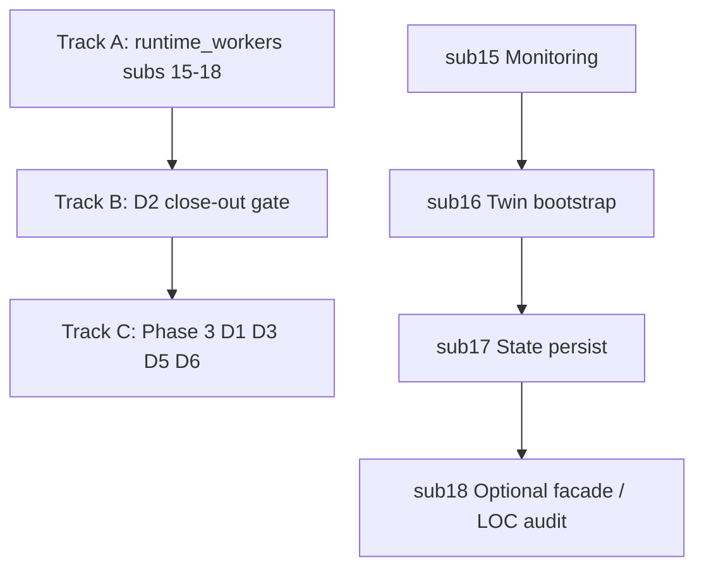

# 2026-06-04 — Phase 3 D2 Completion Roadmap (logical path to finish D2 + align Phase 3 deliverables)

**Classification**: Planning artifact (contract for execution). No production code changed by this file alone.

**Parents (mandatory re-anchor before any slice)**:
- `2026-05-31-elon-musk-first-principles-trading-system-analysis.md` (SPF-006 `runtime_workers` god)
- `2026-05-31-elon-aperture-hardening-90-day-roadmap.md` (Phase 3 D2 verbatim deliverable)
- `project-dna/lumina/interfaces/export/aperture-hardening-mission-control.md`
- `2026-06-04-phase3-d2-sub10-12-perfection-remediation-plan.md` (**COMPLETE** Phases 0–3)
- `2026-06-04-phase3-d2-sub10-12-perfection-phase3-final-gate.md`
- Sub logs sub4–14 + voice `2026-06-14-phase3-d2-voice-legacy-runtime-decomp.md`
- `AGENTS.md` + constitution + self-improvement-protocol + all 5 skills

---

## Brutal current state (2026-06-04)

### D2 minimum bar — **MET**
- **Meta god**: risk mutation firewall (sub1–3).
- **Runtime god**: trading + supervisor path firewalled (sub4–12, sub11 remediation).
- **Voice/legacy**: `VoiceLegacyHandler` + thin `voice_listener_thread` (2026-06-14 alignment).
- **Webhook**: `TraderLeagueWebhook` (sub14).
- **Evidence**: 60+ pytest gate, Guardian 10.0, Aperture 10.0 GREEN.

### D2 **full** completion — **NOT MET**
MC row **#2 remains Yellow** with honest note: *"Still full god (broader supervisor loops + other surfaces)"*.

`runtime_workers.py` is ~**272 LOC** (down from ~74 KB), but still owns:

| Surface | Lines (approx) | Bounded? | Next slice |
|---------|----------------|----------|------------|
| `_compute_session_kpis` + `_publish_runtime_monitoring_snapshot` | ~80 | No (inline) | **sub15** `RuntimeMonitoringService` |
| Twin bootstrap in `_old_supervisor_loop_inner` | ~25 | No (inline thread) | **sub16** `SupervisorBootstrapService` or `EmotionalTwinWorker` |
| `state_persist_daemon` | ~10 | No (inline while) | **sub17** `StatePersistDaemon` |
| `_paper_*` compat shims | ~25 | Yes (delegate to PriceDupeResolver) | Keep as compat exports |
| Supervisor wrappers (`_old_supervisor_loop`, etc.) | ~30 | Thin orchestration only | Optional **sub18** facade module |
| `pre_dream_daemon` | 1 line | Yes (PreDreamDaemon) | PreDream **body** stays in `pre_dream_daemon.py` (by design) |

**Important**: Finishing D2 on `runtime_workers` does **not** finish all of Phase 3 (D1, D5, D6 still Red/Yellow).

---

## Definitions (avoid claim inflation)

| Term | Meaning |
|------|---------|
| **D2 minimum (05-31)** | ≥1 major concentration point decomposed/firewalled on meta **and** runtime; evidence in MC/evol/Guardian. **Done.** |
| **D2 runtime_workers “surface complete”** | No non-trivial inline logic left in `runtime_workers.py` except documented compat shims + one-line thins; grep/AST tests prove 0 stray per surface; `runtime_workers` primarily exports + bootstrap wiring. **Target of Track A.** |
| **D2 MC Green** | Row #2 updated only when Track A gate passes **or** explicit “honest granularity” doc lists remaining with reduced LOC evidence and falsifiable next slice. **Track B.** |
| **Phase 3 complete** | All six Phase 3 deliverables at Green/Green-Yellow per original gates — **separate program** (Track C). |

---

## Logical execution path (recommended order)



### Track A — Finish `runtime_workers` god (highest leverage for D2)

Each slice: fresh Plan Mode (or approved plan section) + explore if >1 file + all 5 skills + sub-slice evol log + MC append + pytest + grep 0 stray + Guardian.

#### **Sub15 — RuntimeMonitoringService** (next)
- **Extract**: `_compute_session_kpis`, `_publish_runtime_monitoring_snapshot`.
- **Consumers**: `SupervisorPhaseStateMachine` lazy-imports from `runtime_workers` today → change to import from bounded module (or thin re-export on `runtime_workers` for compat).
- **Risk**: Observability only; not capital path. Still constitution 5 (transparency).
- **Tests**: unit KPI formulas + snapshot payload shape; grep god has no numpy KPI block.
- **Falsify**: stray KPI/snapshot logic in `runtime_workers` post-thin.

#### **Sub16 — Supervisor bootstrap / emotional twin worker**
- **Extract**: `_emotional_twin_worker` + thread start from `_old_supervisor_loop_inner`.
- **Leave**: supervisor while = price + `advance_or_tick` + sleep (unchanged).
- **Tests**: mock twin `run_cycle` called; thread started once; grep no inline twin while in god inner.
- **Granularity**: does not move `pre_dream` twin calls (separate surface).

#### **Sub17 — StatePersistDaemon**
- **Extract**: `state_persist_daemon` while loop.
- **Tests**: mock `save_state` + sleep stop; bootstrap still wires callable export.

#### **Sub18 — God file close-out (optional small)**
- Move remaining wrappers to `runtime_workers_facade.py` **only if** it reduces god below ~120 LOC without import churn.
- Otherwise: document “compat export hub” as intentional thin shell.

**Track A success gate**:
- `runtime_workers.py` LOC ≤ ~150 (target), all functions ≤5 lines except documented compat.
- `scripts/phase3_perfection_gate_verify.py` extended + new `test_runtime_workers_god_surfaces.py` (AST/grep bundle).
- Guardian 10.0 unchanged.

---

### Track B — D2 formal close-out (after Track A or honest partial)

1. New evol log: `2026-06-04-phase3-d2-runtime-workers-closeout.md`.
2. MC D2 row #2: either **Green** (“runtime_workers surface complete; pre_dream body remains bounded in own module per granularity”) or **Green-Yellow** with explicit residual list.
3. Update `agent-context.md` D2 section with single repro block.
4. Append central `evolution-log.md`.
5. Checklist item in this roadmap marked complete.

**Do not** mark D2 Green if pre_dream **module** size is still large — that is a **different** concentration point (already sub7 thin entry; body ownership is correct pattern).

---

### Track C — Rest of Phase 3 (parallel only after Track A or explicit capacity)

| Deliverable | Status | Logical next |
|-------------|--------|----------------|
| **D1** One-human audit script | Yellow | Harden `aperture_audit_artifact.py` + live campaign data |
| **D3** Guardian aperture forcing | Yellow | Auto D1 on genuine ctxs; fail on missing lineage |
| **D4** 30-day SIM demo | Green-Yellow | Longer external runs (optional) |
| **D5** Constitution near-immutable bypass rule | **Red** | Large + human review; separate Plan Mode |
| **D6** Guardian self-scores aperture | **Red** | After D3 mature |

**North Star 2026-08-29** requires Track C in addition to D2 — prioritize by MC “highest” after D2 close-out: typically **D5** or **D1 maturity**, not more sub-slices unless god regressions appear.

---

## Immediate next execution package (Sub15)

**User-approved path**: proceed with **Sub15 RuntimeMonitoringService** first (monitoring is shared with supervisor SM; low capital risk; clears ~80 LOC).

**Pre-change verifies** (capture in evol log):
```bash
python scripts/dna_guardian/validate_dna.py --report --d1-audits
python scripts/phase3_perfection_gate_verify.py
```

**Implementation sketch** (execution session, not this doc):
1. `lumina_core/engine/runtime_monitoring_service.py` — class with `compute_session_kpis(app)` + `publish_snapshot(app)`.
2. `runtime_workers` — thin delegates; keep names `_compute_session_kpis` / `_publish_runtime_monitoring_snapshot` for SM lazy import compat **or** update SM import path (prefer thin re-export).
3. Tests: `tests/engine/test_runtime_monitoring_service.py` (3+ given-when-then).
4. Grep: no `winrate`/`write_runtime_monitoring_snapshot` block in god file body except deleg.

**Rollback**: revert module + thins; restore inline helpers.

---

## What we will NOT do in D2 completion (explicit)

- Rewrite entire `pre_dream_daemon.py` body into smaller files (unless new Plan Mode scopes it as sub19+).
- Change happy-path trading behavior without evidence.
- Mark Phase 3 “100% complete” when D5/D6 are Red.
- Inflate MC to Green without grep/LOC/test gate.

---

## Checklist (living)

- [x] Sub10–12 perfection plan (Phases 0–3)
- [x] Sub13 voice (`VoiceListenerDaemon` → aligned `VoiceLegacyHandler`)
- [x] Sub14 webhook
- [x] **Sub15** monitoring (`RuntimeMonitoringService`)
- [x] Sub16 twin bootstrap (`EmotionalTwinWorker`)
- [x] Sub17 state persist (`StatePersistDaemon`)
- [x] Sub18 optional facade / LOC audit (`runtime_workers_facade.py` + `test_runtime_workers_god_surfaces.py`, 2026-06-11)
- [x] Track B D2 close-out MC + evol log (`2026-06-04-phase3-d2-runtime-workers-closeout.md`)
- [ ] Track C Phase 3 D1/D5/D6 (separate plans)

---

## Reproduce planning state

```bash
# Current gate
python scripts/phase3_perfection_gate_verify.py
python scripts/dna_guardian/validate_dna.py --report --d1-audits

# God surface audit
python -c "from pathlib import Path; t=Path('lumina_core/runtime_workers.py').read_text(); print(len(t.splitlines()), 'lines')"
```

---

*Per Recursive Self-Improvement Protocol + AGENTS.md + aperture-mission-control. This plan is the contract for “complete D2” vs “complete Phase 3”. Execute Sub15 first unless user reprioritizes Track C.*

---

**Protocol adherence (2026-06-11 hygiene backfill)**

**Hypothesis**: This classified entry documents a bounded change that preserves capital-path invariants when gates stay green.

**Prediction (30d)**: Relevant pytest/Guardian gates remain pass; no new FATAL aperture findings.

**Rollback**: Revert the files named in the Executed/Changes section of this log; add a superseding evolution entry if behavior changes.

